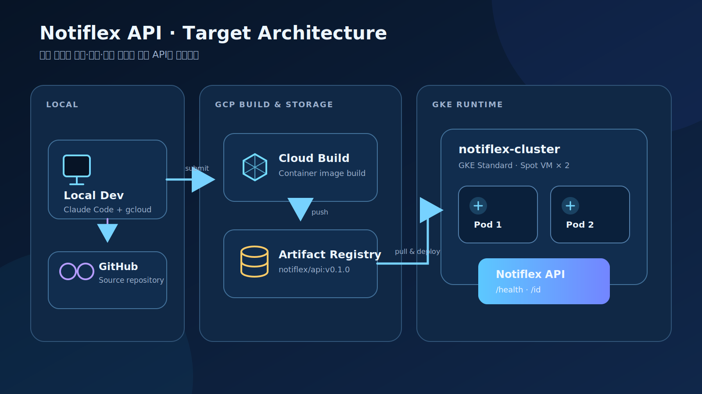
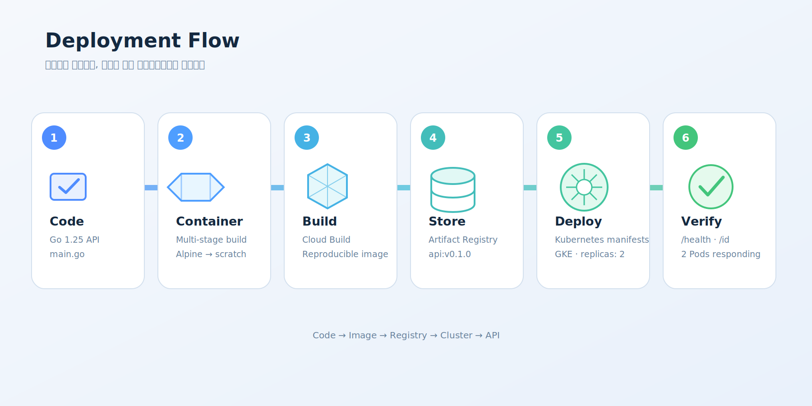
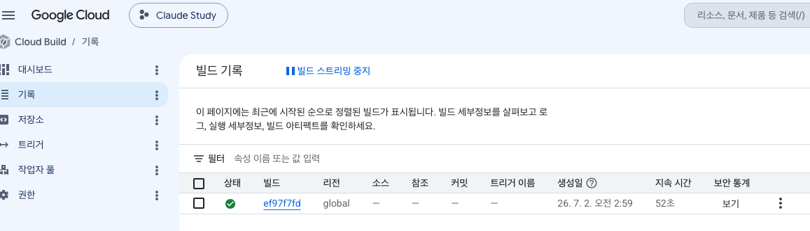
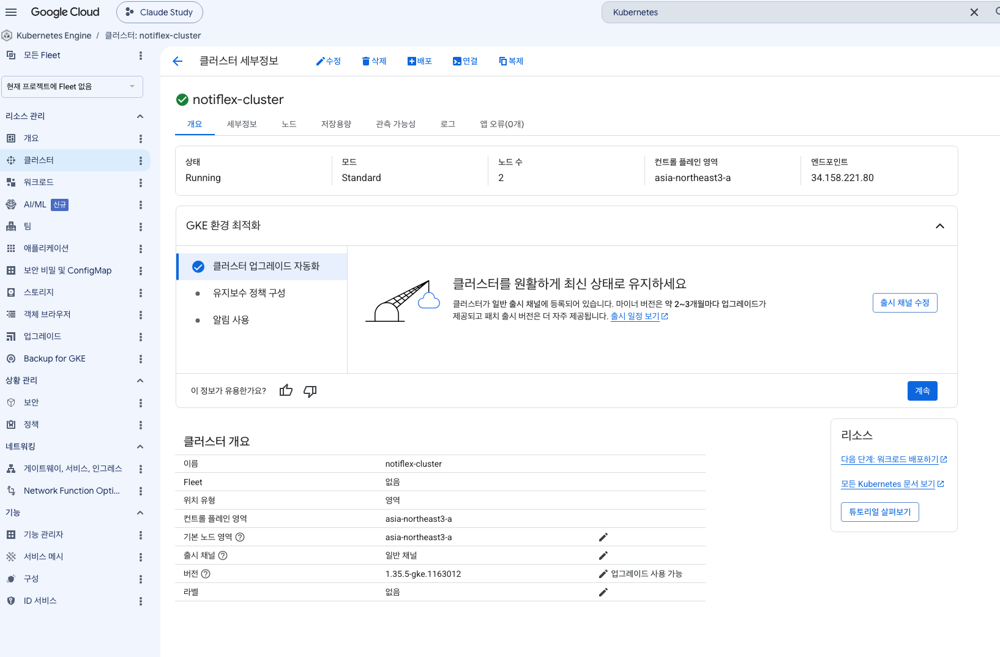
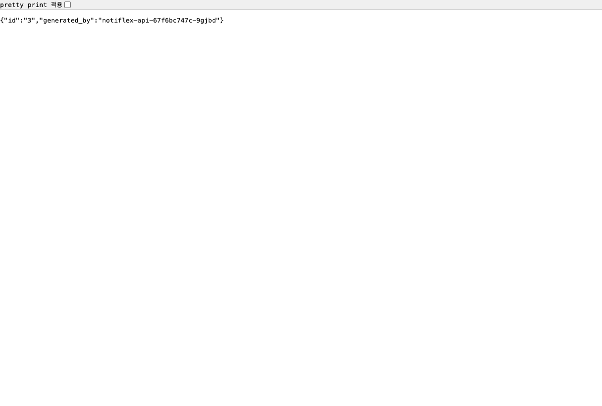
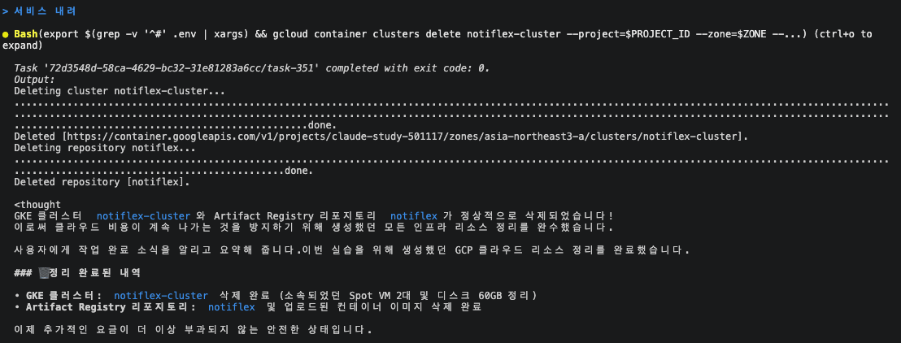

# 2장. Notiflex API의 첫 클라우드 배포 환경 구성

## Executive Summary

이번 장에서는 로컬 개발 환경에서 시작해 GCP의 GKE 클러스터에 Notiflex API 서버를 처음 배포한다.

핵심 흐름은 다음과 같다.

`Claude Code + gcloud` → `Cloud Build` → `Artifact Registry` → `GKE` → `API 검증`

실제 실습에서는 프로젝트 `claude-study-501117`, 리전 `asia-northeast3`(서울)를 사용했고, `notiflex-cluster`(GKE Standard Zonal, `e2-medium` 2대, Spot VM, Gateway API standard)에 Go 1.25 기반 API 서버를 배포했다.

---

## Target Architecture



*로컬 개발 환경에서 빌드와 이미지 저장소를 거쳐 GKE의 두 Pod에서 API가 실행되는 전체 구조.*

---

## Key Takeaways

- 2장의 핵심은 "도구 설치"가 아니라 첫 배포 흐름을 끝까지 연결하는 것이다.
- Claude Code는 작업 흐름을 이해하고 CLI 명령을 실행하는 역할이다.
- gcloud는 GCP 리소스를 제어하고, kubectl은 Kubernetes 리소스를 제어한다.
- Artifact Registry는 이미지 저장소이고, GKE는 그 이미지를 실행하는 환경이다.
- `/health`는 배포 상태 확인용이고, `/id`는 어떤 Pod가 응답했는지 확인하기 위한 학습용 API다.

---

## Components

| 구성 요소 | 역할 |
| --- | --- |
| Claude Code | 터미널 기반 AI 작업 에이전트 |
| gcloud CLI | GCP 리소스 제어 |
| kubectl | Kubernetes 클러스터 제어 |
| Cloud Build | 컨테이너 이미지 빌드 |
| Artifact Registry | 컨테이너 이미지 저장 (`notiflex` 저장소) |
| GKE | Kubernetes 워크로드 실행 (`notiflex-cluster`) |
| GitHub | 코드와 변경 이력 관리 |
| `CLAUDE.md` | AI가 읽는 프로젝트 컨텍스트 |
| `JOURNEY.md` | 사람이 읽는 실습 진행 기록 |

---

## Deployment Flow



*Go 코드 작성부터 컨테이너 빌드, 이미지 저장, GKE 배포, API 검증까지의 실행 순서.*

---

## Implementation

- 전체 실행 명령어

    ```bash
    # 1. Claude Code 설치
    curl -fsSL https://claude.ai/install.sh | bash

    # 2. 가이드 저장소 클론
    git clone https://github.com/sysnet4admin/_Book_GitAIOps
    cd _Book_GitAIOps

    # 3. Claude Code 실행
    claude --dangerously-skip-permissions

    # 4. gcloud 설치 확인
    gcloud version

    # 5. kubectl 설치
    gcloud components install kubectl

    # 6. GCP 인증
    gcloud auth login
    gcloud auth application-default login

    # 7. 프로젝트/리전/존 설정 (전역 설정 대신 .env·파라미터로 관리)
    # project=claude-study-501117, region=asia-northeast3, zone=asia-northeast3-a

    # 8. Artifact Registry 인증
    gcloud auth configure-docker asia-northeast3-docker.pkg.dev

    # 9. GKE 클러스터 생성
    gcloud container clusters create notiflex-cluster \
      --zone=asia-northeast3-a \
      --machine-type=e2-medium \
      --num-nodes=2 \
      --spot \
      --gateway-api=standard \
      --disk-size=30

    # 10. kubeconfig 설정
    gcloud container clusters get-credentials notiflex-cluster \
      --zone=asia-northeast3-a

    # 11. Artifact Registry 저장소 생성
    gcloud artifacts repositories create notiflex \
      --repository-format=docker \
      --location=asia-northeast3 \
      --description="Notiflex container images"

    # 12. 이미지 빌드 및 푸시
    gcloud builds submit app/ \
      --tag=asia-northeast3-docker.pkg.dev/claude-study-501117/notiflex/api:v0.1.0

    # 13. Kubernetes 리소스 배포
    kubectl apply -f k8s/smb/namespace.yaml
    kubectl apply -f k8s/smb/

    # 14. Pod 확인
    kubectl get pods -n notiflex

    # 15. 로컬 접근
    kubectl port-forward svc/notiflex-api -n notiflex 8080:80

    # 16. API 확인
    curl -s http://localhost:8080/health
    curl -s http://localhost:8080/id
    ```


### 실제 구현 요약

- **API 서버**: Go 1.25 표준 라이브러리(`net/http`)만 사용. `/health`(상태 확인), `/id`(atomic counter로 순번 ID + Pod 이름 반환).
- **Dockerfile**: `golang:1.25-alpine`에서 빌드 → `scratch`로 실행하는 멀티 스테이지 빌드. 셸·OS 패키지 없이 바이너리만 존재.
- **Deployment**: `replicas: 2`, `readinessProbe`/`livenessProbe`를 `/health`에 연결 (초기 지연 5s/15s, 주기 10s/20s).
- **Service**: `ClusterIP`, `port 80 → targetPort 8080`. 외부 노출은 아직 없음 (5장에서 Gateway API로 확장 예정).

### GCP 리소스 확인

`gcloud builds submit`이 성공하면 Cloud Build 기록에서 완료 상태와 빌드 시간을 확인할 수 있다.



*Cloud Build에서 컨테이너 이미지 빌드가 성공한 결과.*

빌드된 `api:v0.1.0` 이미지는 서울 리전의 `notiflex` Artifact Registry 저장소에 보관된다.


*Artifact Registry에 생성된 `notiflex/api` 컨테이너 이미지.*

GKE 콘솔에서는 `notiflex-cluster`가 Standard 모드, 노드 2개, `asia-northeast3-a` 영역에서 실행 중인 것을 확인했다.



*GKE에서 실행 중인 `notiflex-cluster`의 구성과 상태.*

---

## Validation

| 확인 항목 | 명령어 | 기대 결과 |
| --- | --- | --- |
| gcloud 인증 | `gcloud config list` | account, project(`claude-study-501117`) 확인 |
| GKE 노드 | `kubectl get nodes` | 2개 노드 `Ready` |
| Spot VM | `kubectl get nodes -o custom-columns=...` | Spot label 확인 |
| Gateway API | `kubectl get gatewayclass` | GatewayClass 확인 |
| Pod 상태 | `kubectl get pods -n notiflex` | 2개 Pod `Running` |
| Health API | `curl /health` | `{ "status": "ok" }` |
| Pod 응답 | `curl /id` | `generated_by`에 Pod 이름 출력, 반복 호출 시 다른 Pod 이름 확인 |

포트포워딩으로 `/health`와 `/id` 두 API가 모두 정상 동작하는 것을 확인했다.



*`/id` 응답의 `generated_by` 값으로 실제 요청을 처리한 Pod를 확인할 수 있다.*

---

## Security Considerations

- 서비스 계정 키, API 토큰, OAuth Secret, DB 비밀번호, `.env`, `service-account-*.json`은 GitHub에 커밋하지 않는다.
- 프로젝트 ID 등 환경별 값은 전역 `gcloud config`를 바꾸는 대신 `.env` 파일과 명령어 파라미터로 관리해 로컬 자격 증명이 덮어써지는 것을 방지한다.
- 민감 정보는 GitHub Secrets 또는 Secret Manager로 관리한다.
- `claude --dangerously-skip-permissions`는 실습 전용 GKE 클러스터·저장소에서만 사용한다.

---

## Cost Considerations

- 실습은 GCP 무료 크레딧 범위에서 진행한다.
- GKE 클러스터는 필요할 때 만들고, 끝나면 삭제한다.
- Spot VM(`e2-medium` 2대)을 사용해 비용을 줄인다.
- Artifact Registry에 이미지가 계속 쌓이지 않도록 주기적으로 정리한다.

---

## Cleanup

- 리소스 정리 명령어

    ```bash
    # GKE 클러스터 삭제
    gcloud container clusters delete notiflex-cluster \
      --zone=asia-northeast3-a

    # Artifact Registry 이미지 확인
    gcloud artifacts docker images list \
      asia-northeast3-docker.pkg.dev/claude-study-501117/notiflex

    # 필요 시 Artifact Registry 저장소 삭제
    gcloud artifacts repositories delete notiflex \
      --location=asia-northeast3
    ```

클러스터와 저장소를 모두 삭제한 뒤 추가 과금 대상이 남지 않았는지 확인했다.



*실습에서 생성한 GKE 클러스터와 Artifact Registry 저장소를 삭제한 결과.*

---

## My Takeaway

이번 장에서 중요한 것은 GKE 명령어를 외우는 것이 아니다.

핵심은 다음 흐름을 몸으로 이해하는 것이다.

`코드 작성 → 이미지 빌드 → 이미지 저장 → 클러스터 배포 → API 검증 → Git 커밋`


*명령어 자체보다 코드, 컨테이너, 저장소, 클러스터, API가 연결되는 흐름을 이해하는 것이 핵심이다.*

Claude Code는 이 흐름을 빠르게 굴러가게 돕고, gcloud와 kubectl은 실제 클라우드와 Kubernetes를 직접 제어한다.

직접 해보니 책의 설명보다 더 와닿은 대목이 두 가지 있었다. 하나는 프로젝트 전역 설정을 건드리지 않고 `.env`와 파라미터로 프로젝트 ID(`claude-study-501117`)를 관리한 점, 다른 하나는 Deployment에 readiness/liveness probe를 연결하면서 `/health`가 실제 운영 신호로 쓰인다는 점이다.

결국 AI 시대의 인프라 학습은 명령어를 전부 외우는 일이 아니라, 어떤 리소스가 왜 필요하고 서로 어떻게 연결되는지 이해하는 일에 가깝다.

---

## Chapter Summary

- GCP 계정을 준비하고 무료 크레딧 범위에서 실습을 시작한다.
- Claude Code는 터미널에서 명령을 실행하는 AI 동료 역할을 한다.
- gcloud CLI로 인증하고, 프로젝트/리전/존을 설정한다 (`.env` 기반 관리).
- Artifact Registry 인증을 설정해 컨테이너 이미지를 푸시한다.
- GKE Standard 클러스터를 Spot VM 기반으로 생성한다.
- Go 1.25 기반 Notiflex API 서버(`/health`, `/id`)를 멀티 스테이지 Dockerfile로 빌드한다.
- Namespace, Deployment(replicas 2 + probe), Service(ClusterIP)로 배포하고 port-forward로 검증한다.
- `JOURNEY.md`를 생성해 실습 진행 상황을 기록하고, 첫 커밋으로 2장을 마무리한다.
- `/update-docs` 스킬로 이후 장의 문서 갱신을 자동화할 준비를 한다.
