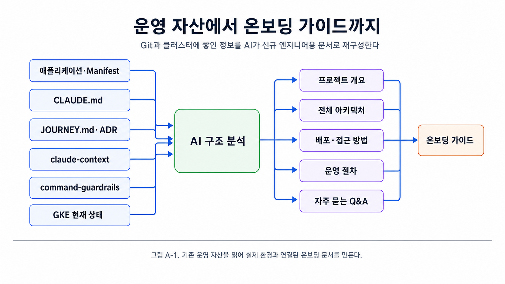
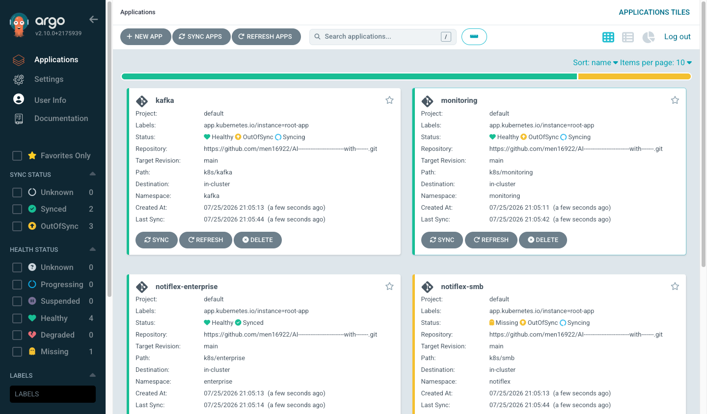
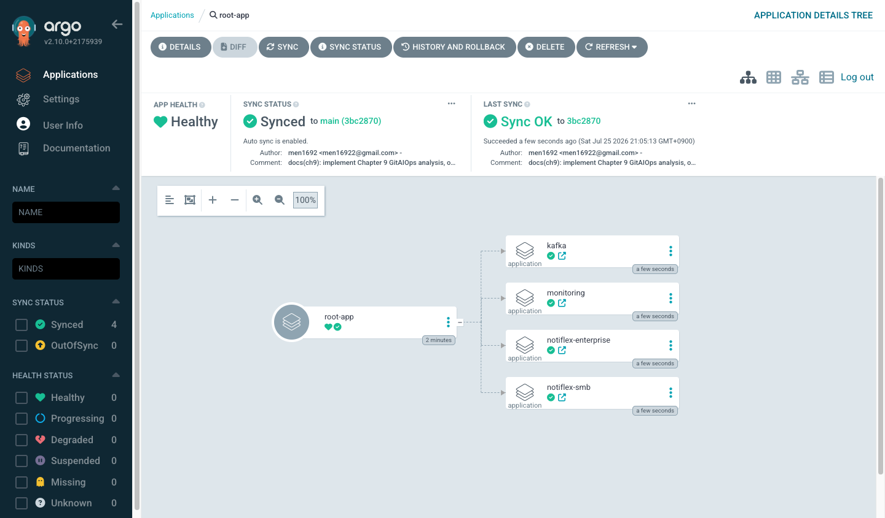
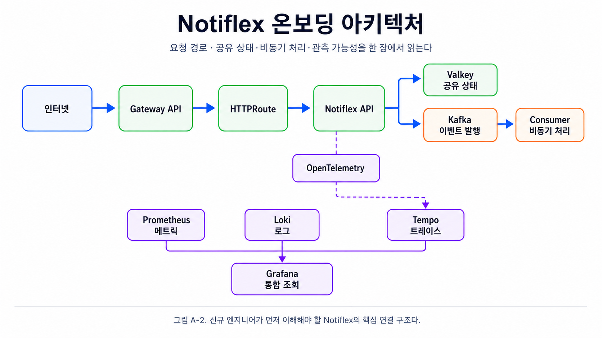
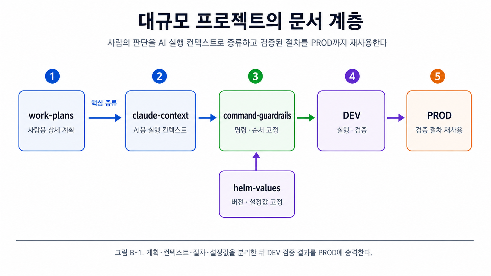
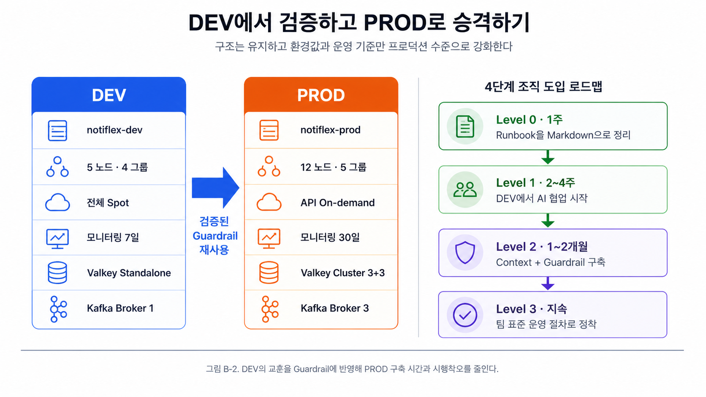

# Appendix. AI로 만든 온보딩 가이드와 대규모 프로젝트 설계

# Appendix A. AI로 만든 온보딩 가이드

## 부록 A의 목표

9.3.3에서 설명한 **“기존 구조에서 새로운 산출물을 만드는 효과”**를 실제 온보딩 문서로 확인합니다. 클로드 코드에게 단순히 `온보딩 문서 만들어줘`라고 요청하면, 저장소와 현재 클러스터 상태를 분석하여 신규 엔지니어가 바로 사용할 수 있는 가이드를 생성합니다.

이 부록의 핵심은 별도의 문서를 처음부터 작성하는 것이 아닙니다. 이미 Git에 축적된 다음 자산을 AI가 읽고 조합합니다.

- 애플리케이션 코드와 Kubernetes Manifest
- `CLAUDE.md`의 프로젝트 규칙
- `JOURNEY.md`와 ADR의 결정 이력
- `claude-context/`의 현재 아키텍처
- `command-guardrails/`의 운영 절차
- 실제 GKE 클러스터 상태

---

## Appendix A 전체 흐름



핵심은 **사람과 AI가 같은 Git 저장소를 읽기 때문에, 온보딩 문서가 실제 운영 상태에서 분리되지 않는 것**입니다.

---

# A.1 온보딩 문서 생성

- **A.1 AI가 현재 상태를 기반으로 온보딩 문서 만들기**

    ## 입력

    ```
    온보딩 문서 만들어줘.
    ```

    클로드 코드는 저장소와 클러스터를 조회한 뒤 신규 엔지니어를 위한 다음 가이드를 생성합니다.

    ## 1. 프로젝트 개요

    Notiflex는 기업 고객에게 알림 API를 제공하는 B2B SaaS 플랫폼입니다. 기업 고객인 테넌트가 API를 호출하면 알림 요청을 생성하고 이벤트를 발행합니다.

    - 애플리케이션: Go 표준 라이브러리 기반 단일 바이너리
    - 코드 규모: `main.go` 약 95줄
    - 실행 환경: GKE
    - 배포 방식: GitHub Actions + Argo CD
    - 외부 진입점: GKE Gateway API
    - 배포 전략: Argo Rollouts Canary
    - 공유 상태: Valkey
    - 비동기 메시징: Kafka
    - 관측 가능성: Prometheus + Loki + Tempo + Grafana

    현재 두 개의 테넌트를 운영합니다.

    - **SMB**: `notiflex` Namespace의 기본 테넌트입니다. Canary 배포, Valkey 캐시, Kafka 이벤트 발행과 CronJob 헬스체크를 사용합니다.
    - **Enterprise**: `enterprise` Namespace의 고객 격리 테넌트입니다. 별도 Rollout과 Secret을 사용합니다.

    ### 📷 실습 인증 - 온보딩 관제 및 아키텍처 배포

    
    > 그림 A-1-1. (실습 인증) Argo CD Web UI 대시보드에서 root-app 아래 `monitoring`, `notiflex-smb`, `notiflex-enterprise`, `kafka` 등 온보딩 대상 전체 애플리케이션이 자동 동기화되어 관리되는 화면.

    
    > 그림 A-1-2. (실습 인증) `root-app` 상세 화면에서 App of Apps 패턴을 통해 등록된 하위 Application 매니페스트 리소스 트리 구조.


    ## 2. 전체 아키텍처

    

    주요 통신 경로는 다음과 같습니다.

    ```
    [인터넷]
        ↓
    [Gateway API]
        ↓ HTTPRoute
    [Notiflex API · notiflex Namespace]
        ├── Valkey · 6379/TCP
        ├── Kafka · 9092/TCP
        └── OpenTelemetry → Tempo · 4317/TCP
    ```

    ## 3. 클러스터와 노드풀

    노드와 노드풀은 다음 명령으로 확인합니다.

    ```bash
    kubectl --context gke-sysnet4admin_book_gitaiops get nodes \
      -o custom-columns=NAME:.metadata.name,POOL:.metadata.labels.cloud\.google\.com/gke-nodepool
    ```

    | 노드풀 | 용도 | 머신 유형 | 주요 워크로드 |
    | --- | --- | --- | --- |
    | `default-pool` | 플랫폼 인프라 | `e2-medium` Spot × 2 | Argo CD, Prometheus, Grafana, Loki |
    | `api-pool` | API 서빙 | `e2-medium` Spot × 1 | SMB·Enterprise Notiflex API, Valkey |
    | `worker-pool` | 데이터 처리 | `e2-standard-2` Spot × 1 | Strimzi, Kafka Broker |
    | `ops-pool` | 운영 도구 | `e2-small` Spot × 1 | Tempo, Health Check CronJob |

    모든 노드는 Spot VM입니다. 비용은 효율적이지만 선점으로 노드가 갑자기 종료될 수 있습니다. Pod는 재스케줄되므로 서비스가 즉시 사라지는 것은 아니지만, 일시적으로 `Pending` 상태가 될 수 있습니다.

    ## 4. Namespace별 워크로드

    ```bash
    kubectl --context gke-sysnet4admin_book_gitaiops get pods -A \
      --no-headers | awk '{print $1}' | sort | uniq -c | sort -rn
    ```

    | Namespace | 주요 Pod | 역할 |
    | --- | --- | --- |
    | `notiflex` | `notiflex-api`, `valkey-primary`, `healthcheck-cronjob` | SMB API, 공유 캐시, 헬스체크 |
    | `enterprise` | `notiflex-api` | Enterprise 테넌트 API |
    | `kafka` | `notiflex-kafka-broker` | Strimzi 기반 Kafka KRaft |
    | `monitoring` | Prometheus, Grafana, Loki, Fluent Bit, Tempo | 메트릭, 로그, 트레이스 |
    | `argocd` | Server, Application Controller, Repo Server | GitOps 배포 |
    | `argo-rollouts` | Argo Rollouts Controller | Canary와 Blue/Green 배포 제어 |

    ## 5. 저장소 구조

    ```
    notiflex-platform/
    ├── CLAUDE.md                 ← 프로젝트 규칙과 AI 자동 로드 문서
    ├── JOURNEY.md                ← 진행 현황과 의사결정 기록
    ├── app/                      ← Go 애플리케이션
    ├── k8s/
    │   ├── smb/                  ← SMB Rollout, Service, CronJob
    │   ├── enterprise/           ← Enterprise Namespace, Rollout, Service
    │   ├── gateway/              ← Gateway API와 HTTPRoute
    │   ├── kafka/                ← Kafka, KafkaNodePool, KafkaTopic
    │   ├── monitoring/           ← PrometheusRule
    │   └── secret/               ← SecretProviderClass
    ├── argocd/
    │   ├── root-app.yaml         ← App of Apps 루트
    │   └── apps/                 ← 개별 Argo CD Application
    ├── helm-values/              ← Helm Chart 설정값
    ├── .github/workflows/        ← GitHub Actions CI
    ├── claude-context/           ← AI용 아키텍처 컨텍스트
    ├── command-guardrails/       ← 위험 작업 실행 절차
    ├── docs/                     ← 작업 기록과 ADR
    └── .claude/
        ├── settings.local.json   ← 명령 권한 제어
        ├── commands/             ← `/update-docs` 등 커스텀 명령
        └── memory/               ← 로컬 작업 컨텍스트
    ```

    ## 6. 배포 방법

    코드를 변경하고 Git에 push하면 자동 배포 흐름이 시작됩니다.

    ```mermaid
    sequenceDiagram
        participant Dev as 개발자
        participant Git as GitHub
        participant CI as GitHub Actions
        participant Registry as Artifact Registry
        participant Argo as Argo CD
        participant Rollout as Argo Rollouts
        participant GKE as GKE

        Dev->>Git: git push
        Git->>CI: Workflow 실행
        CI->>Registry: 이미지 빌드·Push
        CI->>Git: Rollout 이미지 태그 갱신
        Git->>Argo: 변경 감지
        Argo->>Rollout: Manifest 동기화
        Rollout->>GKE: Canary 20% → 50% → 80% → 100%
    ```

    배포 상태는 다음 명령으로 확인합니다.

    ```bash
    kubectl --context gke-sysnet4admin_book_gitaiops \
      argo rollouts status notiflex-api -n notiflex
    ```

    Canary는 각 단계마다 약 30초 동안 정지한 뒤 다음 단계로 진행합니다.

    ## 7. 접근 방법

    ### Argo CD UI

    ```bash
    kubectl --context gke-sysnet4admin_book_gitaiops \
      port-forward svc/argocd-server -n argocd 8080:443
    ```

    접속 주소는 `https://localhost:8080`입니다. 초기 관리자 비밀번호는 다음과 같이 조회합니다.

    ```bash
    kubectl --context gke-sysnet4admin_book_gitaiops \
      get secret argocd-initial-admin-secret -n argocd \
      -o jsonpath='{.data.password}' | base64 -d
    ```

    ### Grafana

    ```bash
    kubectl --context gke-sysnet4admin_book_gitaiops \
      port-forward svc/kube-prometheus-grafana -n monitoring 3000:80
    ```

    접속 주소는 `http://localhost:3000`입니다.

    - Prometheus: PromQL로 메트릭 조회
    - Loki: LogQL로 로그 조회
    - Tempo: Trace ID 또는 Service Name으로 트레이스 조회

    ### API 엔드포인트

    ```bash
    kubectl --context gke-sysnet4admin_book_gitaiops \
      get gateway -n notiflex --no-headers

    curl -s http://<GATEWAY_IP>/health
    curl -s -X POST http://<GATEWAY_IP>/notify \
      -H 'Content-Type: application/json' \
      -d '{"message":"test"}'
    ```

    ## 8. 자주 묻는 Q&A

    ### Canary 배포에서 에러율이 증가하면

    즉시 Rollout을 중단합니다.

    ```bash
    kubectl --context gke-sysnet4admin_book_gitaiops \
      argo rollouts abort notiflex-api -n notiflex
    ```

    Stable 버전으로 트래픽이 복원됩니다. 이후 원인을 분석하고 수정한 뒤 다시 배포합니다.

    ### 특정 에러 로그를 찾으려면

    Grafana Explore에서 Loki를 선택하고 LogQL을 사용합니다.

    ```
    {namespace="notiflex"} |= "error"
    ```

    CLI에서도 확인할 수 있습니다.

    ```bash
    kubectl --context gke-sysnet4admin_book_gitaiops \
      logs -l app=notiflex-api -n notiflex --tail=100
    ```

    ### 요청이 느린 구간을 찾으려면

    API 응답의 `trace_id`를 Grafana Explore의 Tempo에서 검색합니다. API, Valkey, Kafka 구간별 소요 시간이 표시됩니다.

    ### Kafka Topic을 추가하려면

    `k8s/kafka/`에 `KafkaTopic` YAML을 추가하고 Git push합니다.

    ```yaml
    apiVersion: kafka.strimzi.io/v1
    kind: KafkaTopic
    metadata:
      name: new-topic
      namespace: kafka
      labels:
        strimzi.io/cluster: notiflex-kafka
    spec:
      partitions: 3
      replicas: 1
    ```

    ### 신규 테넌트를 추가하려면

    1. `k8s/<tenant-name>/`에 Namespace, Rollout, Service YAML을 생성합니다.
    2. `argocd/apps/<tenant-name>.yaml` Application을 추가합니다.
    3. Git push하면 App of Apps가 자동 관리합니다.

    ### 알림 상태를 확인하려면

    Pod가 5분 안에 세 번 이상 재시작되면 PrometheusRule이 감지하고 Alertmanager가 알림을 발행합니다. Grafana의 Alerting 화면 또는 Alertmanager UI에서 활성 알림을 확인합니다.


---

## Appendix A 핵심 정리

- 온보딩 문서는 현재 저장소와 클러스터 상태를 바탕으로 생성됩니다.
- 신규 팀원은 배포, 관측, 장애 대응과 확장 절차를 하나의 문서에서 확인할 수 있습니다.
- 문서를 별도 Wiki에서 관리하지 않으므로 코드와 운영 상태의 괴리가 줄어듭니다.
- 문서 품질은 Git에 축적된 `JOURNEY.md`, ADR, `claude-context/`, Guardrail의 품질에 따라 결정됩니다.

---

# Appendix B. AI와 함께 설계하는 대규모 프로젝트

## 부록 B의 목표

이 책의 본문에서는 문제가 생길 때마다 필요한 문서를 하나씩 추가했습니다. 그러나 대규모 마이그레이션이나 전면 재설계에서는 전체 그림을 먼저 그리고, AI가 그 계획을 정확히 실행할 수 있는 구조를 설계해야 합니다.

대규모 프로젝트에서는 다음 방향으로 접근합니다.

1. 사람이 전체 계획과 Trade-off를 작성합니다.
2. AI가 읽기 쉬운 형태로 핵심을 증류합니다.
3. 실행 순서와 명령을 Guardrail로 고정합니다.
4. DEV 환경에서 검증합니다.
5. 검증된 절차를 PROD에 재사용합니다.

---

## Appendix B 전체 흐름



본문과 도착지는 같지만 출발점이 다릅니다. 소규모 프로젝트는 문제를 해결하면서 문서가 누적되고, 대규모 프로젝트는 문서를 먼저 설계한 뒤 실행합니다.

---

# B.1 대규모 프로젝트의 문서 계층

- **B.1.1 전체 흐름**

    대규모 프로젝트에서 AI와 협업하는 순서는 다음과 같습니다.

    1. **사람이 계획을 세운다** → `work-plans/`
    2. **AI가 읽을 수 있게 증류한다** → `claude-context/`
    3. **실행 절차를 고정한다** → `command-guardrails/` + `helm-values/`
    4. **DEV에서 검증한다**
    5. **PROD에 재사용한다** → 검증된 Guardrail을 그대로 적용

    그림 B-1처럼 사람용 계획과 AI용 실행 컨텍스트를 분리하고, 검증된 명령과 설정값을 DEV에서 확인한 뒤 PROD에 재사용합니다.


---

- **B.1.2 1단계: 사람이 읽는 계획서 — work-plans**

    가장 먼저 만드는 것은 사람이 읽고 판단하기 위한 상세 계획서입니다. 한국어로 작성하며 각 컴포넌트의 Why, How, Trade-off와 검증 방식을 문서화합니다.

    ```
    work-plans/
    ├── 00-main/
    │   ├── 01-modernization-plan.md   ← 전체 현대화 계획
    │   ├── 02-runbook-dev.md          ← DEV 배포 순서
    │   └── 03-runbook-prod.md         ← PROD 배포 순서
    ├── 10-infrastructure/
    │   ├── 11-cluster-plan.md         ← 클러스터 버전, 노드 그룹
    │   ├── 12-resources-plan.md       ← StorageClass, IngressClass
    │   └── 13-cloud-integration.md     ← PD, GCS, Secret Manager
    ├── 20-platform/
    │   ├── 21-monitoring-metrics.md   ← Prometheus Stack
    │   ├── 22-monitoring-logs.md      ← Loki + Fluent Bit
    │   ├── 23-monitoring-traces.md    ← Tempo
    │   └── 24-argocd.md               ← Argo CD와 RBAC
    ├── 30-data/
    │   ├── 31-valkey.md               ← Valkey 설정과 선택 이유
    │   └── 32-kafka.md                ← Strimzi, KRaft, Topic
    ├── 40-transition/
    │   ├── 41-app-deployment.md       ← 앱 배포 체크포인트
    │   ├── 42-independent-test.md     ← 독립 도메인 테스트
    │   └── 43-traffic-switch.md       ← Weighted Routing 전환
    └── 50-finops/
        └── 51-rightsizing.md          ← 노드 다운사이징과 비용 절감
    ```

    각 문서는 다음 내용을 포함합니다.

    - 목적: 왜 필요한가
    - 버전: 어떤 제품과 Chart 버전을 쓰는가
    - 설정값: 구체적인 Namespace, Node Selector, Storage와 Resource 값
    - 선택 사유: 다른 대안 대신 이 방법을 선택한 이유
    - 검증 방법: 설치와 전환이 성공했는지 확인하는 명령

    ### 예시: `31-valkey.md`

    ```markdown
    # Valkey 캐시 서버

    ## 목적
    Redis에서 Valkey로 전환하여 라이선스 위험을 해소한다.
    Redis 프로토콜과 호환되므로 애플리케이션 코드는 변경하지 않는다.

    ## 버전
    - Valkey 8.1.3
    - Bitnami Chart

    ## 선택 이유
    | 항목 | Redis | Valkey |
    |---|---|---|
    | 라이선스 | SSPL 계열 제약 | BSD 계열 |
    | 호환성 | 기준 | Redis 프로토콜 호환 |
    | 생태계 | 기존 생태계 | Linux Foundation 지원 |

    ## 설정
    - Standalone Mode
    - maxmemory: 256Mi
    - eviction-policy: allkeys-lru
    - PVC: 1Gi

    ## 검증
    kubectl get pods -l app.kubernetes.io/name=valkey -n notiflex
    valkey-cli -h valkey-primary.notiflex PING
    ```

    이 수준의 문서가 컴포넌트별로 있으면 신규 팀원도 **왜 현재 구조를 선택했는지** 추적할 수 있습니다.


---

- **B.1.3 2단계: AI가 읽을 수 있게 증류 — claude-context**

    상세한 `work-plans/`를 AI에게 그대로 전달하면 문서가 너무 길고 결정의 배경과 현재 실행값이 섞여 핵심을 놓칠 수 있습니다. 따라서 AI가 실행에 필요한 부분만 추출하여 `claude-context/`에 정리합니다. 이 과정을 **증류(Distillation)**라고 합니다.

    ```
    claude-context/
    ├── 00-project-summary.md      ← 프로젝트 1페이지 요약
    ├── 01-environment-values.md   ← DEV·PROD 환경값
    ├── 02-document-map.md         ← 상세 계획서 탐색 지도
    ├── 03-current-status.md       ← 현재 배포 상태와 체크리스트
    └── 99-execution-guide.md      ← 실행 순서와 의존성
    ```

    | 계층 | 주요 독자 | 언어 | 목적 |
    | --- | --- | --- | --- |
    | `work-plans/` | 사람 | 한국어 | 의사결정, Trade-off, 배경과 이력 |
    | `claude-context/` | AI | 영어 | 현재 상태, 실행에 필요한 값과 의존성 |

    ### 증류 전

    ```markdown
    ## Valkey 캐시 서버

    ### 목적
    Redis에서 Valkey로 전환합니다. 라이선스 변경 배경과 선택 과정은 다음과 같습니다.
    ...

    ### 선택 이유
    20줄 이상의 배경과 Trade-off 설명
    ```

    ### 증류 후

    ```markdown
    ## Data Layer
    - Valkey 8.1.3, Bitnami Chart
    - standalone mode
    - namespace: notiflex
    - nodeSelector: role=api
    - maxmemory: 256Mi
    - Redis protocol compatible, no application code change

    - Kafka 3.9.0, Strimzi
    - KRaft mode
    - namespace: kafka
    - nodeSelector: role=worker
    ```

    AI에게 당장 필요한 것은 전체 역사보다 **정확한 버전, Namespace, Node Selector와 설정값**입니다.

    ### AI용 문서를 영어로 증류하는 이유

    1. **토큰 효율성**: 동일한 정보를 더 적은 토큰으로 전달할 수 있습니다.
    2. **기술 용어의 일관성**: Kubernetes 생태계 용어와 YAML Key가 영어를 기준으로 합니다.
    3. **명령어와의 직접 연결**: `namespace`, `nodeSelector`, `chart version`을 그대로 명령과 매핑할 수 있습니다.

    모든 문서를 영어로 작성해야 한다는 의미는 아닙니다. `work-plans/`는 사람의 의사결정을 위한 문서이므로 한국어가 적합하고, **누가 읽는가에 따라 문서의 언어와 밀도를 구분하는 것**이 핵심입니다.


---

- **B.1.4 3단계: 실행 절차를 고정한다 — command-guardrails**

    AI가 맥락을 이해하더라도 실행 시점에 명령을 임의로 생성하면 Chart 버전, Values, Namespace와 Context가 달라질 수 있습니다. `command-guardrails/`는 AI의 자유도를 완전히 없애는 것이 아니라, 검증된 실행 순서와 파라미터 범위 안에서 작업하도록 제어합니다.

    ## Guardrail 문서의 기본 구조

    ```markdown
    # 21. Kube-Prometheus-Stack

    ## Guardrails
    - kubectl context: gke-sysnet4admin_book_gitaiops
    - namespace: monitoring
    - chart version: 72.6.2
    - nodeSelector: role=ops
    - ALLOWED: helm install, helm upgrade, kubectl get/describe/logs
    - NOT ALLOWED: helm uninstall, kubectl delete without approval

    ## Prerequisites
    - 클러스터 실행 상태 확인
    - kubectl context 설정 완료
    - prometheus-community Helm Repository 추가
    - monitoring Namespace 존재
    - helm-values/kube-prometheus-stack.yaml 준비
    - role=ops 노드 준비

    ## Commands
    1. Namespace 생성
    2. Helm Chart 설치

    ## Verification
    - kubectl get pods
    - helm status
    ```

    실제 설치 명령은 다음과 같이 버전, Values 파일, Context와 Timeout까지 고정합니다.

    ```bash
    kubectl create namespace monitoring \
      --context gke-sysnet4admin_book_gitaiops \
      --dry-run=client -o yaml | \
      kubectl apply -f - --context gke-sysnet4admin_book_gitaiops

    helm install kube-prometheus-stack \
      prometheus-community/kube-prometheus-stack \
      --namespace monitoring \
      --version 72.6.2 \
      --values helm-values/kube-prometheus-stack.yaml \
      --kube-context gke-sysnet4admin_book_gitaiops \
      --wait \
      --timeout 10m
    ```

    검증 명령도 함께 고정합니다.

    ```bash
    kubectl get pods -n monitoring \
      --context gke-sysnet4admin_book_gitaiops

    helm status kube-prometheus-stack \
      -n monitoring \
      --kube-context gke-sysnet4admin_book_gitaiops
    ```

    AI가 이 문서를 읽으면 다음 값을 추측하지 않습니다.

    - Chart Version
    - Values 파일 위치
    - Kubernetes Context
    - Namespace
    - Node Selector
    - Timeout
    - 실행과 검증 순서

    ## 프로덕션 Guardrail 디렉터리

    ```
    command-guardrails/prod/
    ├── 00-COMMON.md        ← 모든 세션 시작 시 읽는 공통 환경
    ├── 00-prerequisites/   ← Phase 0: IAM, 스토리지, Namespace
    ├── 10-infrastructure/  ← Phase 1: 클러스터, Add-on, StorageClass
    ├── 20-platform/        ← Phase 2: 관측 가능성, Argo CD, Rollouts
    ├── 30-data/            ← Phase 3: Valkey, Kafka
    ├── 40-transition/      ← Phase 4: 앱 배포, 트래픽 전환
    └── 80-rollback/        ← 장애 발생 시 롤백 절차
    ```

    Phase를 건너뛰거나 순서를 바꾸는 것은 금지합니다. AI가 더 효율적인 순서를 제안하더라도 검증된 Runbook의 의존성 순서를 우선합니다.

    ## `helm-values/`로 설정값 고정

    Guardrail에 `helm install`만 기록하면 AI가 임의의 `--set` 플래그를 생성하거나 최신 Chart를 선택할 수 있습니다. 따라서 역할을 다음처럼 분리합니다.

    ```
    command-guardrails/
    → 실행 순서, 허용 명령, Context와 검증 방법

    helm-values/
    → 실제 Helm 파라미터와 환경별 설정값
    ```

    `--set`은 사용하지 않습니다. 모든 설정은 Values 파일에 넣고 Git으로 관리합니다.

    Chart 버전을 지정하지 않으면 최신 버전으로 자동 업그레이드되어 Breaking Change가 발생할 수 있습니다. 따라서 버전과 Values 파일을 모두 Git에 고정합니다.

    이 구조를 실제 운영에 적용하는 다음 단계는 DEV에서 검증한 Guardrail을 PROD에 재사용하는 것입니다.


---

- **B.1.5 4~5단계: DEV에서 PROD로**

    이 구조가 가장 효과적인 순간은 DEV에서 PROD로 넘어갈 때입니다. DEV에서 검증한 `command-guardrails/`의 순서와 검증 방법은 유지하고, 클러스터 Context와 Values 파일의 환경값만 PROD 기준으로 바꿉니다.

    

    DEV와 PROD의 차이는 대부분 환경값과 운영 기준입니다.

    | 항목 | DEV | PROD |
    | --- | --- | --- |
    | 클러스터 이름 | `notiflex-dev` | `notiflex-prod` |
    | 노드 수 | 5개, 4개 그룹 | 12개, 5개 그룹 |
    | Spot/On-Demand | 전체 Spot | API는 On-Demand, 나머지는 Spot |
    | 모니터링 보관 기간 | 7일 | 30일 |
    | Valkey | Standalone | Cluster 모드, 3+3 |
    | Kafka Broker | 1개 | 3개 |

    PROD Guardrail은 DEV Guardrail의 구조를 복사한 뒤 다음 항목만 조정합니다.

    - `--kube-context`: `notiflex-dev`에서 `notiflex-prod`로 변경
    - Values 파일: Replica 수, Resource, 보관 기간과 고가용성 설정 조정
    - 노드 배치: 중요 API는 On-Demand 노드에, 나머지는 Spot 노드에 배치
    - 검증 기준: `nodeSelector`, Replica 수, Pod 분산과 데이터 계층의 고가용성 확인

    DEV에서 Helm Chart 버전을 지정하지 않아 Breaking Change를 겪었다면 PROD Guardrail에는 `--version` 고정을 명시합니다. DEV에서 `nodeSelector`를 빠뜨려 Pod가 잘못된 노드에 배치됐다면 PROD 절차에는 노드 배치 검증 단계를 추가합니다. 이렇게 DEV의 시행착오를 Guardrail에 반영하면 PROD 구축 시간을 줄일 수 있습니다. 예를 들어 DEV 전체 구축에 2일이 걸렸다면 같은 절차를 재사용하는 PROD 구축은 1일로 단축할 수 있습니다.

    이 패턴은 Kubernetes에만 적용되지 않습니다. Terraform, Ansible과 같은 IaC 도구에서도 DEV에서 검증한 모듈과 실행 순서를 유지하고 환경 변수만 PROD 값으로 교체할 수 있습니다.

---

- **B.1.6 조직 도입 로드맵**

    처음부터 모든 문서 계층과 Guardrail을 한꺼번에 도입할 필요는 없습니다. 기존 운영 절차를 정리하는 단계에서 시작해 실제 운영 경험을 반영하며 점진적으로 확장하는 편이 현실적입니다.

    1. **Level 0, 1주**: 기존 Runbook을 구조화된 Markdown으로 정리합니다. 이 단계만으로도 문서를 검색하고 재사용하기 쉬워집니다.
    2. **Level 1, 2~4주**: 클로드 코드로 DEV 환경에서 실험을 시작합니다. `CLAUDE.md`를 작성하고 반복 작업의 컨텍스트를 축적합니다.
    3. **Level 2, 1~2개월**: `claude-context/`와 `command-guardrails/`의 이중 계층을 구축합니다. 운영에서 발견한 문제를 반영하며 실행 절차를 다듬습니다.
    4. **Level 3, 지속**: DEV에서 PROD로 승격하는 패턴을 정착시키고 `helm-values/`까지 포함한 팀 표준 운영 절차로 발전시킵니다.

    도입의 기준은 문서 개수가 아니라 재현성입니다. 다른 팀원이 같은 Context와 Guardrail을 읽고 동일한 순서로 실행·검증할 수 있다면 다음 단계로 넘어갈 준비가 된 것입니다.

---

## Appendix B 핵심 정리

- 사람용 계획서와 AI용 실행 컨텍스트는 목적과 밀도가 다릅니다.
- `work-plans/`는 의사결정과 Trade-off를 보존합니다.
- `claude-context/`는 AI가 현재 상태와 실행값을 빠르게 읽게 합니다.
- `command-guardrails/`는 실행 순서와 허용 범위를 고정합니다.
- `helm-values/`는 버전과 파라미터를 고정해 환경 차이와 임의 해석을 줄입니다.
- DEV에서 발견한 문제는 Guardrail의 검증 단계에 반영하고, PROD에서는 구조를 유지한 채 환경값만 조정합니다.
- 조직 도입은 Runbook 정리에서 시작해 AI 협업, Context·Guardrail 구축, 팀 표준 정착 순으로 확장합니다.
- 대규모 프로젝트에서는 문서를 실행 후 기록하는 것이 아니라, **실행 전에 설계하고 DEV에서 검증한 뒤 PROD로 승격**합니다.
