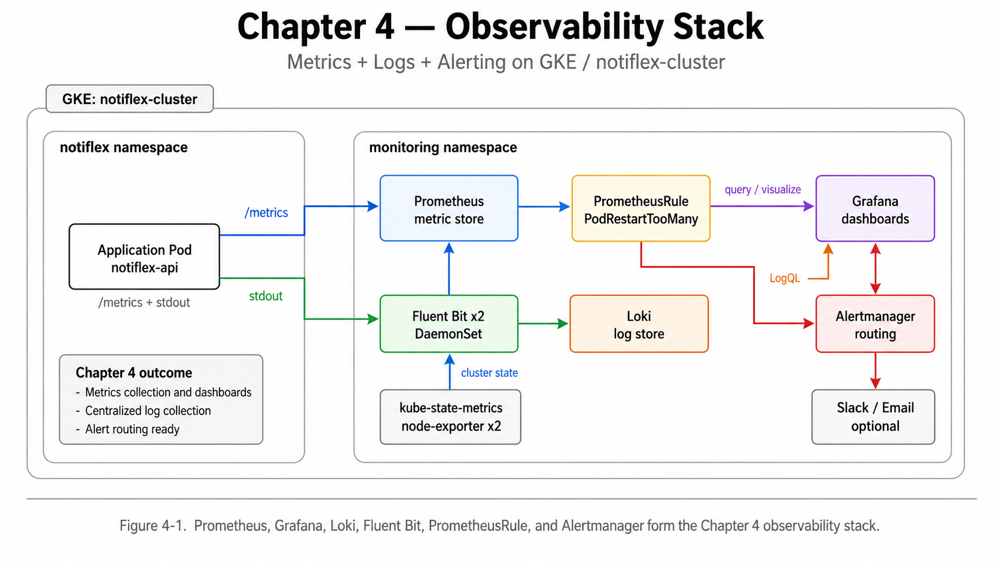
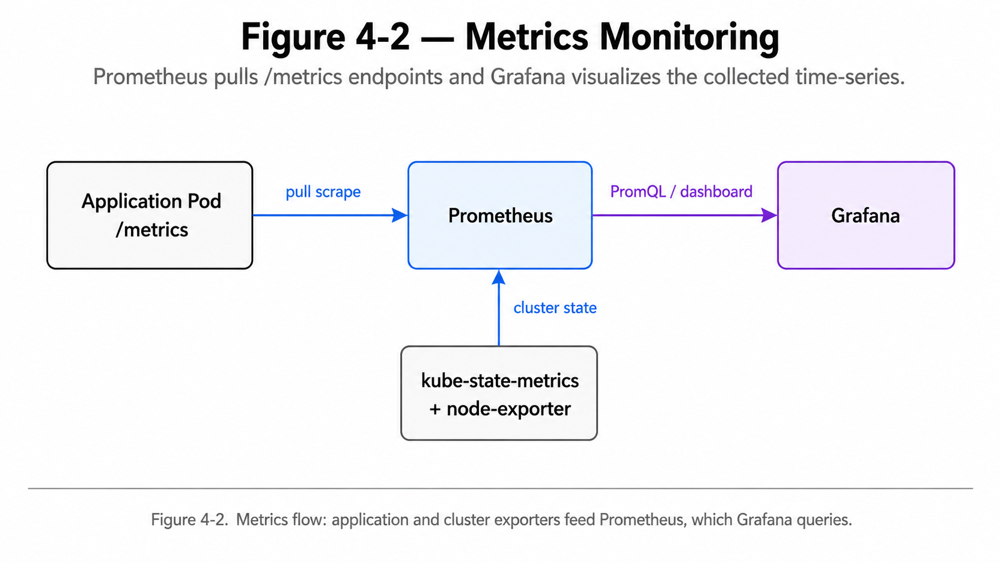
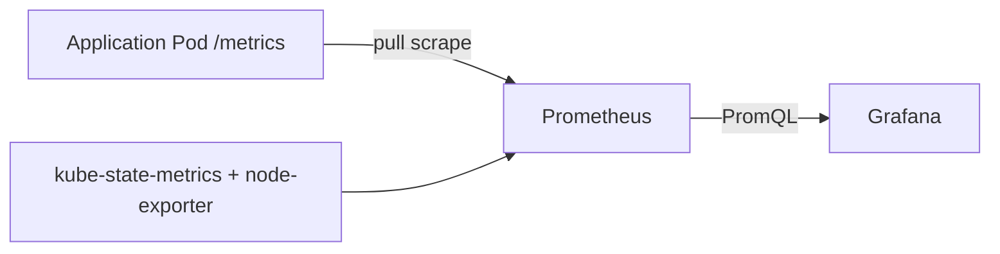
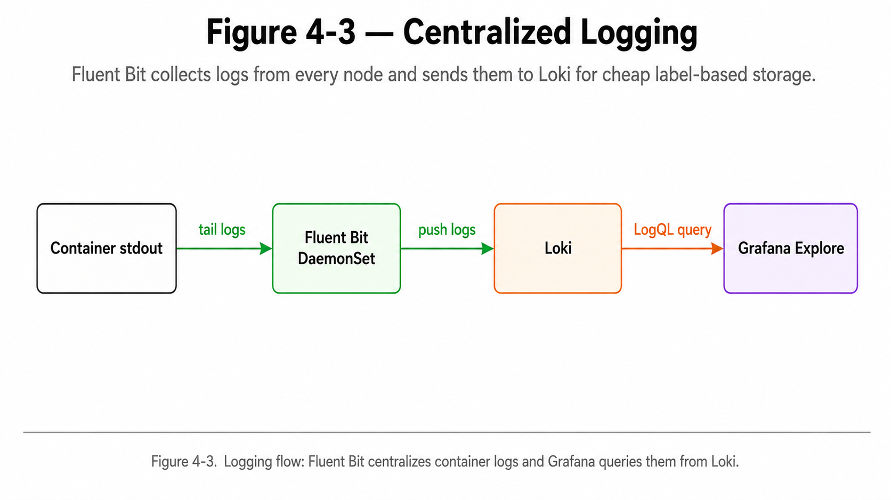
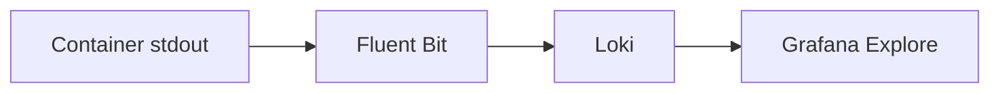
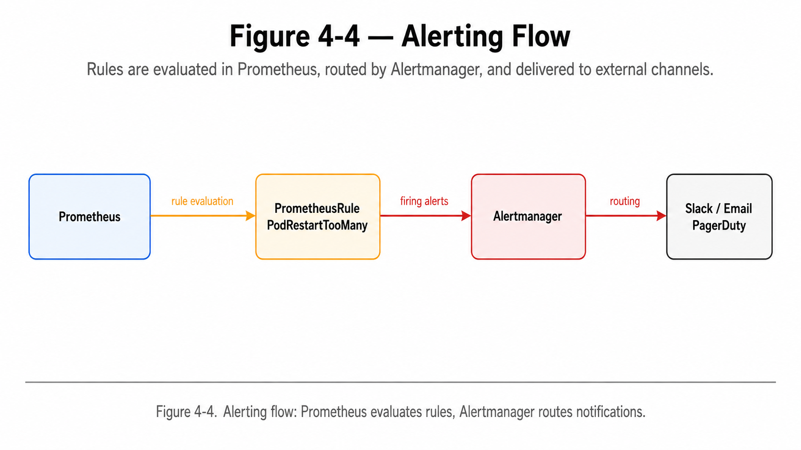
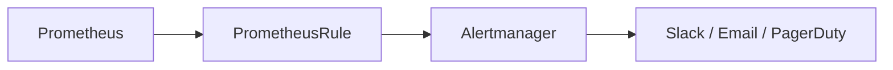
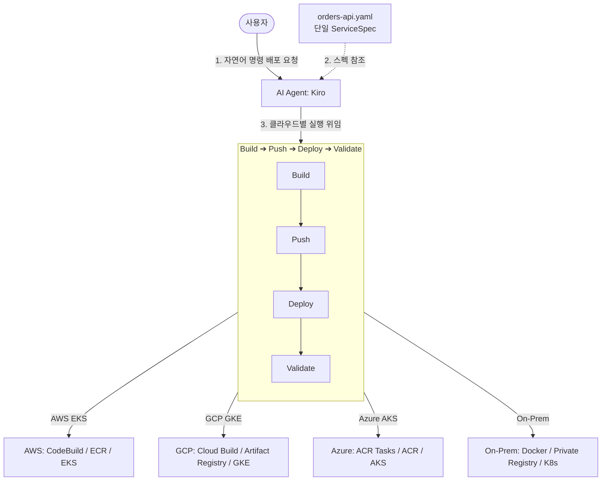

# 4장. 관측 가능성 한 번에 구축하기

## 4장의 목표

3장에서는 GitOps와 CI/CD 파이프라인을 완성했습니다. 코드를 푸시하면 GitHub Actions가 이미지를 빌드하고, Argo CD가 클러스터에 배포합니다.

하지만 배포 자동화만으로 운영이 완성되지는 않습니다.

서비스가 정상인지, CPU나 메모리가 부족하지는 않은지, Pod가 재시작되고 있지는 않은지, 어떤 로그가 쌓이고 있는지, 문제가 생겼을 때 알림을 받을 수 있는지까지 확인할 수 있어야 합니다.

4장에서는 이 문제를 해결하기 위해 Kubernetes 클러스터에 관측 가능성 스택을 구축합니다.

---

## 4장 전체 흐름

그림 4-1. 4장에서 완성하는 Prometheus + Grafana + Loki + Alertmanager 기반 관측 가능성 스택



> 그림 4-1. 4장에서는 메트릭, 로그, 알림을 한 화면에서 확인할 수 있는 관측 가능성 스택을 구축한다.

핵심은 **서비스가 잘 배포되는지뿐 아니라, 배포된 서비스가 실제로 잘 동작하는지 볼 수 있게 만드는 것**입니다.

메트릭은 Prometheus가 수집하고 Grafana가 시각화합니다. 로그는 Fluent Bit가 수집해 Loki에 저장하고, Grafana에서 함께 조회합니다. 알림은 PrometheusRule이 조건을 평가하고 Alertmanager가 라우팅합니다.

```text
메트릭  → Prometheus → Grafana
로그    → Fluent Bit → Loki → Grafana
알림    → PrometheusRule → Alertmanager
```

---

# 4.1 관측 가능성이란

<details>
<summary>**4.1 관측 가능성이란**</summary>

## 핵심 개념

관측 가능성은 시스템 내부에서 무슨 일이 일어나고 있는지 외부에서 파악할 수 있게 해주는 능력입니다.

일반적으로 관측 가능성은 세 가지 요소로 설명합니다.

| 요소 | 의미 | 예시 |
| --- | --- | --- |
| 메트릭 | 숫자 데이터 | CPU 90%, 요청 수 500/s, 에러율 2% |
| 로그 | 텍스트 기록 | connection refused, timeout, stack trace |
| 트레이스 | 요청 흐름 | 하나의 요청이 어떤 서비스를 거쳐 어디에서 느려졌는지 추적 |

4장에서는 이 중 **메트릭**, **로그**, **알림**을 먼저 구축합니다.

트레이스는 서비스 간 호출이 본격적으로 생기는 8장에서 추가합니다.

> 관측 가능성의 네 번째 요소로 프로파일링을 보기도 합니다.  
> 프로파일링은 CPU나 메모리를 어떤 함수가 많이 사용하는지 코드 수준에서 분석하는 방식입니다. 이 책에서는 다루지 않지만, 성능 병목을 깊게 파악할 때 유용합니다.

</details>

---

# 4.2 메트릭 모니터링: Prometheus + Grafana

<details>
<summary>**4.2 메트릭 모니터링: Prometheus + Grafana**</summary>

## 목표

클러스터에서 무슨 일이 일어나고 있는지 숫자로 확인할 수 있도록 메트릭 수집과 시각화를 설정합니다.



> 그림 4-2. 애플리케이션과 클러스터 상태 메트릭을 Prometheus가 수집하고, Grafana가 시각화한다.

```text
Pod / Node / Kubernetes API
        ↓
Prometheus
        ↓
Grafana
```

## 도구 선택

Claude Code에게 메트릭 수집과 시각화 도구를 물어보고, 최종적으로 **Prometheus + Grafana** 조합을 선택합니다.

| 구분 | Prometheus + Grafana | Datadog | Google Cloud Monitoring | CloudWatch |
| --- | --- | --- | --- | --- |
| 추천도 | 높음 | 중간 | 중간 | 낮음 |
| 비용 | 무료 | 유료 | 무료 티어 제한 | AWS 중심 |
| 설치 | Helm 차트 | 에이전트 설치 | GKE 자동 통합 | GKE 부적합 |
| 커스텀 대시보드 | Grafana로 자유롭게 구성 가능 | 자유로움 | 제한적 | 제한적 |
| CNCF | Graduated | 해당 없음 | 해당 없음 | 해당 없음 |
| 통합성 | Loki, Tempo와 연결하기 쉬움 | 자체 APM 포함 | GCP에 제한 | AWS에 제한 |

Notiflex 실습 환경에서는 비용과 리소스 제약이 중요합니다. Prometheus는 낮은 리소스로 시작할 수 있고, Grafana와 함께 메트릭, 로그, 트레이스까지 확장하기 좋습니다.

## Prometheus가 하는 일

Prometheus는 모니터링 대상에게 주기적으로 물어보는 **Pull 기반 수집 방식**을 사용합니다.

```text
Prometheus → Pod의 /metrics 엔드포인트 조회
Prometheus → node-exporter 조회
Prometheus → kube-state-metrics 조회
```

Pull 방식의 장점은 다음과 같습니다.

- 애플리케이션이 모니터링 서버로 직접 데이터를 보낼 필요가 없습니다.
- 새 Pod가 뜨면 Prometheus가 자동으로 발견하고 수집할 수 있습니다.
- 모니터링 서버 장애가 애플리케이션 실행에 직접적인 영향을 주지 않습니다.

## 주요 구성 요소

| 구성 요소 | 역할 |
| --- | --- |
| Prometheus | 메트릭 수집 및 저장 |
| Grafana | 메트릭 시각화 |
| Alertmanager | 알림 라우팅 |
| kube-state-metrics | Kubernetes 오브젝트 상태를 메트릭으로 변환 |
| node-exporter | Node CPU, 메모리, 디스크 I/O 등 시스템 메트릭 수집 |
| Prometheus Operator | ServiceMonitor, PrometheusRule 같은 CRD 관리 |

## 설치 방식

`kube-prometheus-stack` Helm 차트를 사용합니다.

이 차트 하나로 다음 요소가 함께 설치됩니다.

```text
Prometheus
Grafana
Alertmanager
node-exporter
kube-state-metrics
Prometheus Operator
```

<details>
<summary>Helm values 전체 보기</summary>

```yaml
prometheus:
  prometheusSpec:
    resources:
      requests:
        cpu: 100m
        memory: 256Mi
    retention: 24h
    storageSpec: {}

grafana:
  resources:
    requests:
      cpu: 50m
      memory: 128Mi
  adminPassword: notiflex-grafana

alertmanager:
  alertmanagerSpec:
    resources:
      requests:
        cpu: 25m
        memory: 64Mi

prometheusOperator:
  resources:
    requests:
      cpu: 25m
      memory: 64Mi

kubeStateMetrics:
  resources:
    requests:
      cpu: 10m
      memory: 32Mi

nodeExporter:
  resources:
    requests:
      cpu: 10m
      memory: 32Mi
```

</details>

`retention: 24h`는 메트릭 데이터를 24시간만 보관한다는 의미입니다. 실습 환경에서는 디스크를 절약하기 위해 이 정도면 충분합니다. 운영 환경에서는 보통 15~30일 이상으로 설정하거나 Thanos, Cortex 같은 장기 저장 구조를 추가합니다.

## Grafana 접속

```bash
kubectl port-forward svc/kube-prometheus-grafana -n monitoring 3000:80
```

브라우저에서 다음 주소로 접속합니다.

```text
http://localhost:3000
```

로그인 정보는 다음과 같습니다.

```text
ID: admin
PW: notiflex-grafana
```

Grafana에는 기본 대시보드가 자동으로 포함됩니다.

- Kubernetes / Compute Resources / Cluster
- Kubernetes / Compute Resources / Namespace
- Node Exporter / Nodes

### 📸 실습 인증: Grafana Cluster Compute Resources 대시보드


## Prometheus 수집 확인

```bash
kubectl port-forward svc/prometheus-operated -n monitoring 9090:9090
curl -s http://localhost:9090/api/v1/targets | jq '.data.activeTargets | length'
```

예시 결과:

```text
15
```

이는 Prometheus가 15개 타깃에서 메트릭을 수집하고 있음을 의미합니다.

## PromQL 예시

```promql
rate(container_cpu_usage_seconds_total{namespace="notiflex"}[5m])
```

```promql
container_memory_working_set_bytes{namespace="notiflex"}
```

```promql
kube_pod_status_phase{namespace="notiflex"}
```

Grafana 대시보드에서 보이는 그래프도 내부적으로는 PromQL 실행 결과입니다.

<details>
<summary>Mermaid source 보기</summary>



</details>

</details>

---

# 4.3 로그 수집: Loki + Fluent Bit

<details>
<summary>**4.3 로그 수집: Loki + Fluent Bit**</summary>

## 목표

메트릭으로는 “무엇이 이상한지”를 알 수 있지만, “왜 이상한지”를 파악하려면 로그를 봐야 합니다.

4.3에서는 Pod 로그를 중앙에서 수집하고, Grafana에서 조회할 수 있도록 구성합니다.



> 그림 4-3. Fluent Bit가 각 노드의 로그를 수집해 Loki에 저장하고, Grafana가 이를 조회한다.

```text
Container stdout
        ↓
Fluent Bit
        ↓
Loki
        ↓
Grafana
```

## 도구 선택

최종적으로 **Loki + Fluent Bit** 조합을 선택합니다.

| 구분 | Loki + Fluent Bit | ELK Stack | Google Cloud Logging | Datadog Logs |
| --- | --- | --- | --- | --- |
| 추천도 | 높음 | 낮음 | 중간 | 중간 |
| 메모리 | 약 140Mi | 약 2.5Gi 이상 | GKE 기본 | 에이전트 의존 |
| 인덱싱 | 라벨 기반 | 전체 텍스트 | 전체 텍스트 | 전체 텍스트 |
| Grafana 통합 | 네이티브 | Kibana 중심 | 직접 통합 약함 | 자체 UI |
| 비용 | 무료 | 무료지만 운영 비용 큼 | 무료 티어 제한 | 유료 |

Notiflex 환경에서는 리소스가 핵심 제약입니다. Elasticsearch는 최소 메모리 요구량이 높아 실습 환경에는 부담이 큽니다. 반면 Loki는 로그 본문 전체를 인덱싱하지 않고 라벨만 인덱싱하기 때문에 가볍습니다.

## Loki의 라벨 기반 인덱싱

Loki는 로그 본문 전체를 색인하지 않습니다.

대신 다음과 같은 라벨만 인덱싱합니다.

```text
namespace
pod
container
app
job
node_name
```

검색할 때는 라벨로 범위를 좁히고, 그 안에서 로그 본문을 필터링합니다.

```logql
{namespace="notiflex"} |= "error"
```

```logql
{namespace="argocd", container="argocd-server"}
```

```logql
{job="fluent-bit"} | json | level="warn"
```

## LogQL

Loki는 LogQL이라는 전용 쿼리 언어를 사용합니다.

PromQL과 비슷한 구조입니다.

```text
PromQL: rate(http_requests_total{namespace="notiflex"}[5m])
LogQL:  {namespace="notiflex"} |= "error"
```

둘 다 라벨 필터에서 시작하고, 파이프로 조건을 이어 붙이는 형태입니다.

## Loki 설치

Loki는 실습 환경에 맞게 **SingleBinary 모드**로 설치합니다.

SingleBinary 모드는 read, write, backend 같은 여러 컴포넌트를 하나의 Pod에서 실행하는 방식입니다. 프로덕션 대규모 환경에서는 마이크로서비스 모드를 사용하지만, 실습 환경에서는 SingleBinary 모드가 적절합니다.

<details>
<summary>Loki values 전체 보기</summary>

```yaml
deploymentMode: SingleBinary

loki:
  useTestSchema: true
  auth_enabled: false
  storage:
    type: filesystem
    bucketNames:
      chunks: chunks
      ruler: ruler
      admin: admin
  commonConfig:
    replication_factor: 1

singleBinary:
  replicas: 1
  resources:
    requests:
      cpu: 10m
      memory: 128Mi

read:
  replicas: 0

write:
  replicas: 0

backend:
  replicas: 0

gateway:
  enabled: false

chunksCache:
  enabled: false

resultsCache:
  enabled: false
```

</details>

`useTestSchema: true`는 최신 Loki Helm chart에서 schema 설정을 직접 넣지 않았을 때 발생하는 오류를 피하기 위한 설정입니다. 실습 환경에서는 이 설정으로 충분합니다.

## Fluent Bit 설치

Fluent Bit는 DaemonSet으로 설치합니다. 각 노드에 하나씩 배포되어 해당 노드의 모든 컨테이너 로그를 수집합니다.

<details>
<summary>Fluent Bit values 전체 보기</summary>

```yaml
config:
  outputs: |
    [OUTPUT]
        Name        loki
        Match       *
        Host        loki.monitoring.svc.cluster.local
        Port        3100
        Labels      job=fluent-bit
        Auto_Kubernetes_Labels on

resources:
  requests:
    cpu: 10m
    memory: 64Mi
```

</details>

`loki.monitoring.svc.cluster.local`은 Kubernetes 내부 DNS 주소입니다.

형식은 다음과 같습니다.

```text
서비스명.네임스페이스.svc.cluster.local
```

Fluent Bit는 이 주소를 통해 `monitoring` 네임스페이스의 Loki Service로 로그를 전송합니다.

## 로그 수집 확인

```bash
kubectl port-forward svc/loki -n monitoring 3100:3100
curl -s http://localhost:3100/loki/api/v1/labels | jq .data
```

예시 결과:

```json
[
  "app",
  "container",
  "job",
  "namespace",
  "node_name",
  "pod"
]
```

로그 조회 예시는 다음과 같습니다.

```bash
curl -s 'http://localhost:3100/loki/api/v1/query_range'   --data-urlencode 'query={namespace="notiflex"}'   --data-urlencode 'limit=3' | jq '.data.result[0].values[:3]'
```

예시 결과:

```json
[
  ["1712577600000000000", "Starting server on :8080"],
  ["1712577605000000000", "Starting server on :8080"]
]
```

## Grafana에서 Loki 확인

Grafana의 Explore 메뉴에서 Loki 데이터 소스를 선택하고 다음 쿼리를 입력합니다.

```logql
{namespace="notiflex"}
```

정상 동작 기준은 다음과 같습니다.

- Loki SingleBinary Pod가 Running 상태입니다.
- Fluent Bit DaemonSet이 Running 상태입니다.
- Loki에 로그가 수집됩니다.
- Grafana에서 Loki 데이터 소스를 사용할 수 있습니다.

### 📸 실습 인증: Grafana Explore 로그 수집 확인


<details>
<summary>Mermaid source 보기</summary>



</details>

</details>

---

# 4.4 알림 설정: PrometheusRule

<details>
<summary>**4.4 알림 설정: PrometheusRule**</summary>

## 목표

대시보드를 24시간 지켜볼 수는 없습니다. 문제가 생기면 자동으로 알려주는 알림 체계를 설정합니다.



> 그림 4-4. Prometheus가 규칙을 평가하고, Alertmanager가 외부 채널로 알림을 라우팅한다.

```text
Prometheus
    ↓
PrometheusRule 평가
    ↓
Alertmanager
    ↓
Slack / Email / PagerDuty
```

## 도구 선택

최종적으로 **PrometheusRule + Alertmanager** 조합을 선택합니다.

| 구분 | PrometheusRule + Alertmanager | Grafana Alerting | PagerDuty | Google Cloud Monitoring |
| --- | --- | --- | --- | --- |
| 추천도 | 높음 | 중간 | 낮음 | 낮음 |
| 설정 방식 | YAML CRD | Grafana UI | SaaS | GCP 콘솔 |
| GitOps 호환 | 좋음 | 제한적 | 해당 없음 | 해당 없음 |
| 추가 설치 | 이미 포함 | 이미 포함 | 유료 | Prometheus 메트릭 활용 어려움 |
| 에스컬레이션 | 기본 | 기본 | 전문 | 기본 |

PrometheusRule이 더 적합한 이유는 다음과 같습니다.

1. GitOps 일관성  
   `k8s/monitoring/` 디렉터리에 YAML로 저장하면 Argo CD가 자동 관리할 수 있습니다.

2. Alertmanager가 이미 설치되어 있음  
   `kube-prometheus-stack`에 Alertmanager가 포함되어 있습니다.

3. 운영 표준 패턴  
   Kubernetes 운영 환경에서는 `PrometheusRule → Alertmanager → Slack/PagerDuty` 흐름을 많이 사용합니다.

## Grafana Alerting과의 차이

Grafana UI에서도 클릭 몇 번으로 알림을 만들 수 있습니다. 처음에는 더 빠르고 쉽습니다.

하지만 운영 환경에서는 차이가 커집니다.

| 비교 기준 | PrometheusRule | Grafana Alerting |
| --- | --- | --- |
| 저장 위치 | Git 저장소 YAML | Grafana DB |
| 변경 검토 | PR 리뷰 가능 | UI 변경 이력 추적 어려움 |
| 복구 가능성 | Git에서 재적용 가능 | DB 백업 필요 |
| GitOps 적합성 | 높음 | 낮음 |
| 팀 인수인계 | 코드로 설명 가능 | UI 상태 확인 필요 |

GitOps와 Argo CD를 사용하는 흐름에서는 알림도 코드로 남기는 편이 자연스럽습니다.

## Slack 연동 방식

Alertmanager config에 receiver를 추가하면 Slack으로 알림을 보낼 수 있습니다.

```yaml
receivers:
  - name: slack
    slack_configs:
      - channel: '#alerts'
        api_url: 'https://hooks.slack.com/services/...'
```

이 책에서는 알림 규칙 설정과 동작 확인까지만 다루고, 실제 Slack 또는 Email 채널 연동은 운영 환경에서 적용하는 것으로 둡니다.

## PrometheusRule 작성

Pod 재시작이 과도한 경우를 감지하는 알림 규칙을 만듭니다.

<details>
<summary>PrometheusRule YAML 전체 보기</summary>

```yaml
apiVersion: monitoring.coreos.com/v1
kind: PrometheusRule
metadata:
  name: pod-restart-alert
  namespace: monitoring
  labels:
    release: kube-prometheus
spec:
  groups:
    - name: notiflex-alerts
      rules:
        - alert: PodRestartTooMany
          expr: increase(kube_pod_container_status_restarts_total{namespace="notiflex"}[5m]) > 2
          for: 1m
          labels:
            severity: warning
          annotations:
            summary: "Pod {{ $labels.pod }} 재시작 과다"
            description: "네임스페이스 {{ $labels.namespace }}의 {{ $labels.pod }}가 5분 내 {{ $value }}회 재시작되었습니다."
```

</details>

## 주요 필드 설명

| 필드 | 의미 |
| --- | --- |
| `release: kube-prometheus` | Prometheus Operator가 이 Rule을 찾기 위한 라벨 |
| `expr` | 알림 조건 |
| `for: 1m` | 조건이 1분 동안 지속되어야 알림 발동 |
| `severity` | 알림 심각도 |
| `summary` | 알림 제목 |
| `description` | 알림 상세 설명 |

`release: kube-prometheus` 라벨이 없으면 Prometheus Operator가 이 규칙을 무시할 수 있습니다. Helm 설치 시 release 이름을 `kube-prometheus`로 지정했기 때문에 이 라벨과 일치해야 합니다.

`for: 1m`은 조건이 1분간 지속되어야 알림이 발생한다는 뜻입니다. 순간적인 스파이크로 불필요한 알림이 발생하는 것을 줄여줍니다.

## 규칙 적용

```bash
kubectl apply -f k8s/monitoring/pod-restart-alert.yaml
```

예시 결과:

```text
prometheusrule.monitoring.coreos.com/pod-restart-alert created
```

## Prometheus에서 규칙 확인

```bash
kubectl port-forward svc/prometheus-operated -n monitoring 9090:9090
curl -s http://localhost:9090/api/v1/rules   | jq '.data.groups[] | select(.name=="notiflex-alerts") | .rules[].name'
```

예시 결과:

```text
"PodRestartTooMany"
```

Prometheus가 `PodRestartTooMany` 규칙을 정상적으로 로드한 상태입니다.

### 📸 실습 인증: Grafana Alert Rules 상태 확인


## 테스트 시 주의점

Pod를 단순히 삭제하는 것만으로는 이 알림이 발동하지 않을 수 있습니다.

```bash
kubectl delete pod -l app=notiflex-api -n notiflex
```

Deployment가 replicas를 유지하므로 삭제된 Pod는 새 Pod로 교체됩니다. 하지만 `restarts_total`은 같은 Pod 안에서 컨테이너가 재시작된 횟수를 추적합니다.

즉, 새 Pod가 생성되면 재시작 카운터는 0부터 시작합니다.

이 알림이 실제로 발동하려면 다음과 같은 상황이 필요합니다.

```text
같은 Pod 안에서 컨테이너가 반복적으로 죽고 다시 시작됨
→ CrashLoopBackOff
→ restarts_total 증가
→ PrometheusRule 조건 충족
→ Alertmanager로 전달
```

## Alertmanager 상태 확인

```bash
kubectl port-forward svc/alertmanager-operated -n monitoring 9093:9093
curl -s http://localhost:9093/api/v2/status | jq .cluster
curl -s http://localhost:9093/api/v2/alerts | jq '. | length'
```

예시 결과:

```json
{
  "name": "01JSQW...",
  "status": "ready",
  "peers": [
    {
      "name": "01JSQW...",
      "address": "10.x.x.x:9094"
    }
  ]
}
```

```text
0
```

Alertmanager는 정상 동작 중이며, 현재 발동된 알림은 없는 상태입니다.

## 4장 완료 후 아키텍처

```text
[메트릭 경로]
[앱 Pod] ── /metrics ──> [Prometheus] ──> [Grafana]
                         │
                         │ PrometheusRule 평가
                         │ PodRestartTooMany
                         ↓
                   [Alertmanager] ──> 알림

[로그 경로]
[컨테이너 stdout] ──> [Fluent Bit x 2] ──> [Loki] ──> [Grafana]
                         DaemonSet
```

<details>
<summary>Mermaid source 보기</summary>



</details>

</details>

---

# 4.5 마무리: 메모리에 작업 컨텍스트 기록

<details>
<summary>**4.5 마무리: 메모리에 작업 컨텍스트 기록**</summary>

## 목표

4장에서 쌓인 작업 컨텍스트를 Claude Code의 메모리에 기록합니다.

3장과 4장을 거치며 두 종류의 컨텍스트가 생겼습니다.

| 유형 | 예시 | 저장 방식 |
| --- | --- | --- |
| 결정 기록 | Argo CD를 GitOps 도구로 선택한 이유, Loki를 선택한 이유 | 5장에서 다룸 |
| 작업 컨텍스트 | PrometheusRule 임계값 조정 TODO, Helm chart 선호, 리소스 제약 | 메모리에 기록 |

4장에서는 작업 컨텍스트를 다룹니다.

## Claude Code의 메모리

Claude Code에는 두 가지 기억 메커니즘이 있습니다.

| 구분 | 설명 |
| --- | --- |
| `CLAUDE.md` | 사용자가 직접 작성하는 프로젝트 지침. 세션 시작 시 전체 로드 |
| memory | Claude Code가 의미 있는 컨텍스트를 별도 토픽 파일로 저장하고, 필요할 때 참조 |

메모리는 프로젝트 루트가 아니라 홈 디렉터리 아래에 저장됩니다.

```text
~/.claude/projects/<프로젝트>/memory/
```

`MEMORY.md`는 세션 시작 시 첫 200줄 또는 약 25KB까지 로드되는 목차 역할을 하고, 개별 토픽 파일은 관련 주제가 나올 때 Claude Code가 읽어옵니다.

## 메모리에 기록한 내용

예시 요청:

```text
PrometheusRule 임계값은 일단 5분/3회로 뒀는데, 운영 데이터를 보고 조정해야 해.
메모리에 TODO로 적어 둬.
```

생성된 예시 파일:

```text
~/.claude/projects/<프로젝트>/memory/todo-prometheusrule-threshold.md
```

예시 내용:

```markdown
# PrometheusRule 임계값 조정 TODO

Pod 재시작 알림 임계값을 일단 5분/3회로 설정했음.
실제 운영 데이터를 1~2주 수집한 뒤 조정 예정.

대상 알림:
- PodRestartTooMany: 현재 5m/3회, 운영 데이터 보고 조정
- HighMemoryUsage: 현재 80%, 80%가 적정한지 확인 필요
```

## 메모리에 적어둘 만한 항목

```text
TODO: 분산 트레이싱(Tempo)은 서비스 간 호출이 생기는 8장에서 도입
사용자 선호: kubectl apply보다 Helm chart 사용 의도
작업 패턴: Pod 리소스 requests 설정 시 resource-budget.md 참조 우선순위
금지 사항: 이미지 태그 latest 금지, 공식 sha 또는 vX.Y.Z만 사용
```

이렇게 저장해 두면 새 대화에서도 Claude Code가 같은 컨텍스트를 이어갈 수 있습니다.

## `/update-docs`

4장 마지막에는 `/update-docs`를 실행해 변경 사항을 `JOURNEY.md`에 반영합니다.

기록되는 내용은 다음과 같습니다.

```text
4장 관측 가능성 도구 선택
- Prometheus + Grafana
- Loki + Fluent Bit
- PrometheusRule 알림

추가된 리소스 사용량
현재 아키텍처 상태
다음 장으로 이어질 TODO
```

예시 커밋:

```bash
git status
git add JOURNEY.md
git commit -m "ch4: 관측 가능성 스택 구축(메트릭, 로그, 알림)"
git push origin main
```

</details>

---

# 4.6 4장 가드레일 살펴보기

<details>
<summary>**4.6 4장 가드레일 살펴보기**</summary>

## 4장의 프롬프트 패턴

4장에서는 3-프롬프트 패턴을 반복해서 사용합니다.

```text
탐색 → 비교 → 실행
```

각 서브챕터에서 먼저 Claude Code에게 도구 선택을 물어보고, 대안을 비교한 뒤 최종 도구를 설치합니다.

## 4장 가드레일 표

| 서브챕터 | 유형 | 참고 파일 | 역할 |
| --- | --- | --- | --- |
| 4.2 탐색/비교 | 탐색과 비교 | `decision-guides/ch4/4.2-metrics-monitoring.md` | Prometheus 추천 및 대안 비교 |
| 4.2 실행 | 실행 | `prompt-guardrails/ch4/4.2-prometheus-grafana.md` | kube-prometheus-stack 설치 |
| 4.3 탐색/비교 | 탐색과 비교 | `decision-guides/ch4/4.3-logging.md` | Loki 추천 및 ELK 비교 |
| 4.3 실행 | 실행 | `prompt-guardrails/ch4/4.3-loki-fluentbit.md` | Loki + Fluent Bit 설치 |
| 4.4 탐색/비교 | 탐색과 비교 | `decision-guides/ch4/4.4-alerting.md` | PrometheusRule 추천 및 비교 |
| 4.4 실행 | 실행 | `prompt-guardrails/ch4/4.4-alerting.md` | PrometheusRule 작성 |

## 4장의 특징

4장의 특징은 4.2, 4.3, 4.4 모두 독립적인 도구 선택이 필요하다는 점입니다.

그래서 각 영역마다 다음 흐름을 반복합니다.

```text
1. 어떤 도구가 적합한지 묻는다.
2. 다른 선택지와 비교한다.
3. 현재 실습 환경에 맞는 도구를 고른다.
4. Helm values로 리소스를 줄인다.
5. 설치 후 실제 동작을 확인한다.
6. Git에 기록한다.
```

또한 `resource-budget.md`를 참고하여 `e2-medium` 노드에 맞는 리소스 requests를 적용한 것도 중요한 포인트입니다.

</details>

---

# 4장 최종 정리

## 이번 장에서 만든 것

4장에서는 관측 가능성의 세 가지 요소 중 두 가지와 알림 체계를 구축했습니다.

| 영역 | 구축한 도구 | 결과 |
| --- | --- | --- |
| 메트릭 | Prometheus | 클러스터와 Pod 상태를 숫자로 수집 |
| 시각화 | Grafana | 메트릭과 로그를 한 화면에서 확인 |
| 로그 | Fluent Bit + Loki | 모든 노드의 컨테이너 로그를 중앙 수집 |
| 알림 | PrometheusRule + Alertmanager | Pod 재시작 과다 조건을 감지하고 알림 라우팅 준비 |
| 작업 컨텍스트 | Claude Code memory | 임계값 조정 TODO와 운영 패턴 저장 |
| 문서화 | `/update-docs` | JOURNEY.md에 4장 변경 사항 반영 |

## 최종 상태

```text
GKE: notiflex-cluster

├── monitoring namespace
│   ├── Prometheus
│   │   ├── 메트릭 수집
│   │   └── PrometheusRule: PodRestartTooMany
│   │
│   ├── Grafana
│   │   ├── 메트릭 대시보드
│   │   └── Loki 로그 조회
│   │
│   ├── Alertmanager
│   │   └── 알림 라우팅
│   │
│   ├── Loki
│   │   └── 로그 저장
│   │
│   ├── Fluent Bit x 2
│   │   └── 각 노드의 컨테이너 로그 수집
│   │
│   ├── kube-state-metrics
│   │   └── Kubernetes 오브젝트 상태 수집
│   │
│   └── node-exporter x 2
│       └── 노드 시스템 메트릭 수집
│
├── argocd namespace
│   └── Argo CD
│       └── GitOps 동기화
│
└── notiflex namespace
    └── notiflex-api
        └── /metrics 노출
```

## 4장의 핵심 문장

> 운영은 배포 이후부터 시작된다.

> 메트릭은 무엇이 이상한지를 알려주고, 로그는 왜 이상한지를 알려준다.

> PrometheusRule은 알림 규칙을 Git으로 관리하게 해준다.

> Grafana는 메트릭과 로그를 한 화면에서 연결한다.

> 관측 가능성도 애플리케이션처럼 코드로 관리해야 합니다.

## 🔗 관련 관리 콘솔 링크
- [Google Cloud Console - GKE 클러스터 상세 (모니터링 탭)](https://console.cloud.google.com/kubernetes/workload_/gcloud/asia-northeast3-a/notiflex-cluster?project=claude-study-501117)
- [Grafana Local Web UI](http://localhost:3000)

## 🧪 [추가 실험] Platform Agent (Kiro) — 멀티클라우드 자동 배포

본 실습과 별개로, 자연어 명령과 단일 스펙 파일만으로 멀티클라우드(EKS, GKE, AKS, On-Prem)에 동일한 파이프라인을 실행하는 **AI 플랫폼 에이전트(Kiro) 아키텍처**를 구상하고 실험합니다.

### 1. 아키텍처 개요
사용자는 복잡한 클라우드별 배포 명령어(CLI)를 몰라도, 자연어 한 줄과 공통 서비스 명세서(YAML) 단 1개만 에이전트에게 제공하면 됩니다. AI 에이전트 `Kiro`가 컨텍스트를 파싱하여 대상 클라우드에 맞는 빌드/배포 도구를 매핑하여 수행합니다.



### 2. ServiceSpec 정의 (orders-api.yaml)
클라우드 벤더에 종속되지 않는 최소한의 공통 파라미터만 정의합니다.

```yaml
# orders-api.yaml
name: orders-api
image: orders-api
version: v1.4.2
replicas: 3
ports: [8080]
health: /healthz
```

### 3. 클라우드 Provider별 파이프라인 매핑 구조

동일한 추상 파이프라인(`Build ➔ Push ➔ Deploy ➔ Validate`) 하위에서, 각 클라우드 제공업체별로 실행되는 구체적인 기술 스택 매핑은 다음과 같습니다.

| 단계 | AWS (EKS) | GCP (GKE) | Azure (AKS) | On-Prem K8s |
| :--- | :--- | :--- | :--- | :--- |
| **Build** | AWS CodeBuild | GCP Cloud Build | ACR Tasks | Local `docker build` |
| **Push** | AWS ECR | GCP Artifact Registry | Azure Container Registry | Private Registry |
| **Deploy** | `kubectl` ➔ EKS | `kubectl` ➔ GKE | `kubectl` ➔ AKS | `kubectl` ➔ Local K8s |
| **Validate** | HTTP Health Check | HTTP Health Check | HTTP Health Check | HTTP Health Check |

### 4. 에이전트 시나리오 예시
1. **사용자 요청**: `"orders-api를 v1.4.2로 GCP(GKE) 환경에 replicas 3개로 배포해줘."`
2. **Kiro의 해석**:
   - `orders-api.yaml`에서 타겟 사양 파싱
   - 타겟 프로바이더 `GCP` 인식
   - 실행 계획 구성:
     1. GCP Cloud Build 호출하여 컨테이너 이미지 빌드
     2. GCR/Artifact Registry로 푸시
     3. GKE 클러스터에 Deployment 리소스 생성/갱신 (`replicas: 3`)
     4. `/healthz` 경로로 Pod 헬스체크 성공 여부 최종 검증(Validate)
3. **결과 보고**: `"GCP GKE 환경에 orders-api v1.4.2 배포가 완료되었으며, 3개의 Pod가 Healthy 상태임을 확인했습니다."`

## 다음 장으로 이어지는 문제

4장이 끝나면 서비스 상태를 볼 수 있게 됩니다.

하지만 아직 한 가지 문제가 남아 있습니다.

새 버전을 배포할 때마다 순간적으로 서비스가 끊길 수 있습니다. 사용자가 요청을 보내는 도중 Pod가 교체되면 오류가 발생할 수 있습니다.

따라서 5장에서는 이 문제를 해결하기 위해 **무중단 배포**를 구현합니다.

```text
4장: 서비스 상태를 볼 수 있게 만들기
5장: 서비스가 끊기지 않게 배포하기
```
