# 5장. 무중단 배포

## 5장의 목표

4장에서는 Prometheus, Grafana, Loki, Fluent Bit, Alertmanager를 구성해 클러스터 내부에서 무슨 일이 일어나는지 관찰할 수 있게 만들었습니다.

하지만 배포할 때마다 사용자가 잠깐씩 오류를 경험하는 문제는 아직 남아 있습니다. 3장의 Rolling Update는 Pod를 순차적으로 교체하지만, 새 Pod가 `Ready`가 된 직후 실제 요청을 안정적으로 처리할 수 있는지 검증할 시간은 주지 않습니다. 문제가 발견되어 롤백하는 동안에도 일부 사용자는 이미 오류를 경험할 수 있습니다.

5장에서는 다음 두 가지를 해결합니다.

- **Gateway API**로 외부 트래픽 진입점을 구성합니다.
- **Argo Rollouts의 Blue/Green 전략**으로 배포와 검증을 분리합니다.

최종적으로 새 버전을 완전히 준비한 뒤 트래픽을 한 번에 전환하고, 문제가 생기면 기존 ReplicaSet으로 즉시 되돌릴 수 있는 배포 구조를 완성합니다.

---

## 5장 전체 흐름

그림 5-1. Gateway API와 Argo Rollouts로 완성하는 무중단 배포 아키텍처

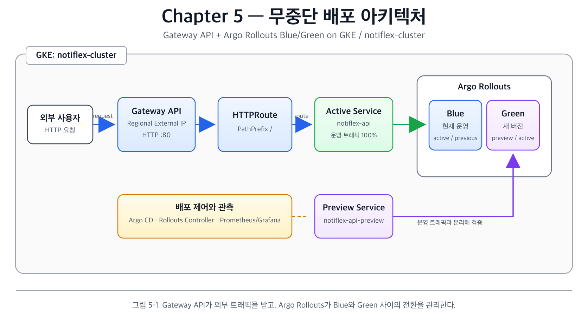

> 그림 5-1. Gateway API가 외부 트래픽을 받고, Argo Rollouts가 Blue와 Green 사이의 전환을 관리한다.

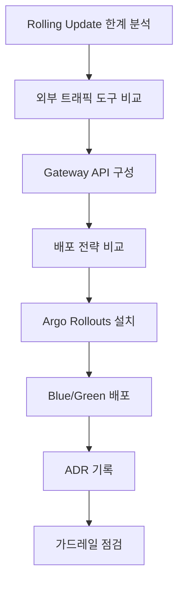

핵심은 **새 버전을 운영 트래픽과 분리된 상태에서 먼저 준비하고 검증한 뒤, Service가 가리키는 ReplicaSet만 전환하는 것**입니다.

---

# 5.1 Rolling Update는 왜 서비스가 끊기는가

<details>
<summary>**5.1 Rolling Update는 왜 서비스가 끊기는가**</summary>

## Rolling Update의 동작

Kubernetes의 기본 Deployment는 Rolling Update 방식으로 Pod를 하나씩 교체합니다.

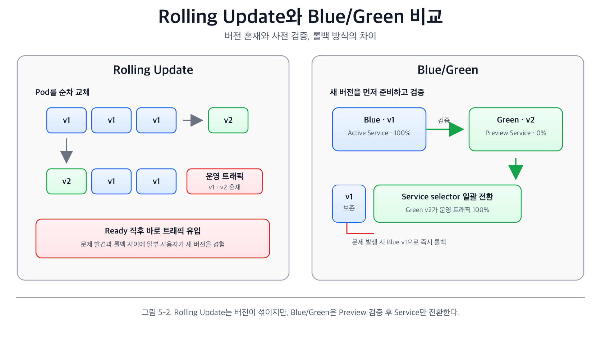

> 그림 5-2. Rolling Update는 운영 중 두 버전이 섞이지만, Blue/Green은 새 버전을 Preview에서 검증한 뒤 Service만 전환한다.

```
[v1][v1][v1]
      ↓
[v2][v1][v1]
      ↓
[v2][v2][v1]
      ↓
[v2][v2][v2]
```

새 Pod가 `Ready`가 될 때까지 기다린 뒤 기존 Pod를 내리므로, 구조 자체는 잘 설계되어 있습니다. 그러나 `Ready`는 애플리케이션이 실제 운영 요청을 완벽하게 처리할 준비가 끝났다는 의미와 항상 같지는 않습니다.

예를 들어 `/health`가 200을 반환해 Pod가 Ready 상태가 되었더라도 다음 작업은 아직 끝나지 않았을 수 있습니다.

- 커넥션 풀 초기화
- 캐시 워밍업
- 외부 서비스 연결
- 최초 요청에 필요한 데이터 로딩

따라서 새 Pod가 트래픽을 받기 시작한 직후 일부 요청이 느려지거나 5xx 오류를 반환할 수 있습니다.

## Rolling Update의 세 가지 한계

1. **배포와 트래픽 전환이 동시에 시작됩니다.**
    - 새 Pod가 Ready가 되면 즉시 일부 트래픽이 유입됩니다.
2. **새 버전을 운영 트래픽 없이 미리 검증하기 어렵습니다.**
    - 별도의 Preview 환경이 없습니다.
3. **롤백도 또 하나의 Rolling Update입니다.**
    - 이전 ReplicaSet을 다시 확장하고 새 ReplicaSet을 축소하는 동안 시간이 걸립니다.

문제를 발견할 시점에는 일부 사용자가 이미 새 버전을 경험했을 수 있습니다.

## Blue/Green으로 해결하는 이유

Blue/Green은 현재 버전과 새 버전을 동시에 유지하되, 트래픽은 하나의 버전에만 전달합니다.

```
Blue  : [v1 active]  ← 운영 트래픽 100%
Green : [v2 preview] ← 운영 트래픽 0%

검증 완료 후

Blue  : [v1 previous]
Green : [v2 active]  ← 운영 트래픽 100%
```

새 버전을 완전히 준비한 후 한 번에 전환하므로 버전 혼재가 없습니다. 문제가 있으면 기존 ReplicaSet이 남아 있어 즉시 되돌릴 수 있습니다.

| 구분 | Rolling Update | Blue/Green |
| --- | --- | --- |
| 버전 전환 | Pod를 순차 교체 | 새 버전 준비 후 한 번에 전환 |
| 배포 중 버전 혼재 | 있음 | 운영 트래픽 기준 없음 |
| 사전 검증 | 제한적 | Preview Service로 가능 |
| 롤백 | 역방향 Rolling Update | 기존 ReplicaSet으로 즉시 전환 |
| 추가 리소스 | 적음 | 전환 중 약 2배 |

Notiflex API는 replica가 2개이고 각 Pod의 요청량도 작기 때문에, 짧은 전환 시간 동안 Blue 2개와 Green 2개를 동시에 실행해도 현재 e2-medium 노드 2대로 충분합니다.

</details>

---

# 5.2 외부 트래픽 관리: Gateway API

<details>
<summary>**5.2 외부 트래픽 관리: Gateway API**</summary>

## 목표

기존 Notiflex API는 `ClusterIP` Service이므로 클러스터 내부에서만 접근할 수 있었습니다. `kubectl port-forward`는 테스트에는 유용하지만 실제 서비스의 외부 진입점으로 사용할 수 없습니다.

외부 트래픽을 받으려면 다음 두 가지가 필요합니다.

- 외부 IP를 제공하는 로드밸런서
- 요청 경로를 Kubernetes Service로 전달하는 라우팅 규칙

5장에서는 GKE의 관리형 **Gateway API**로 이를 구성합니다.

## 도구 비교

| 구분 | Gateway API | Ingress NGINX | Istio Gateway | Traefik |
| --- | --- | --- | --- | --- |
| 추천도 | 높음 | 중간 | 낮음 | 중간 |
| 설치 | GKE 관리형 | Helm 설치 | Helm 설치 | Helm 설치 |
| 추가 리소스 | 클러스터 Pod 없음 | Controller 약 100m/90Mi | istiod와 Sidecar 필요 | Controller 약 100m/50Mi |
| 가중치 라우팅 | 표준 지원 | Annotation 중심 | 강력하게 지원 | 지원 |
| GKE 연동 | 네이티브 | 수동 구성 | 수동 구성 | 수동 구성 |
| 학습 곡선 | 낮음 | 낮음 | 높음 | 중간 |

Gateway API를 선택한 이유는 다음과 같습니다.

1. GKE가 GatewayClass와 Controller를 관리하므로 별도 Controller 설치가 필요 없습니다.
2. Gateway와 HTTPRoute로 인프라와 애플리케이션 라우팅 책임을 분리합니다.
3. HTTPRoute의 `backendRefs.weight`를 이용해 Argo Rollouts와 트래픽 전환을 연동할 수 있습니다.
4. NGINX나 Istio를 추가로 실행할 리소스 여유가 적은 실습 환경에 적합합니다.

## Gateway API의 핵심 리소스

| 리소스 | 역할 |
| --- | --- |
| GatewayClass | Gateway를 구현할 Controller 또는 로드밸런서 유형 지정 |
| Gateway | 수신할 IP, 포트, 프로토콜 정의 |
| HTTPRoute | 호스트와 경로별로 요청을 어느 Service에 보낼지 정의 |
| HealthCheckPolicy | GKE 로드밸런서가 백엔드 상태를 확인할 경로와 포트 정의 |

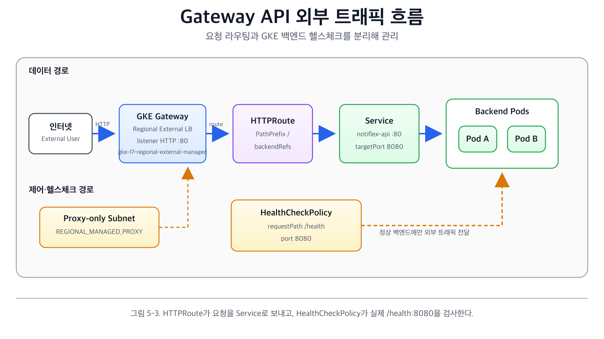

> 그림 5-3. HTTPRoute가 요청을 Service로 보내고, HealthCheckPolicy가 실제 `/health:8080` 경로로 백엔드를 검사한다.

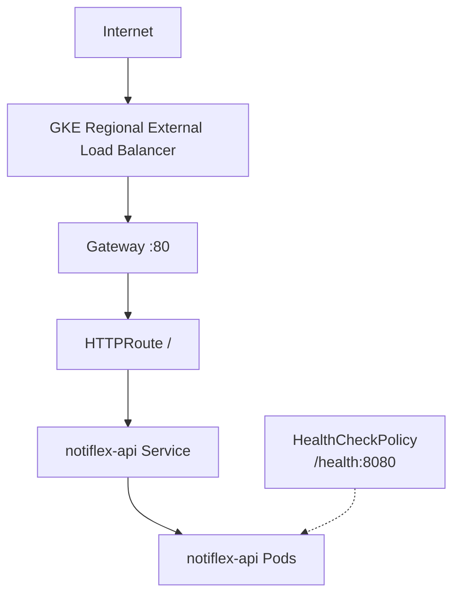

## 1. GatewayClass 확인

2.5장에서 클러스터 생성 시 `--gateway-api=standard` 옵션을 사용했으므로 GKE Gateway API CRD와 관리형 GatewayClass가 설치되어 있습니다.

```bash
kubectl --context gke-sysnet4admin_book_gitaiops get gatewayclass
```

단일 리전인 `asia-northeast3`에서 운영하므로 다음 GatewayClass를 사용합니다.

```
gke-l7-regional-external-managed
```

글로벌 외부 로드밸런서는 여러 지역 사용자를 대상으로 할 때 유용하지만, 단일 리전 학습 환경에서는 리전 로드밸런서가 비용과 구성이 더 단순합니다.

## 2. Gateway 생성

```yaml
# k8s/gateway/gateway.yaml
apiVersion: gateway.networking.k8s.io/v1
kind: Gateway
metadata:
  name: notiflex-gateway
  namespace: notiflex
spec:
  gatewayClassName: gke-l7-regional-external-managed
  listeners:
    - name: http
      port: 80
      protocol: HTTP
      allowedRoutes:
        namespaces:
          from: Same
```

`allowedRoutes.namespaces.from: Same`은 동일한 `notiflex` namespace에 있는 HTTPRoute만 이 Gateway에 연결할 수 있게 제한합니다.

## 3. HTTPRoute 생성

```yaml
# k8s/gateway/httproute.yaml
apiVersion: gateway.networking.k8s.io/v1
kind: HTTPRoute
metadata:
  name: notiflex-route
  namespace: notiflex
spec:
  parentRefs:
    - name: notiflex-gateway
  rules:
    - matches:
        - path:
            type: PathPrefix
            value: /
      backendRefs:
        - name: notiflex-api
          port: 80
```

현재는 모든 경로를 `notiflex-api` Service로 전달합니다. 이후 Canary 배포에서는 `backendRefs`에 여러 Service와 `weight`를 지정해 트래픽 비율을 조정할 수 있습니다.

## 4. HealthCheckPolicy 생성

GKE 로드밸런서는 별도 설정이 없으면 `/` 경로로 헬스체크를 수행합니다. Notiflex API의 실제 헬스체크 경로는 `/health`, 컨테이너 포트는 `8080`이므로 이를 명시해야 합니다.

```yaml
# k8s/gateway/healthcheckpolicy.yaml
apiVersion: networking.gke.io/v1
kind: HealthCheckPolicy
metadata:
  name: notiflex-healthcheck
  namespace: notiflex
spec:
  default:
    checkIntervalSec: 15
    timeoutSec: 5
    healthyThreshold: 1
    unhealthyThreshold: 2
    config:
      type: HTTP
      httpHealthCheck:
        port: 8080
        requestPath: /health
  targetRef:
    group: ""
    kind: Service
    name: notiflex-api
```

`readinessProbe`와 `HealthCheckPolicy`는 검사 계층이 다릅니다.

- `readinessProbe`: kubelet이 Pod를 Service 엔드포인트에 포함할지 판단합니다.
- `HealthCheckPolicy`: GKE 로드밸런서가 외부 트래픽을 해당 백엔드로 보낼지 판단합니다.

외부 요청은 로드밸런서와 네트워크 경로를 통과하므로 두 단계의 헬스체크가 모두 필요합니다.

## 5. Proxy-only 서브넷 확인

리전 외부 Gateway는 GKE 로드밸런서 프록시가 사용하는 `REGIONAL_MANAGED_PROXY` 용도의 서브넷이 필요합니다.

```bash
gcloud compute networks subnets list \
  --filter="purpose=REGIONAL_MANAGED_PROXY" \
  --format="table(name,region,ipCidrRange,purpose)"
```

없다면 GKE Pod 또는 Service 대역과 겹치지 않는 CIDR로 생성합니다.

```bash
gcloud compute networks subnets create proxy-only-subnet \
  --purpose=REGIONAL_MANAGED_PROXY \
  --role=ACTIVE \
  --region=asia-northeast3 \
  --network=default \
  --range=172.16.0.0/23
```

## 6. 외부 IP 확인 및 테스트

```bash
kubectl --context gke-sysnet4admin_book_gitaiops apply -f k8s/gateway/
kubectl --context gke-sysnet4admin_book_gitaiops get gateway -n notiflex -w
```

GKE가 로드밸런서, 포워딩 규칙, URL 맵, 백엔드 서비스를 생성하는 데 약간의 시간이 필요합니다. `PROGRAMMED=True`와 외부 IP가 확인되면 테스트합니다.

```bash
GATEWAY_IP=$(kubectl --context gke-sysnet4admin_book_gitaiops \
  get gateway notiflex-gateway -n notiflex \
  -o jsonpath='{.status.addresses[0].value}')

curl http://$GATEWAY_IP/health
curl http://$GATEWAY_IP/id
curl http://$GATEWAY_IP/version
```

### 📸 실습 인증: Gateway API 외부 접속 테스트

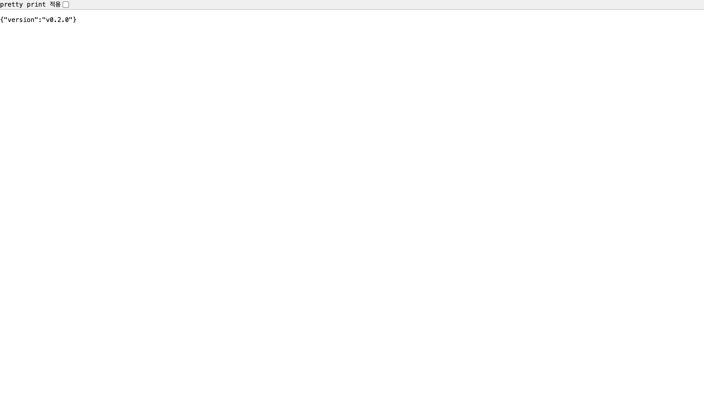

> [!TIP]
> GKE Gateway L7 로드밸런서가 정상적으로 작동하며, 외부 IP를 통해 `/version` API에 접근해 `v0.1.1` 버전을 반환하는 것을 확인할 수 있습니다.

## HTTPS 적용

실습에서는 구성을 단순화하기 위해 HTTP만 사용합니다. 실제 운영 환경에서는 다음 구성이 필요합니다.

1. Google-managed Certificate 또는 기존 인증서 준비
2. Gateway에 HTTPS listener와 `certificateRefs` 추가
3. DNS를 Gateway IP에 연결
4. HTTP에서 HTTPS로 리디렉트하는 별도 HTTPRoute 구성

## Preview Service 접근

Blue/Green의 Preview Service는 기본적으로 `ClusterIP`이므로 클러스터 내부에서만 접근합니다.

```bash
kubectl --context gke-sysnet4admin_book_gitaiops port-forward svc/notiflex-api-preview -n notiflex 8080:80
curl http://localhost:8080/version
```

실제 운영에서는 `preview.notiflex.example.com` 같은 별도 호스트의 HTTPRoute를 만들어 QA 팀이 운영 환경과 동일한 경로로 검증할 수 있습니다.

</details>

---

# 5.3 무중단 전환: Blue/Green 배포

<details>
<summary>**5.3 무중단 전환: Blue/Green 배포**</summary>

## 목표

기본 Deployment를 Argo Rollouts의 Rollout CRD로 전환하고, 현재 버전과 새 버전을 동시에 실행한 뒤 Service selector를 전환하는 Blue/Green 배포를 구성합니다.

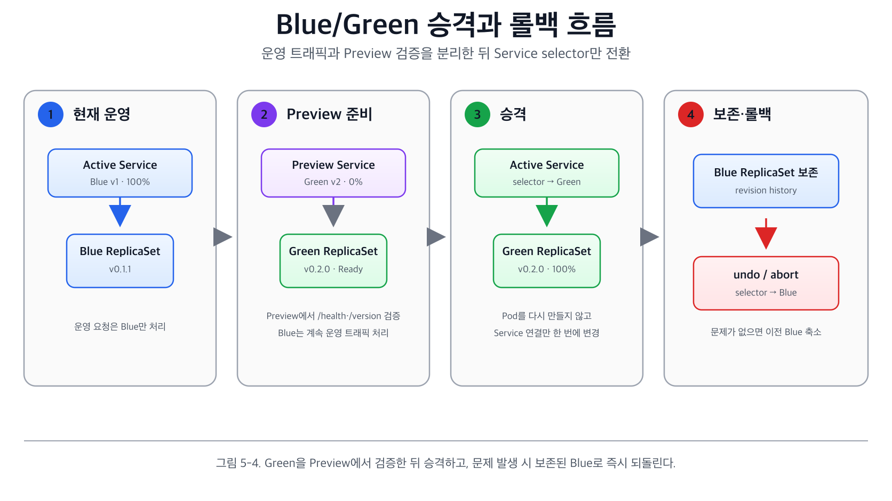

> 그림 5-4. Green을 Preview에서 검증한 뒤 승격하고, 문제가 생기면 보존된 Blue로 즉시 되돌린다.

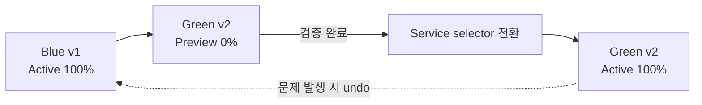

## 도구 비교

| 구분 | Argo Rollouts | Flagger | Kubernetes 기본 Rolling Update |
| --- | --- | --- | --- |
| 추천도 | 높음 | 중간 | 낮음 |
| Blue/Green | 지원 | 제한적 | 미지원 |
| Canary | 지원 | 지원 | 미지원 |
| 메트릭 분석 | AnalysisRun 지원 | 강력하게 지원 | 없음 |
| Argo CD 통합 | 네이티브 | 제한적 | 별도 기능 없음 |
| Istio 의존성 | 없음 | 기본 조합에서 사용 | 없음 |
| Controller 메모리 | 약 50Mi | Flagger와 서비스 메시 리소스 필요 | 추가 리소스 없음 |

Argo Rollouts를 선택한 이유는 다음과 같습니다.

- 기존 Argo CD 기반 GitOps 흐름과 자연스럽게 통합됩니다.
- 하나의 Rollout CRD로 Blue/Green과 Canary를 모두 지원합니다.
- 이후 6장에서 AnalysisRun을 추가해 메트릭 기반 자동 판정으로 확장할 수 있습니다.
- 별도의 서비스 메시 없이도 현재 환경에 적용할 수 있습니다.

## Deployment와 Rollout의 차이

Kubernetes 기본 Deployment는 Rolling Update만 제공합니다. Blue/Green과 Canary는 단순한 replica 수 조절이 아니라 두 ReplicaSet의 상태, Service 연결, 승격과 롤백을 함께 관리해야 하므로 별도의 상태 관리 로직이 필요합니다.

Rollout CRD는 Deployment와 거의 같은 Pod template을 사용하면서 `strategy` 필드에 고급 배포 전략을 선언합니다.

```
Deployment
  └─ RollingUpdate

Rollout
  ├─ BlueGreen
  ├─ Canary
  └─ AnalysisRun / Experiment 연동
```

`argoproj.io/v1alpha1`이라는 API 버전은 Kubernetes 코어 API의 성숙도와 동일한 기준으로 해석하면 안 됩니다. Argo Rollouts 프로젝트가 자체적으로 관리하는 CRD 버전이며, 실제 프로젝트의 안정성과 운영 성숙도는 별도로 판단해야 합니다.

## 1. Argo Rollouts Controller 설치

```bash
kubectl --context gke-sysnet4admin_book_gitaiops create namespace argo-rollouts
kubectl --context gke-sysnet4admin_book_gitaiops apply -n argo-rollouts \
  -f https://github.com/argoproj/argo-rollouts/releases/latest/download/install.yaml

kubectl --context gke-sysnet4admin_book_gitaiops get pods -n argo-rollouts
```

Controller는 Rollout CRD를 감시하고 Blue/Green 또는 Canary 전략을 실행합니다.

주요 CRD는 다음과 같습니다.

- `Rollout`: Deployment를 대체하는 핵심 리소스
- `AnalysisRun` / `AnalysisTemplate`: 메트릭 기반 분석
- `Experiment`: 여러 버전을 비교하는 실험

프로덕션에서는 Helm 차트를 사용해 replica, 리소스, 버전을 명시적으로 관리할 수 있습니다. 실습에서는 공식 install manifest를 그대로 적용합니다.

## 2. kubectl 플러그인 설치

기본 `kubectl get rollout` 명령으로도 리소스 조회는 가능하지만, 배포 진행 과정을 트리 구조와 상태로 관찰하려면 전용 플러그인이 편리합니다.

```bash
# macOS
brew install argoproj/tap/kubectl-argo-rollouts

# Linux
curl -LO https://github.com/argoproj/argo-rollouts/releases/latest/download/kubectl-argo-rollouts-linux-amd64
chmod +x kubectl-argo-rollouts-linux-amd64
sudo mv kubectl-argo-rollouts-linux-amd64 /usr/local/bin/kubectl-argo-rollouts

kubectl --context gke-sysnet4admin_book_gitaiops argo rollouts version
```

`kubectl-argo-rollouts` 실행 파일을 PATH에 두면 `kubectl argo rollouts ...` 형태의 서브커맨드로 호출됩니다. 기존 kubectl 워크플로를 대체하는 별도 CLI가 아니라 시각화와 승격 명령을 확장하는 플러그인입니다.

## 3. Deployment를 Rollout으로 전환

기존 `deployment.yaml`과 `rollout.yaml`을 동시에 유지하면 Argo CD가 두 리소스를 모두 배포해 Pod가 중복 생성됩니다. 반드시 기존 Deployment manifest를 제거해야 합니다.

Rollout의 핵심 설정은 다음과 같습니다.

```yaml
# k8s/smb/rollout.yaml
apiVersion: argoproj.io/v1alpha1
kind: Rollout
metadata:
  name: notiflex-api
  namespace: notiflex
spec:
  replicas: 2
  revisionHistoryLimit: 3
  selector:
    matchLabels:
      app: notiflex-api
  strategy:
    blueGreen:
      activeService: notiflex-api
      previewService: notiflex-api-preview
      autoPromotionEnabled: true
      autoPromotionSeconds: 30
  template:
    metadata:
      labels:
        app: notiflex-api
    spec:
      containers:
        - name: notiflex-api
          image: asia-northeast3-docker.pkg.dev/PROJECT_ID/notiflex/api:v0.1.1
          ports:
            - containerPort: 8080
          resources:
            requests:
              cpu: 50m
              memory: 64Mi
            limits:
              cpu: 100m
              memory: 128Mi
          readinessProbe:
            httpGet:
              path: /health
              port: 8080
            initialDelaySeconds: 5
            periodSeconds: 10
          livenessProbe:
            httpGet:
              path: /health
              port: 8080
            initialDelaySeconds: 10
            periodSeconds: 30
```

- `activeService`: 실제 운영 트래픽을 받는 Service
- `previewService`: 새 버전을 사전 검증하는 Service
- `autoPromotionEnabled`: 자동 승격 여부
- `autoPromotionSeconds`: 새 버전이 준비된 뒤 승격까지 기다릴 시간

`autoPromotionEnabled: false`로 설정하면 새 ReplicaSet이 Ready가 된 뒤 Rollout이 `Paused` 상태로 멈춥니다. Preview Service로 검증한 뒤 다음 명령으로 수동 승격합니다.

```bash
kubectl --context gke-sysnet4admin_book_gitaiops argo rollouts promote notiflex-api -n notiflex
```

초기 프로덕션 환경에서는 수동 승격으로 시작한 뒤, 신뢰가 쌓이면 자동 승격이나 AnalysisRun 기반 판정으로 발전시키는 방식이 안전합니다.

## 4. Preview Service 생성

```yaml
# k8s/smb/service-preview.yaml
apiVersion: v1
kind: Service
metadata:
  name: notiflex-api-preview
  namespace: notiflex
spec:
  selector:
    app: notiflex-api
  ports:
    - port: 80
      targetPort: 8080
```

Argo Rollouts는 배포 과정에서 active Service와 preview Service의 selector에 Rollout이 생성한 고유 hash를 추가해 각각 Blue와 Green ReplicaSet을 가리키도록 관리합니다.

배포 순서는 다음과 같습니다.

1. Green ReplicaSet과 새 Pod 생성
2. Green Pod가 Ready가 될 때까지 대기
3. Preview Service를 Green ReplicaSet에 연결
4. 설정된 시간 동안 검증
5. Active Service를 Green ReplicaSet으로 전환
6. 기존 Blue ReplicaSet 축소

## 5. 기존 Deployment 제거 후 적용

```bash
rm k8s/smb/deployment.yaml
kubectl --context gke-sysnet4admin_book_gitaiops delete deployment notiflex-api -n notiflex
kubectl --context gke-sysnet4admin_book_gitaiops apply -f k8s/smb/rollout.yaml
kubectl --context gke-sysnet4admin_book_gitaiops apply -f k8s/smb/service-preview.yaml

kubectl --context gke-sysnet4admin_book_gitaiops argo rollouts get rollout notiflex-api -n notiflex
```

초기 Rollout이 `Healthy`이고 Desired, Current, Updated, Ready, Available replica가 모두 2인지 확인합니다.

## 6. v0.2.0 배포 과정 관찰

애플리케이션 버전을 `v0.2.0`으로 변경하고 이미지를 빌드한 뒤 Rollout image tag를 갱신합니다.

```bash
gcloud builds submit app/ \
  --tag=asia-northeast3-docker.pkg.dev/PROJECT_ID/notiflex/api:v0.2.0

kubectl --context gke-sysnet4admin_book_gitaiops apply -f k8s/smb/rollout.yaml
kubectl --context gke-sysnet4admin_book_gitaiops argo rollouts get rollout notiflex-api -n notiflex -w
```

Preview 단계에서는 Blue 2개와 Green 2개, 총 4개의 Pod가 동시에 실행됩니다.

```
Desired:   2
Current:   4
Updated:   2
Ready:     4
Available: 4
```

30초 후 auto-promote가 실행되면 active Service selector가 Green ReplicaSet으로 바뀌고, 이전 Blue ReplicaSet이 축소됩니다.

```
Desired:   2
Current:   2
Updated:   2
Ready:     2
Available: 2
```

외부 Gateway를 통해 새 버전을 확인합니다.

```bash
curl http://$GATEWAY_IP/version
# {"version":"0.2.0"}

curl http://$GATEWAY_IP/health
# {"status":"ok"}
```

### 📸 실습 인증: Argo Rollouts Dashboard 확인

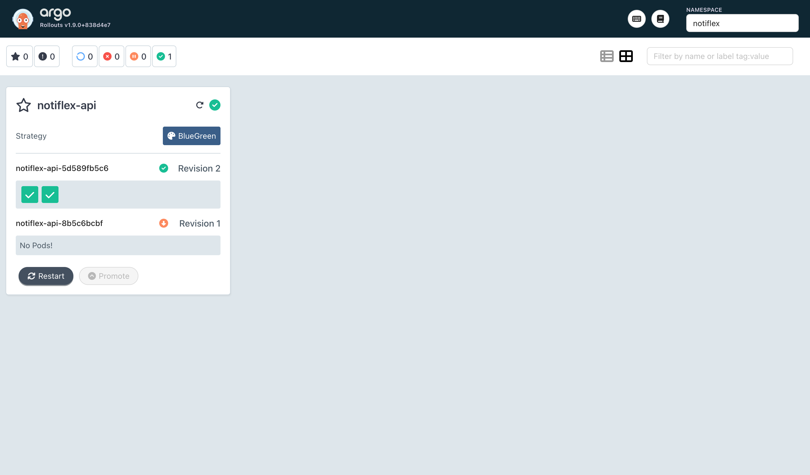

> [!TIP]
> `kubectl argo rollouts dashboard -n notiflex`를 통해 제공되는 웹 UI 화면에서 `v0.2.0` 버전이 `stable, active` 상태로 전환되고 기존 버전이 scale down 된 구조를 시각적으로 확인할 수 있습니다.

### 📸 실습 인증: Argo Rollouts CLI 모니터링 화면

> ```bash
> kubectl --context gke-sysnet4admin_book_gitaiops argo rollouts get rollout notiflex-api -n notiflex
> ```

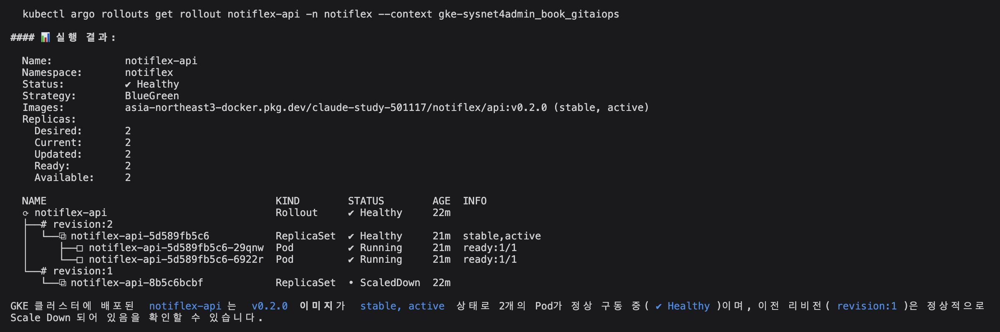

> [!TIP]
> CLI 트리에서 새 ReplicaSet의 `revision`, Pod 준비 상태, 기존 ReplicaSet의 scale down 결과를 함께 확인합니다.

## Rolling Update와의 차이

- Rolling Update는 배포 중 v0.1.1과 v0.2.0이 섞여 서비스됩니다.
- Blue/Green은 v0.2.0을 완전히 준비하고 검증한 후 active Service를 한 번에 전환합니다.
- 전환 후 이전 ReplicaSet이 revision history에 남아 있어 즉시 롤백할 수 있습니다.

```bash
kubectl --context gke-sysnet4admin_book_gitaiops argo rollouts undo notiflex-api -n notiflex
```

</details>

---

# 5.4 마무리: 아키텍처 결정 기록하기

<details>
<summary>**5.4 마무리: 아키텍처 결정 기록하기**</summary>

## ADR을 작성하는 이유

코드와 manifest는 **무엇을 구성했는지**는 보여주지만, **왜 그 선택을 했는지**는 설명하지 않습니다. 시간이 지나거나 새 팀원이 합류하면 다음과 같은 질문이 반복됩니다.

- Ingress 대신 Gateway API를 선택한 이유는 무엇인가?
- Rolling Update 대신 Blue/Green을 사용한 이유는 무엇인가?
- Prometheus와 Loki를 선택한 기준은 무엇인가?

ADR(Architecture Decision Record)은 중요한 아키텍처 결정을 번호와 시간 순서로 누적하는 문서입니다. 로컬 메모리가 개인의 작업 컨텍스트라면 ADR은 팀이 공유하는 의사결정 기록입니다.

## 누적 ADR

| 시점 | ADR | 결정 |
| --- | --- | --- |
| 3장 | ADR-001~002 | Argo CD, GitHub Actions |
| 4장 | ADR-003~005 | Prometheus와 Grafana, Loki와 Fluent Bit, PrometheusRule과 Alertmanager |
| 5장 | ADR-006~007 | Gateway API, Argo Rollouts Blue/Green |
| 6장 예정 | ADR-008~010 | Valkey, Secret Manager CSI, Canary 전환 |
| 7장 예정 | ADR-011~013 | 노드풀 분리, App of Apps, 멀티 테넌시 |
| 8장 예정 | ADR-014~016 | Kafka, Tempo, CronJob |

## 5장의 신규 ADR

### ADR-006: 외부 진입점은 Gateway API로 구성

- **결정:** GKE 관리형 Gateway API를 사용하고 Ingress는 사용하지 않습니다.
- **이유:**
    - 별도 Controller 설치가 필요 없습니다.
    - NGINX Controller 리소스를 추가로 소비하지 않습니다.
    - Gateway와 HTTPRoute로 역할이 분리됩니다.
    - HTTPRoute weight를 이용해 Argo Rollouts와 트래픽 전환을 연동할 수 있습니다.
- **트레이드오프:** Gateway와 HTTPRoute 두 리소스를 관리해야 하며, 특정 GKE 기능은 구현체에 의존합니다.

### ADR-007: 무중단 배포는 Argo Rollouts Blue/Green으로 구성

- **결정:** 기본 Deployment를 Rollout으로 교체하고 Blue/Green 전략을 사용합니다.
- **이유:**
    - 배포와 운영 트래픽 전환을 분리합니다.
    - Preview Service에서 새 버전을 사전 검증할 수 있습니다.
    - 기존 ReplicaSet이 남아 있어 빠른 롤백이 가능합니다.
    - Argo CD와 자연스럽게 통합되고 향후 Canary로 확장할 수 있습니다.
- **트레이드오프:** 배포 전환 중 Pod 리소스가 약 2배 필요합니다. 현재 2 replica 환경에서는 감당할 수 있지만 대규모 서비스에서는 Canary가 더 효율적일 수 있습니다.

## 도구 변경 의견에 대응하는 방식

ADR이 있으면 Claude Code가 단순히 사용자의 즉흥적인 변경 요청을 실행하지 않고, 기존 결정과 트레이드오프를 설명할 수 있습니다.

예를 들어 “Ingress가 더 친숙하니 바꾸자”는 요청이 들어오면 다음을 먼저 확인합니다.

1. Gateway API를 선택한 기존 이유
2. 변경 시 필요한 NGINX Controller와 리소스
3. Argo Rollouts 트래픽 라우팅 재구성 범위
4. 변경해야 할 특별한 운영 요구사항

특별한 이유가 없다면 기존 결정을 유지하고, 이유가 충분하면 새로운 ADR을 추가해 변경합니다.

</details>

---

# 5.5 5장 가드레일 살펴보기

<details>
<summary>**5.5 5장 가드레일 살펴보기**</summary>

5장에서는 탐색, 비교, 실행의 3-프롬프트 패턴을 사용했습니다. Claude Code가 모든 결정을 즉흥적으로 생성한 것이 아니라, 사전에 작성한 의사결정 가이드와 실행 가드레일을 참조해 작업했습니다.

| 구간 | 유형 | 참조 파일 | 역할 |
| --- | --- | --- | --- |
| 5.2 | 탐색과 비교 | `decision-guides/ch5/5.2-traffic-management.md` | Gateway API와 대안 비교 |
| 5.2 | 실행 | `prompt-guardrails/ch5/5.2-gateway-api.md` | Gateway, HTTPRoute, HealthCheckPolicy 구성 |
| 5.3 | 탐색과 비교 | `decision-guides/ch5/5.3-deployment-strategy.md` | Argo Rollouts와 Flagger 비교 |
| 5.3 | 실행 | `prompt-guardrails/ch5/5.3-bluegreen.md` | Rollout CRD와 Blue/Green 전환 |
| 5장 마무리 | 실행 | `prompt-guardrails/ch5/5.4-adr.md` | ADR 누적과 도구 변경 의견 대응 |

## 가드레일이 방지한 문제

### HealthCheckPolicy 누락 방지

Gateway API 실행 가드레일에는 `/health:8080`을 사용하는 HealthCheckPolicy를 반드시 구성하도록 명시되어 있습니다. 이를 누락하면 GKE 로드밸런서가 기본 `/` 경로로 검사해 모든 백엔드를 unhealthy로 판단하고 `no healthy upstream` 오류가 발생할 수 있습니다.

### Deployment와 Rollout 중복 방지

Blue/Green 실행 가드레일에는 기존 `deployment.yaml`을 삭제한 뒤 `rollout.yaml`을 적용하도록 명시되어 있습니다. 두 manifest가 Git에 함께 남으면 Argo CD가 Deployment와 Rollout을 모두 배포해 Pod가 중복 생성됩니다.

가드레일은 단순한 주석이 아니라 **자주 발생하는 실패 조건과 필수 순서를 사전에 명시한 실행 규칙**입니다. 문제가 발생한 뒤 수정하는 대신, 처음부터 잘못된 구성을 만들지 않도록 합니다.

</details>

---

## 최종 아키텍처

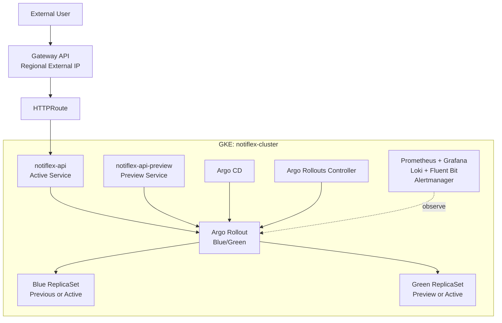

---

## 5장 핵심 정리

- Rolling Update는 Pod를 안전하게 교체하지만 배포와 트래픽 전환이 동시에 일어나므로 새 버전의 사전 검증이 어렵습니다.
- Gateway API로 GKE 외부 IP와 표준 라우팅 구조를 구성했습니다.
- HTTPRoute가 요청 경로를 Service로 전달하고, HealthCheckPolicy가 실제 `/health:8080` 경로를 검사합니다.
- Deployment를 Argo Rollouts의 Rollout CRD로 교체했습니다.
- Blue/Green 전략으로 v0.2.0을 Preview 상태에서 준비한 뒤 active Service를 한 번에 전환했습니다.
- 전환 후 이전 ReplicaSet이 남아 있어 `undo`로 빠르게 롤백할 수 있습니다.
- Gateway API와 Blue/Green 선택 근거를 ADR-006과 ADR-007로 기록했습니다.
- 실행 가드레일로 HealthCheckPolicy 누락과 Deployment/Rollout 중복 배포를 사전에 방지했습니다.

5장에서 **배포와 검증을 분리하는 구조**를 만들었습니다. 6장에서는 상태 저장을 위한 Valkey와 Secret Manager CSI를 추가하고, Prometheus 메트릭을 기반으로 트래픽을 단계적으로 전환하는 Canary 배포로 발전시킵니다.

---

## 관련 장

- [Chapter 4. 관측 가능성 한번에 구축하기](https://app.notion.com/p/Chapter-4-3984c2420ac481b38c8affad5c5ee25b?pvs=21)
