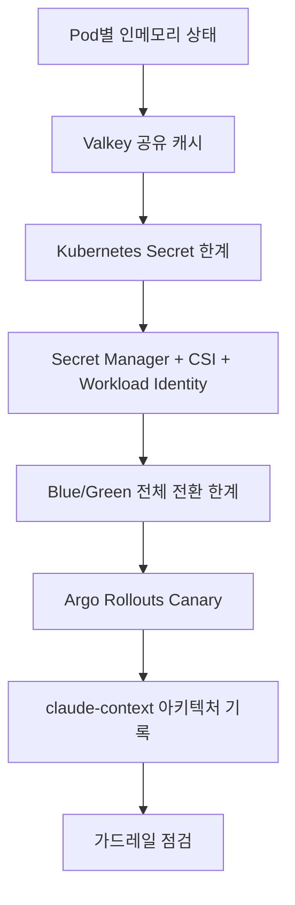
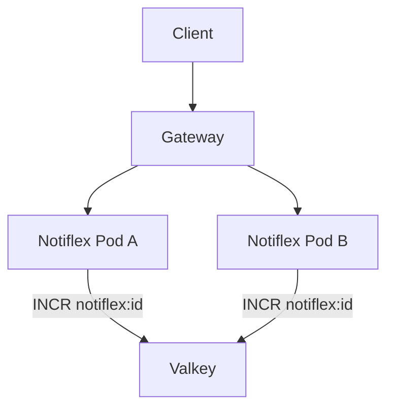
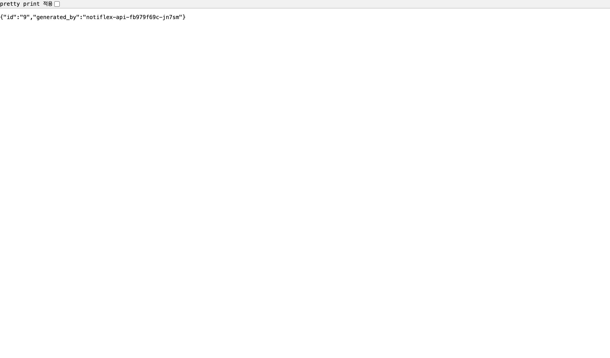
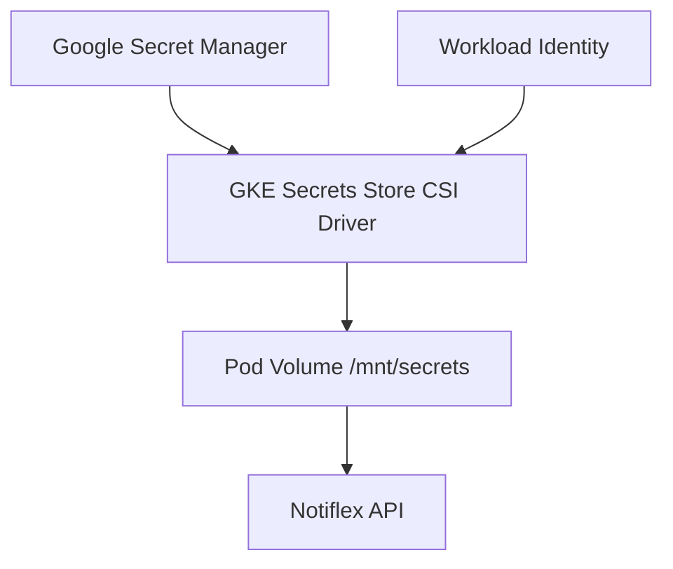
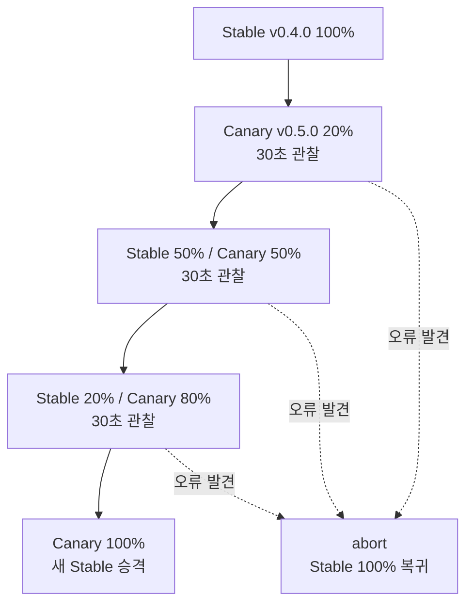
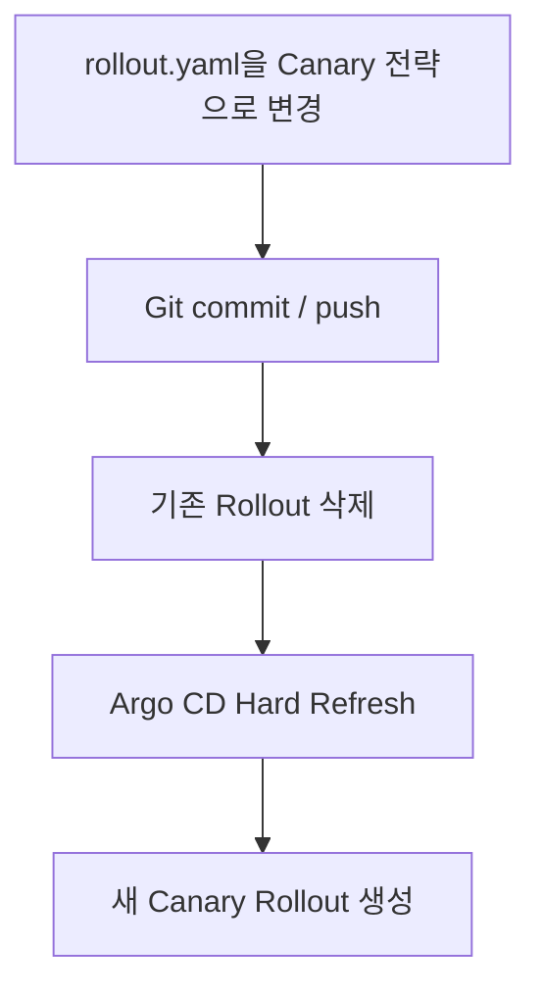
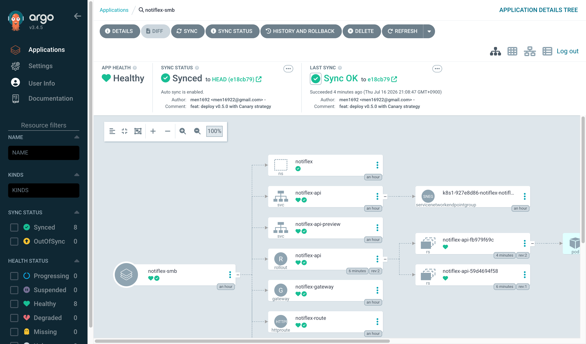
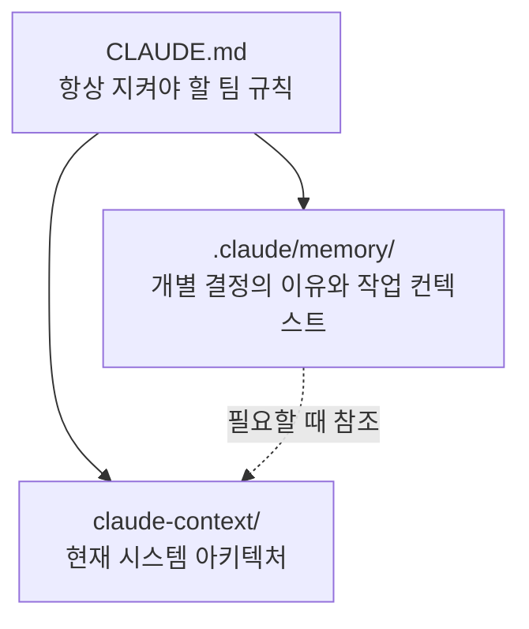
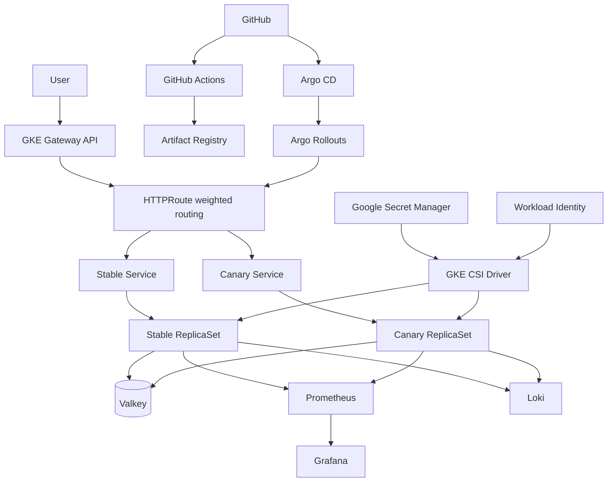

# 6장. 엔터프라이즈를 위한 기반 정비

## 6장의 목표

5장에서는 Gateway API로 외부 진입점을 구성하고, Argo Rollouts의 Blue/Green 전략으로 새 버전을 검증한 뒤 트래픽을 한 번에 전환할 수 있게 만들었습니다.

서비스가 성장하면서 다음 문제가 드러납니다.

- Pod마다 독립적인 인메모리 상태를 가지므로 ID가 중복되거나 데이터가 일관되지 않습니다.
- Kubernetes Secret은 Base64 인코딩일 뿐 암호화된 비밀 저장소가 아니며, Git으로 안전하게 관리하기 어렵습니다.
- Blue/Green은 전체 트래픽을 한 번에 전환하므로 실제 운영 트래픽에서만 드러나는 문제의 영향 범위가 큽니다.

6장에서는 엔터프라이즈 운영을 위한 세 가지 기반을 정비합니다.

1. **Valkey**로 Pod 간 상태를 공유합니다.
2. **Google Secret Manager + Workload Identity + CSI Driver**로 시크릿을 외부에서 안전하게 관리합니다.
3. **Canary 배포**로 트래픽을 20% → 50% → 80% → 100% 순서로 점진적으로 전환합니다.

마지막으로 현재 시스템 전체 구조를 `claude-context/architecture.md`에 기록해 사람과 AI가 동일한 아키텍처 그림을 공유하도록 만듭니다.

---

## 6장 전체 흐름



핵심은 **애플리케이션 상태, 보안 정보, 배포 위험을 Pod 내부에 남겨 두지 않고 외부의 관리 가능한 계층으로 분리하는 것**입니다.

---

# 6.1 Pod 간 상태 공유: Valkey 캐시

<details>
<summary>**6.1 Pod 간 상태 공유: Valkey 캐시**</summary>

## 문제 상황

기존 Notiflex API의 `/id` 엔드포인트는 프로세스 내부의 atomic counter로 ID를 생성했습니다. Pod가 하나일 때는 문제가 없지만 replica가 두 개 이상이면 각 Pod가 서로 다른 카운터를 갖게 됩니다.

```
요청 1 → Pod A → ID 1
요청 2 → Pod B → ID 1  ← 중복
요청 3 → Pod A → ID 2
```

Pod가 재시작되면 카운터도 초기화됩니다. 따라서 여러 Pod가 동일한 상태를 공유할 수 있는 중앙 저장소가 필요합니다.

## 도구 비교

| 도구 | 특징 | 장점 | 단점 | Notiflex 적합도 |
| --- | --- | --- | --- | --- |
| Valkey | Redis 호환, BSD 계열 라이선스 | Redis 프로토콜 호환, 라이선스 부담이 적고 Bitnami Chart 제공 | Redis보다 커뮤니티 역사가 짧음 | 높음 |
| Redis | 대표적인 인메모리 데이터 저장소 | 성숙한 생태계와 풍부한 자료 | 최근 버전의 SSPL/RSAL 라이선스 제약 | 중간 |
| Memcached | 단순 Key-Value 캐시 | 가볍고 멀티스레드 | 영속성이 없고 Redis 방식의 원자적 증가 동작과 차이가 있음 | 낮음 |
| DragonflyDB | Redis 호환 고성능 인메모리 DB | 높은 처리량과 메모리 효율 | 현재 실습 규모에는 과하고 Helm 운영 경험이 상대적으로 적음 | 낮음 |

## Valkey를 선택한 이유

1. **Redis 명령과 클라이언트 호환**: `GET`, `SET`, `INCR` 같은 기존 Redis 생태계를 그대로 사용할 수 있습니다.
2. **원자적 ID 증가**: `INCR notiflex:id`는 여러 Pod가 동시에 요청해도 중복 없이 순차 값을 반환합니다.
3. **라이선스 안전성**: 상용 환경에서도 관리형 서비스 제공 제한과 같은 Redis 최신 라이선스 이슈를 피할 수 있습니다.
4. **작은 리소스 사용량**: standalone 구성에서 `50m CPU / 64Mi` 수준의 request로 실습할 수 있습니다.



## 1. 리소스 확보

5장의 Blue/Green 전략은 전환 중 active 2개와 preview 2개, 총 4개의 Pod가 필요했습니다. Valkey와 CSI DaemonSet을 추가하면 e2-medium 노드 두 대의 CPU 여유가 부족할 수 있습니다.

따라서 6장에서는 GitOps 원칙에 따라 `rollout.yaml`의 replica를 2개에서 1개로 줄입니다.

```bash
sed -i 's/replicas: 2/replicas: 1/' k8s/smb/rollout.yaml
git add k8s/smb/rollout.yaml
git commit -m "chore: reduce replicas to 1 for ch6 resource budget"
git push origin main
```

Argo CD의 `selfHeal: true`가 활성화되어 있으므로 `kubectl patch`로 직접 변경하면 Git의 선언 상태로 되돌아갑니다. 지속되는 변경은 반드시 Git을 통해 반영합니다.

## 2. Valkey 설치

학습 환경에서는 Bitnami Helm Chart의 standalone 구성을 사용합니다.

```bash
helm repo add bitnami https://charts.bitnami.com/bitnami

helm install valkey bitnami/valkey -n notiflex \
  --set architecture=standalone \
  --set primary.resourcesPreset=none \
  --set primary.resources.requests.cpu=50m \
  --set primary.resources.requests.memory=64Mi \
  --set primary.resources.limits.cpu=200m \
  --set primary.resources.limits.memory=128Mi
```

주요 리소스는 다음과 같습니다.

- `valkey-primary-0`: StatefulSet으로 관리되는 Valkey Pod
- `valkey-primary`: 포트 6379를 제공하는 Service
- `valkey`: Helm이 생성한 비밀번호 Secret

```bash
kubectl --context gke-sysnet4admin_book_gitaiops get pods -n notiflex -w
kubectl --context gke-sysnet4admin_book_gitaiops get secret valkey -n notiflex \
  -o jsonpath='{.data.valkey-password}' | base64 -d
```

> 강의 시점의 Bitnami Chart는 학습용 `latest` 이미지를 사용할 수 있지만, 운영 환경에서는 Valkey 공식 이미지 또는 조직이 검증한 이미지를 사용하고 버전을 명시적으로 고정하는 편이 안전합니다.
> 

## 3. 애플리케이션 연동

Go 애플리케이션에 Valkey 클라이언트를 추가합니다.

```bash
cd app
go get github.com/valkey-io/valkey-go
```

애플리케이션은 다음 환경변수를 읽습니다.

- `VALKEY_ADDR`: `valkey-primary.notiflex.svc.cluster.local:6379`
- `VALKEY_PASSWORD`: 기존 Kubernetes Secret 기반 비밀번호

초기 기동 시 Valkey Pod나 DNS가 아직 준비되지 않을 수 있으므로 연결을 즉시 한 번만 시도하지 않고 재시도합니다.

```go
for i := 0; i < 10; i++ {
    client, err = valkey.NewClient(valkey.ClientOption{
        InitAddress: []string{addr},
        Password:    pass,
    })
    if err == nil {
        break
    }
    log.Printf("Valkey 연결 재시도 %d/10: %v", i+1, err)
    time.Sleep(3 * time.Second)
}
```

`10회 × 3초 = 최대 30초`는 일반적인 Kubernetes 초기 기동 시간을 고려한 단순한 학습용 설정입니다. 운영 환경에서는 exponential backoff와 최대 대기 시간을 함께 설계하는 편이 좋습니다.

`/id` 핸들러는 인메모리 카운터 대신 Valkey의 원자적 증가 명령을 사용합니다.

```go
cmd := client.B().Incr().Key("notiflex:id").Build()
result := client.Do(r.Context(), cmd)
id, _ := result.AsInt64()
```

연결 재시도가 없다면 외부 의존성이 늦게 올라오는 순간 프로세스가 종료되고, kubelet의 재시작 간격이 점점 늘어나는 `CrashLoopBackOff` 상태에 빠질 수 있습니다.

## 4. Rollout 환경변수와 배포

```yaml
# k8s/smb/rollout.yaml
env:
  - name: VALKEY_ADDR
    value: valkey-primary.notiflex.svc.cluster.local:6379
  - name: VALKEY_PASSWORD
    valueFrom:
      secretKeyRef:
        name: valkey
        key: valkey-password
```

이미지를 `v0.3.0`으로 빌드한 뒤 Git에 반영하면 Argo CD와 Argo Rollouts가 배포합니다.

```bash
gcloud builds submit app/ \
  --tag=asia-northeast3-docker.pkg.dev/PROJECT_ID/notiflex/api:v0.3.0

git add app/ k8s/
git commit -m "feat: integrate Valkey for distributed ID generation"
git push origin main
```

## 5. 동작 검증

```bash
for i in $(seq 1 6); do
  curl -s http://$GATEWAY_IP/id | jq -r '.id, .generated_by' | paste - -
done
```

```
1 notiflex-api-...
2 notiflex-api-...
3 notiflex-api-...
4 notiflex-api-...
5 notiflex-api-...
6 notiflex-api-...
```

ID가 순차적으로 증가하면 Valkey의 `INCR`이 정상 동작하는 것입니다. Pod를 재시작하거나 replica를 늘려도 카운터는 Valkey에 남으므로 중복되지 않습니다.



</details>

---

# 6.2 시크릿 관리: Google Secret Manager

<details>
<summary>**6.2 시크릿 관리: Google Secret Manager**</summary>

## 문제 상황

6.1에서는 Valkey 비밀번호를 Kubernetes Secret에 저장했습니다. 그러나 Kubernetes Secret은 기본적으로 Base64 인코딩된 값이며 암호화된 비밀 저장소 자체는 아닙니다.

```bash
echo 'BASE64_VALUE' | base64 -d
```

Git에 Secret YAML을 커밋하면 권한이 있는 사람은 원문을 확인할 수 있습니다. 엔터프라이즈 환경에서는 시크릿을 외부 전용 저장소에 보관하고, 접근 이력과 버전을 관리해야 합니다.

## 도구 비교

| 방식 | 특징 | 장점 | 단점 | Notiflex 적합도 |
| --- | --- | --- | --- | --- |
| CSI Driver + Secret Manager | GCP 관리형 저장소의 값을 Pod에 파일로 마운트 | Workload Identity, 감사 로그, 버전 관리, SA Key 불필요 | 초기 설정 단계가 많음 | 높음 |
| Sealed Secrets | 암호화된 Secret을 Git에 저장 | GitOps 친화적이고 설치가 단순함 | 암호화 키 수명주기 관리가 필요하고 GCP 네이티브 감사 기능이 없음 | 중간 |
| External Secrets Operator | 외부 저장소 값을 Kubernetes Secret으로 동기화 | 다양한 Provider와 직관적인 CRD | 별도 Operator를 설치하고 결국 K8s Secret이 생성됨 | 중간 |
| kubectl create secret | Kubernetes 기본 기능 | 가장 간단함 | Git 관리 불가, Base64, 감사와 버전 관리 부족 | 낮음 |

## 선택 구조



이 구성을 선택한 이유는 다음과 같습니다.

1. **GKE 네이티브 통합**: Workload Identity로 GKE ServiceAccount와 GCP IAM ServiceAccount를 연결합니다.
2. **단일 진실 공급원**: 시크릿 원본은 Google Secret Manager 한 곳에만 저장됩니다.
3. **감사 가능성**: Cloud Audit Logs를 통해 누가 언제 시크릿에 접근했는지 추적할 수 있습니다.
4. **버전 관리**: 새 버전을 추가하고 필요하면 이전 버전으로 되돌릴 수 있습니다.
5. **키 파일 제거**: Pod에 GCP Service Account JSON 키를 배포하지 않습니다.

## 핵심 개념

- **Workload Identity**: Kubernetes ServiceAccount가 OIDC 토큰으로 GCP IAM ServiceAccount 권한을 사용합니다.
- **Secrets Store CSI Driver**: 외부 시크릿을 Kubernetes 볼륨처럼 Pod에 마운트합니다.
- **SecretProviderClass**: 어떤 Secret Manager의 어떤 버전을 어떤 파일명으로 가져올지 정의합니다.

## 1. Workload Identity 확인

클러스터와 노드 풀 양쪽에 활성화되어 있어야 합니다.

```bash
gcloud container clusters describe notiflex-cluster \
  --zone=asia-northeast3-a \
  --format='value(workloadIdentityConfig.workloadPool)'

gcloud container node-pools describe default-pool \
  --cluster=notiflex-cluster \
  --zone=asia-northeast3-a \
  --format='value(config.workloadMetadataConfig.mode)'
```

```
PROJECT_ID.svc.id.goog
GKE_METADATA
```

Workload Identity가 없다면 Pod에 GCP SA JSON 키를 마운트해야 합니다. 이 키 파일 자체가 새로운 시크릿이 되므로 권장하지 않습니다.

## 2. GKE 관리형 CSI Driver 활성화

```bash
gcloud container clusters update notiflex-cluster \
  --zone=asia-northeast3-a \
  --enable-secret-manager
```

활성화하면 각 노드에 다음 DaemonSet이 배포됩니다.

- `csi-secrets-store-gke`: Secret Manager 값을 가져오는 볼륨 Driver
- `csi-secrets-store-provider-gke`: GKE 인증 Provider

```bash
kubectl --context gke-sysnet4admin_book_gitaiops get daemonset -n kube-system | grep csi-secrets
```

CSI Add-on은 노드마다 두 개의 DaemonSet을 실행하므로 CPU 사용량이 증가합니다. 실습 환경에서는 Prometheus와 Alertmanager의 request를 조정해 여유를 확보했습니다.

> GKE 관리형 CSI Driver와 오픈소스 CSI Driver는 리소스 이름이 다릅니다. 관리형 구성을 사용할 때는 `provider: gke`, `driver: secrets-store-gke.csi.k8s.io`를 사용해야 합니다. 오픈소스 예제의 `provider: gcp`, `secrets-store.csi.k8s.io`를 섞으면 Pod가 시작되지 않습니다.
> 

## 3. Secret Manager에 비밀번호 저장

기존 Valkey Secret의 값을 한 번 읽어 Secret Manager로 이전합니다.

```bash
VALKEY_PW=$(kubectl --context gke-sysnet4admin_book_gitaiops get secret valkey -n notiflex \
  -o jsonpath='{.data.valkey-password}' | base64 -d)

echo -n "$VALKEY_PW" | gcloud secrets create valkey-password \
  --data-file=- --project=PROJECT_ID
```

## 4. GCP IAM과 Workload Identity 바인딩

```bash
gcloud iam service-accounts create notiflex-sa \
  --display-name="Notiflex Workload Identity SA"

gcloud secrets add-iam-policy-binding valkey-password \
  --member="serviceAccount:notiflex-sa@PROJECT_ID.iam.gserviceaccount.com" \
  --role="roles/secretmanager.secretAccessor"

kubectl --context gke-sysnet4admin_book_gitaiops create serviceaccount notiflex-ksa -n notiflex

gcloud iam service-accounts add-iam-policy-binding \
  notiflex-sa@PROJECT_ID.iam.gserviceaccount.com \
  --role="roles/iam.workloadIdentityUser" \
  --member="serviceAccount:PROJECT_ID.svc.id.goog[notiflex/notiflex-ksa]"

kubectl --context gke-sysnet4admin_book_gitaiops annotate serviceaccount notiflex-ksa -n notiflex \
  iam.gke.io/gcp-service-account=notiflex-sa@PROJECT_ID.iam.gserviceaccount.com
```

권한은 프로젝트 전체가 아니라 `valkey-password` 시크릿 하나에만 부여해 최소 권한 원칙을 적용합니다.

## 5. SecretProviderClass 생성

```yaml
# k8s/secret/secretproviderclass.yaml
apiVersion: secrets-store.csi.x-k8s.io/v1
kind: SecretProviderClass
metadata:
  name: notiflex-secrets
  namespace: notiflex
spec:
  provider: gke
  parameters:
    secrets: |
      - resourceName: "projects/PROJECT_ID/secrets/valkey-password/versions/latest"
        path: "valkey-password"
```

```bash
kubectl --context gke-sysnet4admin_book_gitaiops apply -f k8s/secret/secretproviderclass.yaml
```

## 6. Rollout에 CSI 볼륨 마운트

```yaml
# k8s/smb/rollout.yaml
template:
  spec:
    serviceAccountName: notiflex-ksa
    containers:
      - name: notiflex-api
        env:
          - name: VALKEY_ADDR
            value: valkey-primary.notiflex.svc.cluster.local:6379
          - name: VALKEY_PASSWORD_FILE
            value: /mnt/secrets/valkey-password
        volumeMounts:
          - name: secrets
            mountPath: /mnt/secrets
            readOnly: true
    volumes:
      - name: secrets
        csi:
          driver: secrets-store-gke.csi.k8s.io
          readOnly: true
          volumeAttributes:
            secretProviderClass: notiflex-secrets
```

## 7. 애플리케이션에서 파일 읽기

로컬 개발 환경과 클러스터 환경을 모두 지원하기 위해 파일 경로가 있으면 파일을 우선 사용하고, 없으면 기존 환경변수로 fallback합니다.

```go
pass := os.Getenv("VALKEY_PASSWORD")
if pwFile := os.Getenv("VALKEY_PASSWORD_FILE"); pwFile != "" {
    if data, err := os.ReadFile(pwFile); err == nil {
        pass = string(data)
        log.Println("Secret 파일에서 비밀번호 로드 완료")
    }
}
```

- 로컬 개발: `VALKEY_PASSWORD` 환경변수
- GKE: `/mnt/secrets/valkey-password` 파일

## 8. 배포 및 검증

이미지를 `v0.4.0`으로 빌드하고 Git에 반영합니다.

```bash
gcloud builds submit app/ \
  --tag=asia-northeast3-docker.pkg.dev/PROJECT_ID/notiflex/api:v0.4.0

git add app/ k8s/
git commit -m "feat: integrate Secret Manager via CSI Driver + Workload Identity"
git push origin main
```

```bash
kubectl --context gke-sysnet4admin_book_gitaiops exec -it $(kubectl --context gke-sysnet4admin_book_gitaiops get pod -l app=notiflex-api -n notiflex -o name | head -1) \
  -n notiflex -- cat /mnt/secrets/valkey-password

curl http://$GATEWAY_IP/id
curl http://$GATEWAY_IP/version
```

```
이전: Kubernetes Secret(Base64) → 환경변수 직접 주입
현재: Google Secret Manager → CSI Driver → 파일 마운트 → 애플리케이션 파일 읽기
```

보안 측면에서 다음이 개선됩니다.

- 시크릿이 Git에 저장되지 않습니다.
- GCP SA 키 파일이 필요하지 않습니다.
- 접근 감사 로그가 기록됩니다.
- Secret Manager의 버전 관리 기능을 사용할 수 있습니다.

</details>

---

# 6.3 점진적 배포: Canary

<details>
<summary>**6.3 점진적 배포: Canary**</summary>

## Blue/Green의 다음 한계

Blue/Green은 새 버전을 완전히 준비한 뒤 전체 트래픽을 한 번에 전환합니다. Preview에서 정상으로 보여도 실제 트래픽에서만 발생하는 문제가 있다면 전환 순간 전체 사용자가 영향을 받습니다.

Canary 배포는 새 버전에 일부 트래픽만 먼저 보내고, 관찰 결과가 정상일 때 비율을 점진적으로 높입니다.



## 전략 비교

| 기준 | Canary | Blue/Green | Rolling Update |
| --- | --- | --- | --- |
| 전환 방식 | 20% → 50% → 80% → 100% | 0% → 100% 즉시 | Pod 순차 교체 |
| 롤백 | `abort`로 즉시 Stable 복귀 | Service 전환으로 매우 빠름 | 이전 Pod 재생성으로 상대적으로 느림 |
| 추가 리소스 | 약 1.2배 | 전환 중 약 2배 | 약 1배 |
| 사용자 영향 | 초기에는 일부 사용자만 노출 | 전환 시 전체 사용자 | 점진적이나 통제하기 어려움 |
| 관찰 기회 | 각 단계마다 가능 | Preview에서 한 번 확인 | 명시적 관찰 단계 없음 |

Notiflex에서는 다음 이유로 Canary를 선택합니다.

1. Valkey와 CSI DaemonSet이 추가된 작은 노드 환경에서 Blue/Green의 2배 리소스가 부담됩니다.
2. 4장에서 구축한 Prometheus와 Grafana를 활용해 단계별 메트릭을 관찰할 수 있습니다.
3. Rolling Update → Blue/Green → Canary 순서로 배포 전략을 점진적으로 고도화합니다.

> 데이터베이스 스키마와 함께 원자적으로 전환해야 하는 배포는 Blue/Green이 더 적합할 수 있습니다. 일반적인 API 업데이트와 점진적 검증에는 Canary가 유리합니다.
> 

## 1. Blue/Green에서 Canary로 전환

동일한 Argo Rollouts CRD에서 `strategy`만 변경합니다.

```yaml
# k8s/smb/rollout.yaml
strategy:
  canary:
    canaryService: notiflex-api-preview
    stableService: notiflex-api
    steps:
      - setWeight: 20
      - pause: {duration: 30s}
      - setWeight: 50
      - pause: {duration: 30s}
      - setWeight: 80
      - pause: {duration: 30s}
```

- `stableService`: 현재 운영 버전을 가리키는 `notiflex-api`
- `canaryService`: Canary Pod를 가리키는 기존 `notiflex-api-preview`
- `setWeight`: 새 버전에 전달할 트래픽 비율
- `pause`: 다음 단계 전에 관찰할 시간

Blue/Green에서 사용한 Preview Service는 Canary에서 Canary Service 역할로 재사용합니다. 삭제하면 Rollout이 `InvalidSpec` 상태가 됩니다.

Argo Rollouts CRD의 API가 `argoproj.io/v1alpha1`이어도 API 성숙도 이름과 실제 운영 안정성은 별개입니다. Argo Rollouts는 대규모 운영 사례가 많지만, 조직에서는 릴리스 빈도, 유지보수 상태, CNCF 단계와 실사용 사례를 함께 판단해야 합니다.

## 2. GitOps 환경의 전환 순서

Argo CD가 Auto Sync 상태일 때 Rollout을 먼저 삭제하면 Git의 기존 Blue/Green 리소스를 즉시 복원할 수 있습니다. 반드시 Git push를 먼저 하고 새 선언이 저장소에 존재하는 상태에서 리소스를 재생성합니다.



```bash
git add k8s/smb/rollout.yaml
git commit -m "feat: switch deployment strategy from Blue/Green to Canary"
git push origin main

kubectl --context gke-sysnet4admin_book_gitaiops delete rollout notiflex-api -n notiflex
kubectl --context gke-sysnet4admin_book_gitaiops annotate application notiflex-smb -n argocd \
  argocd.argoproj.io/refresh=hard --overwrite
```

기존 이미지로 재생성된 최초 Rollout은 이미 Stable 상태이므로 모든 Canary 단계가 완료된 `Step 6/6`, `SetWeight 100`으로 표시됩니다. 실제 진행을 보려면 새 이미지 버전을 배포해야 합니다.

## 3. v0.5.0 Canary 배포

```bash
sed -i 's/v0.4.0/v0.5.0/' app/main.go

gcloud builds submit app/ \
  --tag=asia-northeast3-docker.pkg.dev/PROJECT_ID/notiflex/api:v0.5.0

sed -i 's/v0.4.0/v0.5.0/' k8s/smb/rollout.yaml
git add app/ k8s/
git commit -m "feat: deploy v0.5.0 with Canary strategy"
git push origin main
```

진행 상태를 실시간으로 확인합니다.

```bash
kubectl --context gke-sysnet4admin_book_gitaiops argo rollouts get rollout notiflex-api -n notiflex -w
```

```
Step 1/6: setWeight 20
  → v0.5.0에 트래픽 20%
  → 30초 pause

Step 3/6: setWeight 50
  → v0.5.0에 트래픽 50%
  → 30초 pause

Step 5/6: setWeight 80
  → v0.5.0에 트래픽 80%
  → 30초 pause

Step 6/6
  → v0.5.0 Stable 승격
  → v0.4.0 ReplicaSet 축소
```

## 4. 실패 대응

수동으로 배포를 중단하면 Canary Pod가 제거되고 모든 트래픽이 Stable 버전으로 즉시 돌아갑니다.

```bash
kubectl --context gke-sysnet4admin_book_gitaiops argo rollouts abort notiflex-api -n notiflex
```

현재 실습에서는 각 pause 동안 Grafana 메트릭을 사람이 확인합니다. 프로덕션에서는 `AnalysisTemplate`과 `AnalysisRun`을 연결해 에러율, 지연 시간, 성공률을 자동 판정하고 기준을 벗어나면 자동 중단하도록 발전시켜야 합니다.

```
수동 관찰: pause → Grafana 확인 → 진행 또는 abort
자동 분석: pause → Prometheus Query → 성공 또는 자동 abort
```

## 5. 완료 검증

```bash
curl http://$GATEWAY_IP/version
curl http://$GATEWAY_IP/id
```

```
{"version":"0.5.0"}
{"id":9,"generated_by":"notiflex-api-..."}
```

Canary 배포 완료 후에는 v0.5.0이 Stable이 되고 이전 v0.4.0 ReplicaSet이 축소됩니다.



</details>

---

# 6.4 마무리: `claude-context/`로 현재 아키텍처 정리하기

<details>
<summary>**6.4 마무리: `claude-context/`로 현재 아키텍처 정리하기**</summary>

## 왜 별도의 아키텍처 컨텍스트가 필요한가

4장에서는 개인 작업 컨텍스트를 메모리에 저장했고, 5장에서는 의사결정 이유와 트레이드오프를 ADR에 기록했습니다. 그러나 시스템이 커지면 “현재 무엇이 어디에서 어떻게 연결되어 있는가”를 한눈에 보여주는 문서가 필요합니다.

- 메모리: 개인 작업 과정과 판단을 기억합니다.
- ADR: 특정 결정을 왜 내렸는지 기록합니다.
- `claude-context/`: 현재 시스템 전체 구조와 연결 관계를 기록합니다.

사람과 AI가 동일한 문서를 보고 같은 구조를 공유해야 새 컴포넌트를 추가할 때 기존 아키텍처와 충돌하지 않는 방향을 제안할 수 있습니다.

## Claude Code의 3층 지식 구조

| 파일 | 역할 | 로드 시점 |
| --- | --- | --- |
| `CLAUDE.md` | 항상 지켜야 할 팀 규칙과 코딩 컨벤션 | 매 세션 기본 로드 |
| `.claude/memory/` | 개별 결정의 이유와 작업 컨텍스트 | 인덱스만 로드하고 필요할 때 참조 |
| `claude-context/` | 현재 아키텍처의 전체 그림 | `CLAUDE.md`에서 참조해 로드 |



비유하면 `CLAUDE.md`는 팀 규칙, 메모리는 개인 노트, `claude-context/`는 시스템 구성도입니다.

## [architecture.md](http://architecture.md)에 기록할 내용

`kubectl get` 결과와 Git 선언을 바탕으로 구체적인 현재값을 기록합니다.

```markdown
# Notiflex Platform Architecture

## 클러스터
- GKE Standard, Zonal: asia-northeast3-a
- default-pool: e2-medium × 2, Spot VM
- Workload Identity 활성화

## Namespace: notiflex
- Rollout: notiflex-api v0.5.0
- Strategy: Canary 20% → 50% → 80% → 100%
- Valkey: standalone StatefulSet, port 6379
- Secret: Google Secret Manager + GKE CSI Driver
- Gateway + HTTPRoute + HealthCheckPolicy

## Namespace: argocd
- Application: notiflex-smb
- auto-sync + selfHeal

## Namespace: monitoring
- Prometheus + Grafana + Alertmanager
- Loki + Fluent Bit

## 배포 흐름
Git push → GitHub Actions → Artifact Registry
→ Argo CD Auto Sync → Argo Rollouts Canary

## 시크릿 흐름
Google Secret Manager → GKE CSI Driver
→ /mnt/secrets/valkey-password → Application
```

## ADR 추가

6장의 결정은 기존 ADR 파일에 누적합니다.

- **ADR-008**: Pod 간 공유 상태는 Valkey를 사용한다.
- **ADR-009**: 시크릿은 Google Secret Manager + Workload Identity + GKE CSI Driver로 관리한다.
- **ADR-010**: 기본 배포 전략을 Blue/Green에서 Canary로 전환한다.

## 문서 반영

`/update-docs` 명령은 다음 변경을 한 번에 반영합니다.

- `JOURNEY.md`: 6장 진행 과정
- `docs/architecture-decisions.md`: ADR-008~010
- `claude-context/architecture.md`: 현재 아키텍처

```bash
git add JOURNEY.md docs/architecture-decisions.md claude-context/
git commit -m "ch6: document Valkey, Secret Manager CSI, Canary architecture"
git push origin main
```

6장까지 누적된 핵심 구성은 다음과 같습니다.

- 3장: Argo CD와 GitHub Actions
- 4장: Prometheus, Grafana, Loki, Alertmanager
- 5장: Gateway API와 Argo Rollouts
- 6장: Valkey, Secret Manager, Canary 전략

</details>

---

# 6.5 6장 가드레일 살펴보기

<details>
<summary>**6.5 6장 가드레일 살펴보기**</summary>

6장의 각 서브챕터는 탐색 → 비교 → 실행의 3-프롬프트 패턴으로 구성됩니다.

| 서브챕터 | 유형 | 참조 파일 | 역할 |
| --- | --- | --- | --- |
| 6.1 탐색/비교 | 탐색과 비교 | `decision-guides/ch6/6.1-cache.md` | Valkey 추천과 Redis·Memcached 비교 |
| 6.1 실행 | 실행 | `prompt-guardrails/ch6/6.1-valkey.md` | Helm 설치, 애플리케이션 연동, 재시도 처리 |
| 6.2 탐색/비교 | 탐색과 비교 | `decision-guides/ch6/6.2-secret-management.md` | CSI Driver, Sealed Secrets, ESO 비교 |
| 6.2 실행 | 실행 | `prompt-guardrails/ch6/6.2-secret.md` | Workload Identity, GKE CSI, Secret Manager 구성 |
| 6.3 탐색/비교 | 탐색과 비교 | `decision-guides/ch6/6.3-canary-vs-bluegreen.md` | Canary 추천과 Blue/Green 비교 |
| 6.3 실행 | 실행 | `prompt-guardrails/ch6/6.3-canary.md` | 전략 변경 순서와 점진적 배포 검증 |
| 6장 마무리 | 실행 | `prompt-guardrails/ch6/6.4-architecture-context.md` | `claude-context/architecture.md` 생성과 문서 동기화 |

## 가드레일이 방지한 문제

### 1. GKE 관리형 CSI와 오픈소스 CSI 혼용

관리형 구성은 다음 이름을 사용합니다.

```
provider: gke
driver: secrets-store-gke.csi.k8s.io
```

오픈소스 구성은 다음 이름을 사용합니다.

```
provider: gcp
driver: secrets-store.csi.k8s.io
```

두 방식을 섞으면 `provider not found` 또는 `ContainerCreating` 정체가 발생합니다. 가드레일은 현재 클러스터가 GKE 관리형 Add-on을 사용한다는 사실을 명시해 잘못된 예제를 적용하지 않게 합니다.

### 2. Argo CD Auto Sync 환경에서 잘못된 전환 순서

Blue/Green에서 Canary로 전략을 바꿀 때 기존 Rollout을 먼저 삭제하면 Argo CD가 Git의 이전 Blue/Green 선언을 즉시 복원합니다.

```
잘못된 순서: Rollout 삭제 → Git push
올바른 순서: Git push → Rollout 삭제 → Argo CD 재조정
```

### 3. 직접 패치로 GitOps 선언과 불일치

`kubectl patch`로 replica나 리소스를 수정해도 `selfHeal`이 Git 상태로 복원합니다. 가드레일은 장기 변경을 항상 Git에서 수행하도록 제한합니다.

### 4. 외부 의존성 기동 순서

Valkey가 준비되기 전에 API가 시작될 수 있습니다. 재시도 로직이 없으면 CrashLoopBackOff가 발생합니다. 가드레일은 외부 서비스 연결에 재시도와 timeout을 포함하도록 요구합니다.

가드레일은 자주 밟는 지뢰를 미리 기록한 지도입니다. 코드 생성 결과만 검토하는 것이 아니라 **도구 이름, 적용 순서, 운영 원칙까지 제약하는 것**이 핵심입니다.

</details>

---

## 6장 최종 아키텍처



---

## 6장 핵심 정리

1. **공유 상태는 Pod 밖에 둡니다.**
    - 인메모리 카운터를 Valkey `INCR`로 바꾸어 Pod가 늘어나거나 재시작되어도 ID가 중복되지 않게 했습니다.
2. **시크릿은 전용 저장소에서 관리합니다.**
    - Google Secret Manager를 단일 원본으로 사용하고 Workload Identity와 CSI Driver로 파일을 마운트했습니다.
3. **배포 위험을 점진적으로 노출합니다.**
    - Blue/Green의 0% → 100% 전환을 Canary의 20% → 50% → 80% → 100% 전환으로 발전시켰습니다.
4. **GitOps에서는 변경 순서도 아키텍처입니다.**
    - Git push, 리소스 삭제, Argo CD 재조정 순서를 지키지 않으면 이전 선언이 복원됩니다.
5. **현재 구조를 사람과 AI가 함께 읽을 수 있게 기록합니다.**
    - `claude-context/architecture.md`에 실제 클러스터 구조와 데이터 흐름을 남겼습니다.

6장까지 엔터프라이즈 운영의 기본 토대가 갖춰졌습니다. 7장에서는 노드 풀을 분리하고, 애플리케이션을 여러 개로 확장하며, 테넌트별 환경을 체계적으로 관리하는 구조로 발전합니다.
