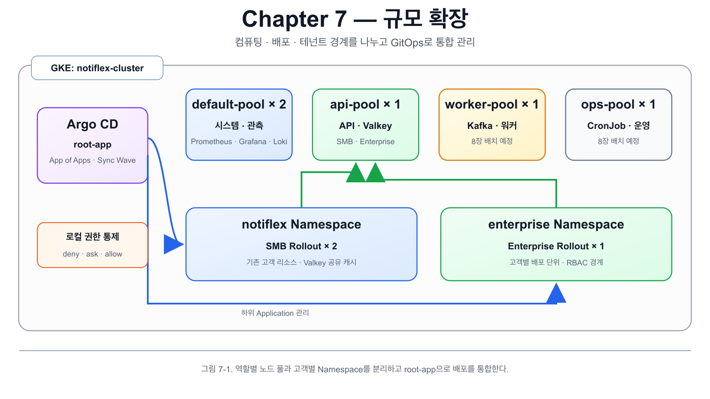
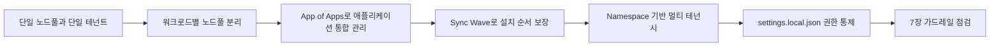
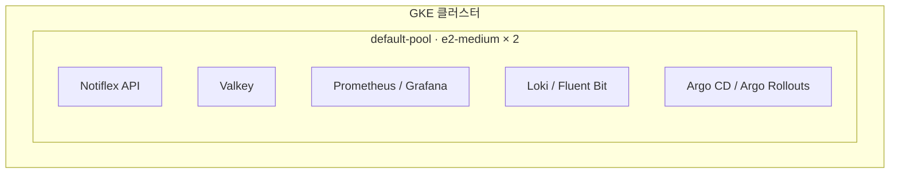
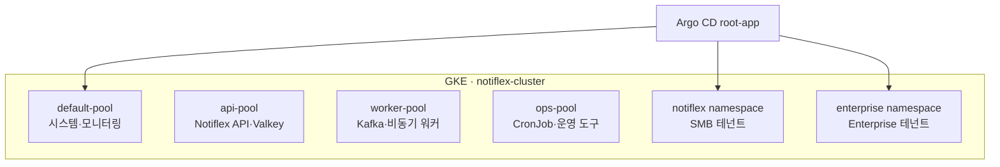
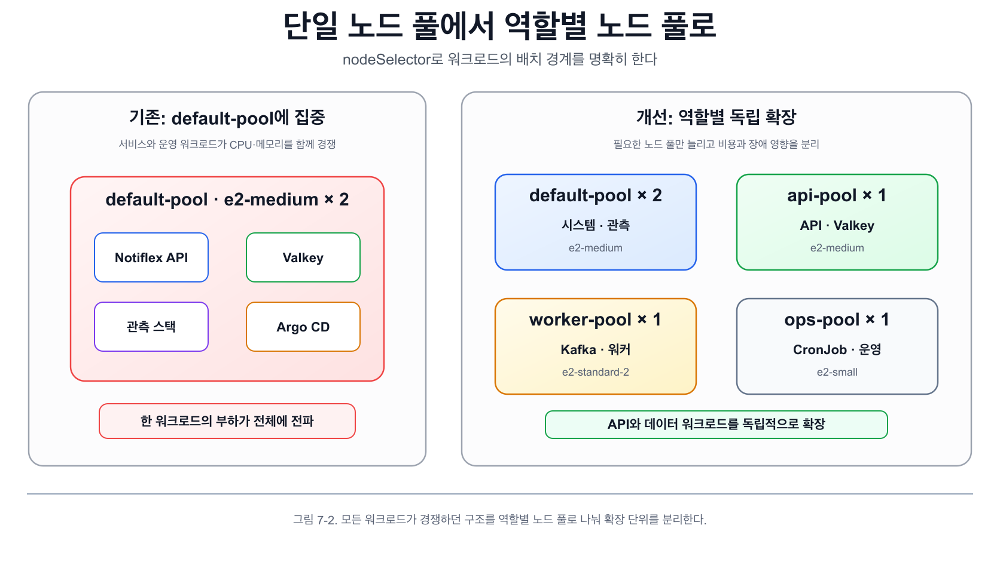
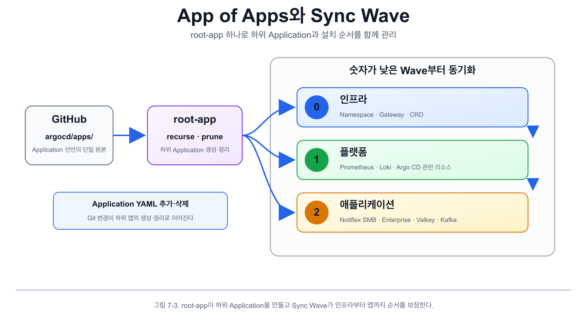
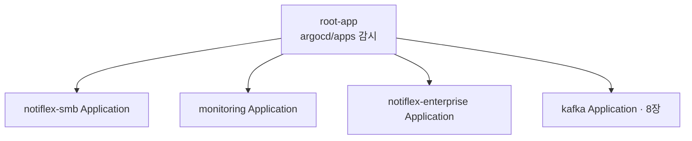
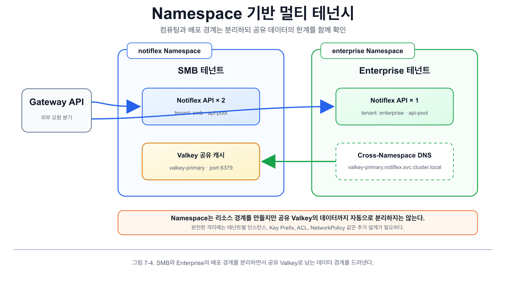
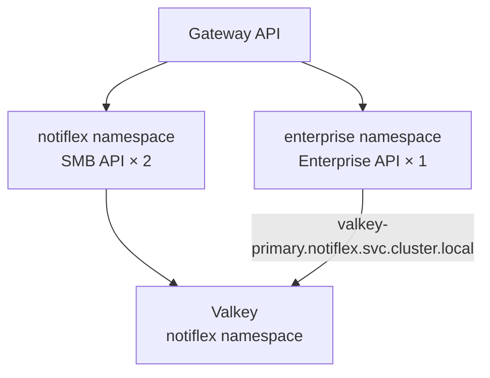
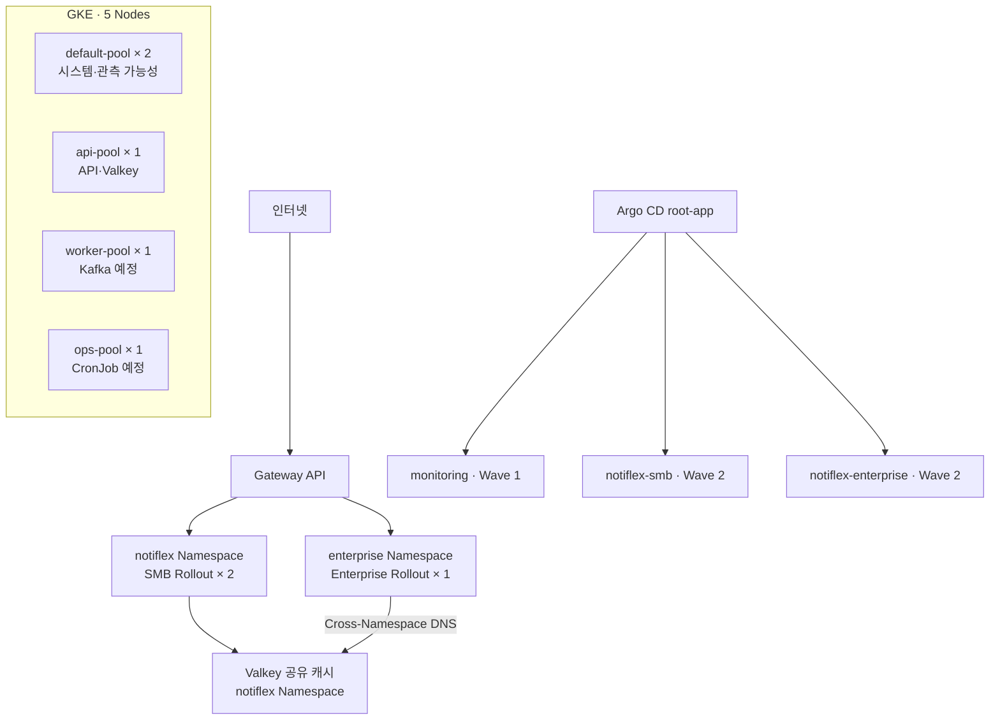

# 7장. 규모 확장

## 7장의 목표

6장에서는 엔터프라이즈 운영을 위한 기반을 정비했습니다. Valkey로 Pod 간 상태를 공유하고 Secret Manager로 시크릿을 관리하며 Canary 배포로 트래픽을 점진적으로 전환했습니다.

하지만 현재 구조에서는 모든 워크로드가 같은 노드풀과 네임스페이스를 공유합니다. 고객과 기능이 늘어나면 다음 문제가 발생합니다.

- API, 모니터링, Argo CD, Valkey가 같은 노드에서 CPU와 메모리를 경쟁합니다.
- Kafka처럼 메모리를 많이 사용하는 워크로드를 추가하면 기존 서비스의 응답 속도까지 영향을 받습니다.
- 모든 고객의 리소스가 하나의 네임스페이스에 모여 있어 테넌트 간 격리가 어렵습니다.
- Argo CD Application이 늘어날수록 개별 YAML을 수동으로 관리하기 어려워집니다.

7장에서는 규모 확장을 위해 다음 세 가지 구조를 적용합니다.

1. **멀티 노드풀**로 역할별 워크로드를 분리합니다.
2. **App of Apps + Sync Wave**로 여러 애플리케이션과 설치 순서를 관리합니다.
3. **Namespace 기반 멀티 테넌시**로 고객별 리소스를 논리적으로 격리합니다.

마지막으로 `.claude/settings.local.json`을 사용해 자연어 가이드와 기술적 권한 통제의 차이를 체험합니다.

---

## 7장 전체 흐름

그림 7-1. 컴퓨팅 자원, 배포 단위, 고객 경계를 분리한 7장의 전체 구조



> 그림 7-1. 역할별 노드 풀과 고객별 Namespace를 분리하고 여러 배포 단위는 Argo CD의 root-app으로 통합 관리한다.



핵심은 **컴퓨팅 자원, 배포 단위, 고객 경계를 각각 분리하면서도 GitOps로 하나의 운영 체계를 유지하는 것**입니다.

---

# 7.1 성장통: SMB 구조의 한계

<details>
<summary>**7.1 성장통: SMB 구조의 한계**</summary>

## 현재 구조

현재 GKE 클러스터에서는 다음 워크로드가 `default-pool`의 두 노드에 함께 배치되어 있습니다.

- Notiflex API
- Valkey
- Prometheus와 Grafana
- Loki와 Fluent Bit
- Argo CD와 Argo Rollouts
- Secret Manager CSI Driver

네임스페이스도 사실상 SMB 고객용 `notiflex` 하나를 중심으로 구성되어 있습니다.



## 문제 1. 리소스 경합

Prometheus가 메트릭을 수집하거나 Grafana와 Loki가 많은 리소스를 사용하면 같은 노드의 Notiflex API 응답도 느려질 수 있습니다. 8장에서 Kafka를 추가하면 JVM Heap과 Kubernetes 오버헤드까지 더해져 메모리 경합이 심해집니다.

이 구조에서는 **모니터링 때문에 서비스가 느려지고 백그라운드 워커 때문에 API가 영향을 받습니다.**

## 문제 2. 고객 격리 불가

대형 고객이 요구하는 것은 자신의 데이터와 워크로드가 다른 고객에게 영향을 주지 않는 환경입니다. 그러나 모든 리소스가 하나의 네임스페이스에 있으면 다음 요구를 충족하기 어렵습니다.

- 고객별 리소스와 Secret 분리
- 고객별 배포 및 롤백
- 고객별 ResourceQuota 적용
- RBAC 기반 접근 범위 제한

## 문제 3. 애플리케이션 관리 복잡도 증가

현재도 Argo CD Application이 여러 개 존재합니다. 앞으로 Kafka, Tempo, CronJob, 테넌트별 애플리케이션이 추가되면 Application YAML을 하나씩 적용하는 방식은 누락과 관리 오류를 유발합니다.

## 해결 방향

| 문제 | 해결 방향 |
| --- | --- |
| API와 운영 워크로드의 리소스 경쟁 | 역할별 노드풀 분리 |
| Application 수 증가 | App of Apps 패턴 |
| 고객별 데이터와 리소스 혼재 | Namespace 기반 멀티 테넌시 |



</details>

---

# 7.2 워크로드별 노드 배치: 멀티 노드풀

<details>
<summary>**7.2 워크로드별 노드 배치: 멀티 노드풀**</summary>

## 문제 상황

현재 `default-pool(e2-medium × 2)`에 모든 워크로드가 올라가 있습니다. API 트래픽이 증가하면 Prometheus와 CPU를 경쟁하고 8장에서 Kafka를 추가하면 메모리 부족으로 이어집니다.



> 그림 7-2. 모든 워크로드가 한곳에서 경쟁하던 구조를 네 개의 역할별 노드 풀로 나누어 확장 단위를 분리한다.

## 노드 배치 방법 비교

| 방식 | 복잡도 | 장점 | 단점 | 현재 적합도 |
| --- | --- | --- | --- | --- |
| `nodeSelector` | 낮음 | 가장 단순하며 GKE 자동 라벨을 바로 사용 | 다른 Pod의 진입을 거부하지는 못함 | 높음 |
| Taint / Toleration | 중간 | 특정 Pod만 노드에 들어오도록 거부 경계 제공 | 노드와 Pod 양쪽 설정 필요 | 중간 |
| Node Affinity | 높음 | `required`와 `preferred`로 유연한 규칙 구성 | 설정과 디버깅 복잡 | 낮음 |
| Topology Spread | 높음 | Zone과 노드 간 균등 분산 | 단일 Zone 실습에서는 불필요 | 낮음 |

### 각 방식의 차이

- `nodeSelector`: Pod가 특정 라벨의 노드로 가겠다고 지정합니다.
- Taint/Toleration: Node는 특정 Toleration을 가진 Pod만 받겠다고 제한합니다.
- Node Affinity: 강제 또는 선호 조건을 조합해 스케줄링합니다.
- Topology Spread: 장애 도메인이나 노드별로 Pod를 균등 배치합니다.

현재 실습 환경은 단일 Zone이며 GKE가 노드풀 생성 시 `cloud.google.com/gke-nodepool` 라벨을 자동으로 부여합니다. 이 실습에서는 가장 단순한 `nodeSelector`를 선택합니다.

> 프로덕션에서는 전용 노드풀에 다른 Pod가 들어오는 것까지 막아야 한다면 `nodeSelector + Taint/Toleration`을 함께 사용합니다.
>

## 계획하는 노드 구성

| 노드풀 | 머신 타입 | 수량 | 역할 |
| --- | --- | --- | --- |
| `default-pool` | e2-medium | 2 | 시스템 컴포넌트와 관측 가능성 스택 |
| `api-pool` | e2-medium | 1 | Notiflex API와 Valkey |
| `worker-pool` | e2-standard-2 | 1 | Kafka 및 비동기 워커 |
| `ops-pool` | e2-small | 1 | CronJob과 운영 도구 |

Kafka는 JVM Heap, 운영체제, Kubernetes 오버헤드를 함께 고려해야 하므로 4GB 메모리의 e2-medium보다 8GB 메모리의 e2-standard-2를 사용합니다.

## 쿼터 사전 확인

노드풀을 추가하기 전에 리전 vCPU와 SSD 쿼터를 확인합니다.

```bash
# vCPU 쿼터 확인
gcloud compute regions describe asia-northeast3 \
  --format="table(quotas[name=CPUS].limit,quotas[name=CPUS].usage)"

# SSD 쿼터 확인
gcloud compute regions describe asia-northeast3 \
  --format="table(quotas[name=SSD_TOTAL_GB].limit,quotas[name=SSD_TOTAL_GB].usage)"
```

실습에서는 vCPU 사용량이 4/24이고 신규 노드풀에 필요한 vCPU는 총 5개이므로 쿼터 안에서 생성 가능합니다.

## 노드풀 생성

```bash
# API 전용 노드풀
gcloud container node-pools create api-pool \
  --cluster=notiflex-cluster \
  --zone=asia-northeast3-a \
  --machine-type=e2-medium \
  --disk-type=pd-standard \
  --disk-size=50 \
  --num-nodes=1 \
  --spot \
  --workload-metadata=GKE_METADATA

# Kafka와 워커용 노드풀
gcloud container node-pools create worker-pool \
  --cluster=notiflex-cluster \
  --zone=asia-northeast3-a \
  --machine-type=e2-standard-2 \
  --disk-type=pd-standard \
  --disk-size=50 \
  --num-nodes=1 \
  --spot \
  --workload-metadata=GKE_METADATA

# 운영 도구용 노드풀
gcloud container node-pools create ops-pool \
  --cluster=notiflex-cluster \
  --zone=asia-northeast3-a \
  --machine-type=e2-small \
  --disk-type=pd-standard \
  --disk-size=50 \
  --num-nodes=1 \
  --spot \
  --workload-metadata=GKE_METADATA
```

학습 환경이므로 비용 절감을 위해 Spot VM을 사용합니다. Spot VM은 언제든 회수될 수 있으므로 실제 운영 환경에서는 워크로드 특성과 가용성 요구사항에 따라 Standard VM, 다중 노드, PodDisruptionBudget 등을 함께 검토해야 합니다.

## 노드 확인

```bash
kubectl --context gke-sysnet4admin_book_gitaiops get nodes \
  -o custom-columns='NAME:.metadata.name,POOL:.metadata.labels.cloud\.google\.com/gke-nodepool,MACHINE:.metadata.labels.node\.kubernetes\.io/instance-type,STATUS:.status.conditions[-1].type'
```

총 다섯 개의 노드가 `Ready` 상태인지 확인합니다.

## Notiflex API를 api-pool에 배치

`k8s/smb/rollout.yaml`의 Pod template에 다음 설정을 추가합니다.

```yaml
spec:
  replicas: 2
  template:
    spec:
      nodeSelector:
        cloud.google.com/gke-nodepool: api-pool
```

변경 사항을 Git에 반영하면 Argo CD가 자동으로 동기화합니다.

```bash
git add k8s/smb/rollout.yaml
git commit -m "feat: add nodeSelector for api-pool, restore replicas to 2"
git push origin main
```

## 배치 결과 확인

```bash
kubectl --context gke-sysnet4admin_book_gitaiops get pods -n notiflex -o wide | grep notiflex-api
```

Notiflex API Pod 두 개가 모두 `api-pool` 노드에 배치되었는지 확인합니다.

### 최종 배치 상태

| 노드풀 | 현재 워크로드 |
| --- | --- |
| `api-pool` | Notiflex API × 2, Valkey |
| `default-pool` | Prometheus, Grafana, Loki, Argo CD 등 |
| `worker-pool` | 현재 비어 있음, 8장에서 Kafka 배치 |
| `ops-pool` | 현재 비어 있음, 8장에서 CronJob 배치 |

API 트래픽이 늘어나면 `api-pool`만 확장하고 Kafka 성능이 필요할 때는 `worker-pool`만 독립적으로 늘리면 됩니다.

</details>

---

# 7.3 다수 앱 관리: App of Apps 패턴 + Sync Wave

<details>
<summary>**7.3 다수 앱 관리: App of Apps 패턴 + Sync Wave**</summary>

## 문제 상황

현재 Argo CD Application은 다음과 같이 여러 개 존재합니다.

- Notiflex API
- kube-prometheus-stack
- Loki + Fluent Bit
- Argo Rollouts
- Valkey

앞으로 Kafka, Tempo, CronJob, 테넌트별 배포가 추가되면 Application 수가 계속 늘어납니다. 각 YAML을 하나씩 `kubectl apply`로 관리하면 누락 가능성이 있고 전체 상태를 파악하기 어렵습니다.

## 관리 방식 비교

| 방식 | 복잡도 | 장점 | 단점 | 현재 적합도 |
| --- | --- | --- | --- | --- |
| App of Apps | 낮음 | 직관적이며 순수 YAML과 Git 디렉터리를 사용 | 앱마다 Application YAML 필요 | 높음 |
| ApplicationSet | 중간 | 템플릿으로 많은 Application을 동적 생성 | Go Template 학습과 디버깅 필요 | 중간 |
| 수동 관리 | 낮음 | 추가 설정이 없음 | 누락 가능성이 높고 일괄 관리 불가 | 낮음 |

ApplicationSet은 같은 애플리케이션을 여러 클러스터나 dev/staging/prod 환경에 반복 배포할 때 강점이 있습니다. 현재는 단일 클러스터에서 서로 다른 앱 5~7개를 관리하므로 App of Apps가 더 단순합니다.

## App of Apps 동작 원리

하나의 루트 Application이 `argocd/apps/` 디렉터리를 감시하고 그 안의 Application YAML을 하위 Application으로 자동 생성합니다.



> 그림 7-3. root-app이 Git의 하위 Application을 만들고 Sync Wave가 인프라부터 애플리케이션까지 동기화 순서를 보장한다.



새 YAML을 추가하면 Application이 생성되고 YAML을 삭제하면 `prune: true` 설정에 따라 Application도 삭제됩니다. 이때 Git의 PR 리뷰와 브랜치 보호가 안전장치가 됩니다.

## 루트 Application 작성

`argocd/root-app.yaml`

```yaml
apiVersion: argoproj.io/v1alpha1
kind: Application
metadata:
  name: root-app
  namespace: argocd
spec:
  project: default
  source:
    repoURL: https://github.com/USER/notiflex-platform.git
    targetRevision: main
    path: argocd/apps
    directory:
      recurse: true
  destination:
    server: https://kubernetes.default.svc
    namespace: argocd
  syncPolicy:
    automated:
      prune: true
      selfHeal: true
```

### 핵심 설정

- `path: argocd/apps`: 이 디렉터리의 YAML을 Application 리소스로 적용합니다.
- `directory.recurse: true`: 하위 디렉터리까지 재귀적으로 탐색합니다.
- `prune: true`: Git에서 Application YAML을 삭제하면 클러스터에서도 삭제합니다.
- `selfHeal: true`: 수동 변경으로 Git과 달라지면 Git 상태로 복구합니다.

## 하위 Application 이동

기존 Application YAML을 `argocd/apps/` 디렉터리로 이동합니다.

`argocd/apps/notiflex-smb.yaml`

```yaml
apiVersion: argoproj.io/v1alpha1
kind: Application
metadata:
  name: notiflex-smb
  namespace: argocd
spec:
  project: default
  source:
    repoURL: https://github.com/USER/notiflex-platform.git
    targetRevision: main
    path: k8s/smb
  destination:
    server: https://kubernetes.default.svc
    namespace: notiflex
  syncPolicy:
    automated:
      prune: true
      selfHeal: true
```

`argocd/apps/monitoring.yaml`

```yaml
apiVersion: argoproj.io/v1alpha1
kind: Application
metadata:
  name: monitoring
  namespace: argocd
spec:
  project: default
  source:
    repoURL: https://github.com/USER/notiflex-platform.git
    targetRevision: main
    path: k8s/monitoring
  destination:
    server: https://kubernetes.default.svc
    namespace: monitoring
  syncPolicy:
    automated:
      prune: true
      selfHeal: true
```

기존에 수동으로 만들었던 Application과 동일한 이름을 사용하면 Argo CD가 기존 리소스를 자연스럽게 이어받습니다. `argocd/apps/`에 없는 Application은 루트 Application의 관리 범위 밖에 남으므로, 통합하려는 모든 Application YAML을 디렉터리에 포함해야 합니다.

## 루트 Application 적용

```bash
git add argocd/
git commit -m "feat: add App of Apps pattern for centralized management"
git push origin main

kubectl --context gke-sysnet4admin_book_gitaiops apply -f argocd/root-app.yaml
kubectl --context gke-sysnet4admin_book_gitaiops get application -n argocd
```

`root-app`, `notiflex-smb`, `monitoring`이 모두 `Synced`와 `Healthy` 상태인지 확인합니다.

## Sync Wave로 설치 순서 정하기

App of Apps는 애플리케이션을 통합 관리하지만 앱 간 선행 조건까지 자동으로 이해하지는 않습니다. 예를 들어 Namespace와 CRD를 먼저 만든 뒤 그 위에 애플리케이션을 배포해야 합니다.

Argo CD의 `argocd.argoproj.io/sync-wave` 애너테이션을 사용하면 숫자가 낮은 순서부터 동기화됩니다.

| Wave | 대상 | 예시 |
| --- | --- | --- |
| 0 | 인프라 | Namespace, Gateway, CRD |
| 1 | 플랫폼 | Prometheus, Loki, Argo CD 관련 리소스 |
| 2 | 애플리케이션 | Notiflex, Valkey, Kafka |

```yaml
metadata:
  name: monitoring
  namespace: argocd
  annotations:
    argocd.argoproj.io/sync-wave: "1"
```

```yaml
metadata:
  name: notiflex-smb
  namespace: argocd
  annotations:
    argocd.argoproj.io/sync-wave: "2"
```

```bash
git add argocd/apps/
git commit -m "feat: add sync-wave annotations for deployment ordering"
git push origin main
```

클러스터를 처음부터 다시 구성해도 루트 Application 하나를 적용하면 **인프라 → 플랫폼 → 애플리케이션** 순서로 환경이 복원됩니다.

</details>

---

# 7.4 멀티 테넌시: 네임스페이스 격리

<details>
<summary>**7.4 멀티 테넌시: 네임스페이스 격리**</summary>

## 문제 상황

Notiflex는 여러 기업 고객에게 서비스를 제공하는 B2B 알림 SaaS입니다. 대형 고객은 자신의 데이터와 리소스가 다른 고객과 섞이지 않고 다른 고객의 부하가 자신의 서비스에 영향을 주지 않기를 요구합니다.

## 격리 방식 비교

| 방식 | 격리 수준 | 장점 | 단점 | 현재 적합도 |
| --- | --- | --- | --- | --- |
| Namespace + RBAC | 논리적 | 추가 도구 없이 단순하고 리소스 효율적 | 네트워크 격리가 약함 | 높음 |
| Namespace + NetworkPolicy | 논리적 + 네트워크 | Pod 간 통신까지 명시적으로 제한 | CNI 지원과 정책 관리 필요 | 중간 |
| vCluster | 가상 클러스터 | 테넌트별 가상 Control Plane과 독립 API | etcd/API 리소스와 운영 복잡도 증가 | 중간 |
| 클러스터별 분리 | 물리적 | 가장 강한 격리와 완전한 독립성 | 비용과 관리 부담이 큼 | 낮음 |

현재 학습 환경은 e2-medium 중심의 작은 클러스터이며 목표는 멀티 테넌시 개념을 이해하는 데 있습니다. 이 실습은 Kubernetes 기본 기능인 **Namespace + RBAC**로 시작합니다.

프로덕션에서는 고객과 규제 요구사항에 따라 다음 순서로 격리를 강화합니다.

1. Namespace + RBAC
2. NetworkPolicy 추가
3. ResourceQuota와 LimitRange 적용
4. 강한 격리가 필요한 고객은 vCluster 또는 별도 클러스터 사용

## 테넌트 구성

- `notiflex` Namespace: 기존 SMB 고객
- `enterprise` Namespace: 신규 Enterprise 고객
- 두 테넌트는 학습 목적으로 `notiflex` Namespace의 Valkey를 공유
- Enterprise API는 Cross-Namespace DNS로 Valkey에 접근



> 그림 7-4. SMB와 Enterprise의 컴퓨팅·배포 경계를 나누되, 공유 Valkey에 남아 있는 데이터 경계의 한계도 함께 보여준다.



## Enterprise Namespace 작성

`k8s/enterprise/namespace.yaml`

```yaml
apiVersion: v1
kind: Namespace
metadata:
  name: enterprise
```

## Enterprise Rollout 작성

`k8s/enterprise/rollout.yaml`

```yaml
apiVersion: argoproj.io/v1alpha1
kind: Rollout
metadata:
  name: notiflex-api
  namespace: enterprise
spec:
  replicas: 1
  revisionHistoryLimit: 3
  selector:
    matchLabels:
      app: notiflex-api
      tenant: enterprise
  strategy:
    canary:
      steps:
        - setWeight: 50
        - pause: {duration: 30s}
  template:
    metadata:
      labels:
        app: notiflex-api
        tenant: enterprise
    spec:
      nodeSelector:
        cloud.google.com/gke-nodepool: api-pool
      containers:
        - name: notiflex-api
          image: asia-northeast3-docker.pkg.dev/PROJECT_ID/notiflex/api:v0.5.0
          ports:
            - containerPort: 8080
          env:
            - name: VALKEY_ADDR
              value: valkey-primary.notiflex.svc.cluster.local:6379
            - name: VALKEY_PASSWORD
              valueFrom:
                secretKeyRef:
                  name: valkey-enterprise
                  key: password
```

핵심은 `VALKEY_ADDR`입니다.

```
valkey-primary.notiflex.svc.cluster.local:6379
```

Kubernetes 서비스 DNS 형식은 다음과 같습니다.

```
<service>.<namespace>.svc.cluster.local
```

이 주소를 사용하면 `enterprise` Namespace의 Pod가 `notiflex` Namespace의 Valkey에 접근합니다.

## Valkey Secret 생성

Valkey 인스턴스는 `notiflex` Namespace에 있지만 인증을 위해 `enterprise` Namespace에도 같은 비밀번호를 가진 Secret이 필요합니다.

```bash
VALKEY_PW=$(kubectl --context gke-sysnet4admin_book_gitaiops get secret valkey -n notiflex \
  -o jsonpath='{.data.valkey-password}' | base64 -d)

kubectl --context gke-sysnet4admin_book_gitaiops create namespace enterprise

kubectl --context gke-sysnet4admin_book_gitaiops create secret generic valkey-enterprise \
  -n enterprise \
  --from-literal=password="$VALKEY_PW"
```

> 현재는 학습을 위해 Secret을 복제합니다. 실제 환경에서는 External Secrets, Secret Manager CSI Driver 또는 테넌트별 Valkey 인스턴스를 검토합니다.
>

## App of Apps에 Enterprise Application 추가

`argocd/apps/notiflex-enterprise.yaml`

```yaml
apiVersion: argoproj.io/v1alpha1
kind: Application
metadata:
  name: notiflex-enterprise
  namespace: argocd
  annotations:
    argocd.argoproj.io/sync-wave: "2"
spec:
  project: default
  source:
    repoURL: https://github.com/USER/notiflex-platform.git
    targetRevision: main
    path: k8s/enterprise
  destination:
    server: https://kubernetes.default.svc
    namespace: enterprise
  syncPolicy:
    automated:
      prune: true
      selfHeal: true
    syncOptions:
      - CreateNamespace=true
```

```bash
git add k8s/enterprise/ argocd/apps/notiflex-enterprise.yaml
git commit -m "feat: add enterprise tenant with multi-tenancy"
git push origin main
```

Git push 후 다음 과정이 자동으로 진행됩니다.

1. `root-app`이 `argocd/apps/notiflex-enterprise.yaml`을 감지합니다.
2. `notiflex-enterprise` Application이 생성됩니다.
3. `k8s/enterprise/`의 리소스가 Enterprise Namespace에 배포됩니다.

```bash
kubectl --context gke-sysnet4admin_book_gitaiops get application -n argocd
kubectl --context gke-sysnet4admin_book_gitaiops get pods -n enterprise
```

`notiflex-enterprise`가 `Synced`, `Healthy`이고 Enterprise API Pod가 `Running`인지 확인합니다.

## Valkey 연결 확인

```bash
kubectl --context gke-sysnet4admin_book_gitaiops logs -l app=notiflex-api -n enterprise --tail=3
```

로그에서 Valkey 연결 재시도 후 성공 메시지와 `:8080` 서버 시작을 확인합니다. 이 결과로 Enterprise 테넌트가 Cross-Namespace DNS로 공유 Valkey에 연결됐음을 확인합니다.

## ResourceQuota 검토

한 테넌트가 CPU와 메모리를 독점하지 못하게 하려면 Namespace에 ResourceQuota를 설정합니다.

```yaml
apiVersion: v1
kind: ResourceQuota
metadata:
  name: enterprise-quota
  namespace: enterprise
spec:
  hard:
    requests.cpu: "2"
    requests.memory: 4Gi
    limits.cpu: "4"
    limits.memory: 8Gi
```

현재 실습 환경은 노드가 작기 때문에 실제 적용하지 않았습니다. 프로덕션에서는 테넌트별 ResourceQuota와 LimitRange가 필수입니다.

## ID 공유 테스트

```bash
kubectl --context gke-sysnet4admin_book_gitaiops port-forward svc/notiflex-api -n enterprise 8081:80 &

curl http://localhost:8081/id
# {"id":10,"generated_by":"notiflex-api-..."}

curl http://localhost:8081/id
# {"id":11,"generated_by":"notiflex-api-..."}

kill %1
```

SMB 테넌트가 ID 1~9를 이미 사용했기 때문에 Enterprise 테넌트의 ID가 10부터 이어집니다. 두 테넌트가 같은 Valkey 카운터를 공유한다는 의미입니다.

### 현재 멀티 테넌시 상태

- Enterprise Namespace에 별도 Notiflex API가 배포되었습니다.
- Cross-Namespace DNS로 공유 Valkey에 접근합니다.
- SMB와 Enterprise가 같은 ID 카운터를 사용합니다.
- App of Apps가 Enterprise Application을 자동 관리합니다.

> 현재 구조는 컴퓨팅과 배포 리소스를 Namespace로 분리하지만 데이터는 공유합니다. 완전한 데이터 격리가 필요하면 테넌트별 Valkey 인스턴스를 사용하거나 동일한 Valkey 안에서 키 Prefix를 분리해야 합니다.
>

## 7장 아키텍처



</details>

---

# 7.5 마무리: settings.local.json으로 권한 분리 체험

<details>
<summary>**7.5 마무리: settings.local.json으로 권한 분리 체험**</summary>

## 자연어 규칙의 한계

3장에서 `CLAUDE.md`에 다음과 같은 자연어 규칙을 추가했습니다.

- `kubectl delete`를 직접 실행하지 않는다.
- 모든 변경은 Git으로 배포한다.

이 규칙은 클로드 코드가 참고하는 가이드이지만 기술적으로 실행을 막지는 않습니다. 구조가 복잡해질수록 잘못된 명령 하나로 테넌트 리소스나 노드풀을 삭제할 위험이 커집니다.

## settings.local.json 만들기

`.claude/settings.local.json`은 명령을 다음 세 단계로 제어합니다.

| 수준 | 동작 | 용도 |
| --- | --- | --- |
| `allow` | 승인 없이 실행 | 조회 명령 |
| `ask` | 실행 전 사용자 확인 요청 | 비용 또는 변경을 유발하는 명령 |
| `deny` | 실행 자체를 거부 | 위험한 직접 변경 명령 |

```json
{
  "permissions": {
    "deny": [
      "Bash(kubectl --context gke-sysnet4admin_book_gitaiops delete *)",
      "Bash(kubectl --context gke-sysnet4admin_book_gitaiops apply *)"
    ],
    "ask": [
      "Bash(helm install *)",
      "Bash(helm upgrade *)",
      "Bash(gcloud container node-pools delete *)"
    ]
  }
}
```

### 설정 이유

- `kubectl delete`: 운영 리소스를 직접 삭제하므로 차단합니다.
- `kubectl apply`: Git에 없는 리소스를 직접 생성해 Argo CD의 관리 상태와 드리프트를 만들 수 있으므로 차단합니다.
- `helm install`, `helm upgrade`: 클러스터 상태를 변경하므로 승인받습니다.
- `gcloud container node-pools delete`: 비용과 가용성에 영향을 주므로 승인받습니다.

자연어로 규칙 생성을 요청하면 초안 작성에는 도움이 되지만 동일한 명령 패턴이 항상 완전하게 생성된다는 보장은 없습니다. 최종 설정은 사람이 직접 검토해야 합니다.

## 차단(deny) 체험

다음과 같이 Enterprise API 삭제를 요청합니다.

```
엔터프라이즈 네임스페이스의 notiflex-api를 kubectl로 지워줘.
```

필요한 명령은 다음과 같지만 `deny` 규칙이 실행을 막습니다.

```bash
kubectl --context gke-sysnet4admin_book_gitaiops delete deployment notiflex-api -n enterprise
```

`kubectl apply`도 함께 차단함으로써 모든 변경이 Git으로 이루어지는 GitOps 원칙을 기술적으로 강제합니다.

## 승인(ask) 체험

사용하지 않는 것처럼 보이는 `worker-pool` 삭제를 요청합니다.

```
worker-pool이 누가 만든 것인지 모르겠고 비용도 드는데 삭제해줘.
```

실행하려는 명령은 다음과 같습니다.

```bash
gcloud container node-pools delete worker-pool \
  --cluster=notiflex-cluster \
  --zone=asia-northeast3-a
```

이 명령은 `ask`에 등록되어 있으므로 사용자 확인을 받아야 합니다. 거부하면 명령은 실행되지 않습니다. 익숙하지 않은 리소스나 비용 변경을 발견했을 때 승인 게이트가 한 번 더 보호합니다.

## 자연어 가이드에서 기술적 강제로

| 수단 | 수준 | 도입 시점 |
| --- | --- | --- |
| `CLAUDE.md` 규칙 | 자연어 가이드 | 3장 |
| `settings.local.json` | 기술적 차단과 승인 | 7장 |

처음부터 모든 명령을 차단하면 학습과 개발 속도를 떨어뜨립니다. 구조와 위험도가 높아질수록 기술적 강제를 점진적으로 도입하는 편이 자연스럽습니다.

## 체험 정리와 되돌리기

이번 설정은 체험용이므로 다음 장 작업에 영향을 주지 않도록 삭제합니다.

```bash
rm .claude/settings.local.json
```

`settings.local.json`은 로컬 설정이며 Git 상태에 포함하지 않습니다. 이후 `/update-docs`로 다음 문서를 갱신합니다.

- `JOURNEY.md`
- `docs/architecture-decisions.md`
- `claude-context/architecture.md`

7장의 주요 결정은 다음과 같이 누적합니다.

- ADR-011: 멀티 노드풀 도입
- ADR-012: App of Apps 및 Sync Wave 도입
- ADR-013: Namespace 기반 멀티 테넌시 도입

</details>

---

# 7.6 7장 가드레일 살펴보기

<details>
<summary>**7.6 7장 가드레일 살펴보기**</summary>

7장의 세 서브챕터인 7.2, 7.3, 7.4는 모두 **3-프롬프트 패턴**을 사용합니다.

1. 클로드 코드에게 해결 방법을 탐색하게 합니다.
2. 대안을 비교하고 현재 환경에 적합한 방식을 선택합니다.
3. 선택한 방식을 실제 코드와 인프라에 적용하고 검증합니다.

## 가드레일 구성

| 서브챕터 | 유형 | 참조 파일 | 역할 |
| --- | --- | --- | --- |
| 7.2 탐색/비교 | 탐색과 비교 | `decision-guides/ch7/7.2-node-scheduling.md` | `nodeSelector` 추천, Taint/Affinity 비교 |
| 7.2 실행 | 실행 | `prompt-guardrails/ch7/7.2-multi-nodepool.md` | 노드풀 세 개 생성, 쿼터 확인, nodeSelector 설정 |
| 7.3 탐색/비교 | 탐색과 비교 | `decision-guides/ch7/7.3-multi-app-management.md` | App of Apps와 ApplicationSet 비교 |
| 7.3 실행 | 실행 | `prompt-guardrails/ch7/7.3-app-of-apps.md` | 루트 Application과 디렉터리 구조 생성 |
| 7.4 탐색/비교 | 탐색과 비교 | `decision-guides/ch7/7.4-multi-tenancy.md` | Namespace 분리와 vCluster 비교 |
| 7.4 실행 | 실행 | `prompt-guardrails/ch7/7.4-multi-tenancy.md` | Enterprise 테넌트 생성과 App of Apps 연동 |
| 7장 마무리 체험 | 실행 | `prompt-guardrails/ch7/settings-local-example.md` | `deny`와 `ask` 체험 후 설정 되돌리기 |

## 특히 주의할 가드레일

### 1. vCPU 쿼터 사전 확인

GCP 무료 체험 계정이나 제한된 프로젝트는 리전별 vCPU 쿼터가 작을 수 있습니다. 여러 노드풀을 한 번에 생성하면 쿼터 초과로 실패할 수 있으므로 생성 전에 쿼터를 확인해야 합니다.

### 2. Cross-Namespace DNS 형식

다른 Namespace의 Service에 접근할 때는 다음 전체 DNS 이름을 사용합니다.

```
<service>.<namespace>.svc.cluster.local
```

이번 장에서는 다음 주소가 핵심입니다.

```
valkey-primary.notiflex.svc.cluster.local:6379
```

### 3. GitOps와 직접 변경의 충돌 방지

Argo CD의 `selfHeal`이 활성화된 환경에서 `kubectl apply`로 리소스를 직접 수정하면 Git과 클러스터 사이에 드리프트가 발생합니다. 모든 영구 변경은 Git에 반영하고 Argo CD로 배포합니다.

### 4. App of Apps의 prune 주의

`prune: true` 상태에서 Application YAML을 Git에서 삭제하면 해당 Application도 제거됩니다. PR 리뷰와 브랜치 보호를 필수 안전장치로 사용해야 합니다.

### 5. 공유 Valkey의 데이터 경계

Namespace를 분리해도 공유 Valkey 안의 데이터가 자동으로 분리되지는 않습니다. 실제 멀티 테넌트 서비스에서는 다음 중 하나를 적용합니다.

- 테넌트별 Valkey 인스턴스
- 테넌트별 Key Prefix
- 인증 및 ACL 분리
- NetworkPolicy로 통신 범위 제한

</details>

---

# 7장 정리

7장에서는 시스템의 규모를 확장했습니다.

- **멀티 노드풀**: API, Kafka, 운영 도구를 역할별 노드풀로 분리해 리소스 경합과 독립 확장 문제를 해결했습니다.
- **App of Apps**: 루트 Application 하나가 여러 Application을 관리하도록 만들고 Sync Wave로 설치 순서를 보장했습니다.
- **멀티 테넌시**: Enterprise 고객용 Namespace와 Rollout을 만들고 Cross-Namespace DNS로 공유 Valkey에 접근했습니다.
- **기술적 권한 통제**: `settings.local.json`의 `deny`와 `ask`로 자연어 가이드를 실행 수준의 통제로 강화했습니다.

규모는 갖춰졌지만 현재 API는 요청을 동기적으로 처리합니다. 요청이 몰리면 응답 지연과 장애 전파로 이어집니다.

8장에서는 Kafka로 이벤트 기반 비동기 아키텍처를 구축하고 Tempo로 분산 트레이싱을 추가하며 CronJob으로 주기적인 작업을 자동화합니다.
