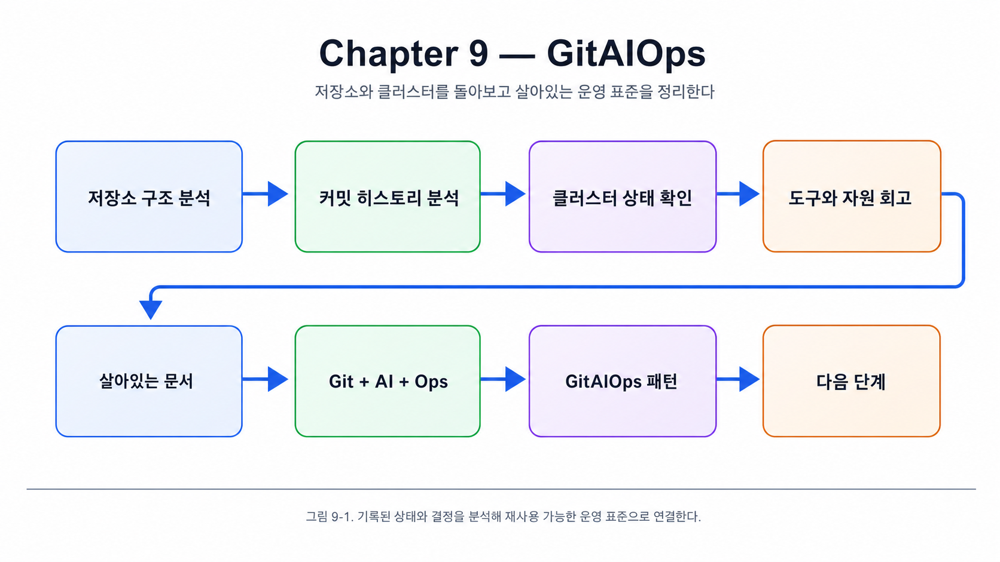
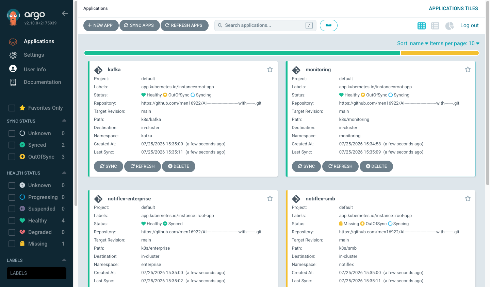
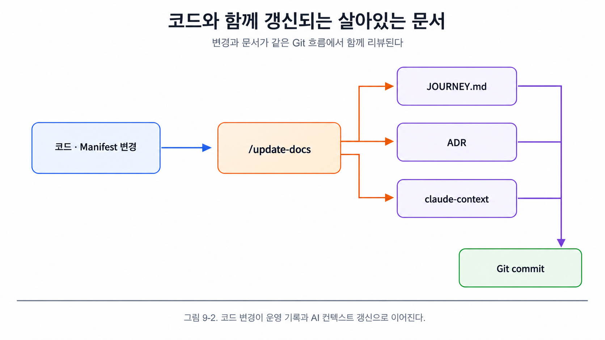
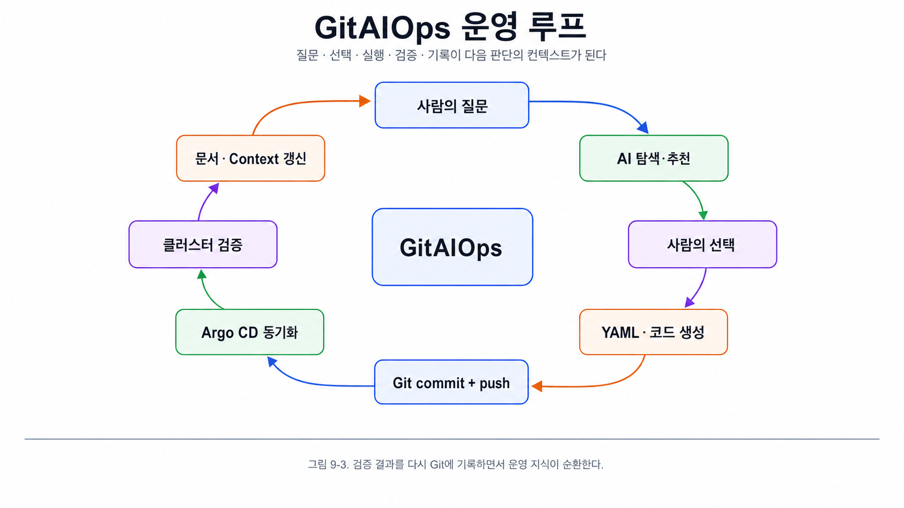
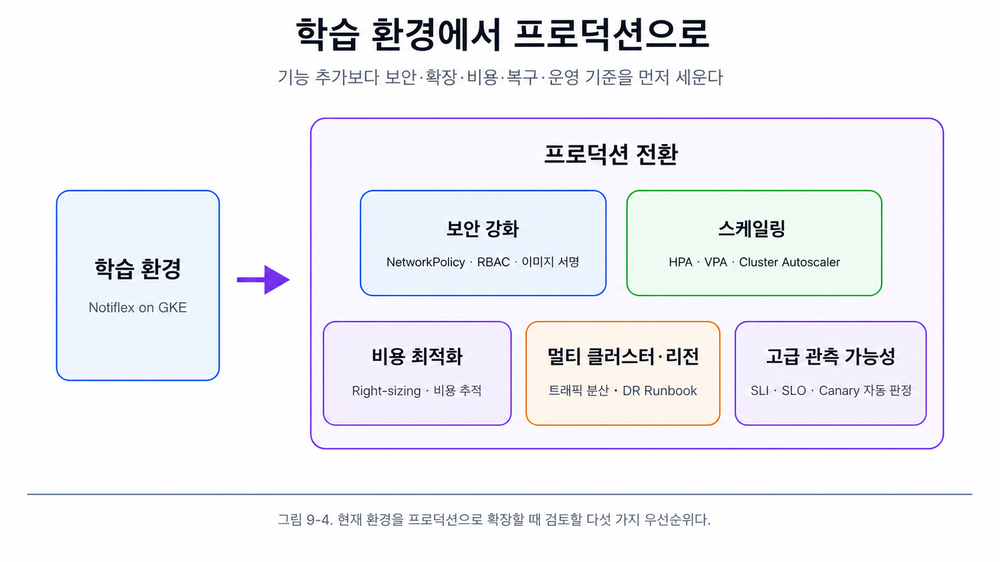

# Chapter 9. GitAIOps, 살아있는 운영 표준의 탄생

## 9장의 목표

2장에서 빈 GitHub 저장소와 작은 Go API로 시작한 Notiflex는 8장을 거치며 다음과 같은 클라우드 네이티브 플랫폼을 갖췄습니다.

- GitHub Actions와 Argo CD를 이용한 GitOps 배포
- Gateway API와 Argo Rollouts를 이용한 무중단 배포
- Valkey와 Secret Manager를 이용한 엔터프라이즈 기반
- 멀티 노드풀, App of Apps, Namespace 기반 멀티 테넌시
- Kafka 기반 비동기 메시징
- Prometheus, Loki, Tempo, Grafana 기반 관측 가능성
- CronJob과 `command-guardrails/` 기반 운영 자동화

9장에서는 새로운 도구를 설치하지 않습니다. 지금까지 만든 저장소와 클러스터를 분석하면서 **현재 구조가 만들어진 이유**와 **Git, AI, Ops가 결합된 방식**을 돌아봅니다.

1. AI에게 저장소 구조, 커밋 이력, 현재 클러스터 상태를 분석시킵니다.
2. 각 장에서 선택한 도구와 의사결정의 일관성을 회고합니다.
3. 코드와 함께 살아남는 문서, AI가 읽는 문서가 만든 예상 밖의 효과를 살펴봅니다.
4. GitOps에 AI가 결합된 **GitAIOps** 패턴을 정리합니다.
5. 현재 학습 환경을 프로덕션으로 발전시키기 위한 다음 단계를 제안합니다.

---

## 9장 전체 흐름



이 장은 Git에 상태와 결정을 기록합니다. AI와 함께 설계·분석·문서화하고 Ops 도구로 실행과 검증을 자동화하는 운영 방식을 하나의 표준으로 정리합니다.

---

# 9.1 AI에게 저장소 분석시키기

- **9.1 AI에게 저장소 분석시키기**
    
    ## 9.1.1 저장소 구조 분석
    
    클로드 코드에게 다음과 같이 요청합니다.
    
    ```
    지금까지 구성한 notiflex-platform 저장소를 분석해줘.
    ```
    
    저장소에는 애플리케이션 코드, Kubernetes 선언, GitOps 설정, 운영 문서와 AI용 컨텍스트가 함께 쌓였습니다.
    
    ```
    notiflex-platform/
    ├── CLAUDE.md
    ├── JOURNEY.md
    ├── app/
    │   ├── main.go
    │   ├── go.mod
    │   ├── go.sum
    │   └── Dockerfile
    ├── k8s/
    │   ├── smb/
    │   │   ├── rollout.yaml
    │   │   ├── service.yaml
    │   │   ├── service-preview.yaml
    │   │   └── healthcheck-cronjob.yaml
    │   ├── enterprise/
    │   │   ├── namespace.yaml
    │   │   ├── rollout.yaml
    │   │   ├── service.yaml
    │   │   └── valkey-secret.yaml
    │   ├── gateway/
    │   │   ├── gateway.yaml
    │   │   ├── httproute.yaml
    │   │   └── healthcheckpolicy.yaml
    │   ├── monitoring/
    │   │   └── pod-restart-alert.yaml
    │   ├── kafka/
    │   │   ├── kafka-cluster.yaml
    │   │   ├── kafka-nodepool.yaml
    │   │   └── topic-notifications.yaml
    │   └── secret/
    │       └── secretproviderclass.yaml
    ├── argocd/
    │   ├── root-app.yaml
    │   └── apps/
    │       ├── notiflex-smb.yaml
    │       ├── notiflex-enterprise.yaml
    │       └── monitoring.yaml
    ├── helm-values/
    │   └── tempo.yaml
    ├── .github/workflows/
    │   └── ci.yaml
    ├── claude-context/
    ├── command-guardrails/
    ├── docs/
    │   ├── JOURNEY.md
    │   └── architecture-decisions.md
    └── .claude/
        ├── commands/update-docs.md
        └── memory/
    ```
    
    파일 규모를 비교하면 GitOps 프로젝트의 특성이 드러납니다.
    
    ```bash
    find notiflex-platform -name '*.go' | xargs wc -l
    find notiflex-platform -name '*.yaml' -not -path '*/.git/*' | xargs wc -l
    ```
    
    ```
    Go 코드: 약 95줄
    Kubernetes Manifest: 약 450줄, 24개 YAML
    ```
    
    애플리케이션이 **무엇을 하는지**는 Go 코드가 정합니다. **어떻게 배포하고 라우팅하고 모니터링하고 복구하는지**는 Manifest와 운영 문서에 담깁니다. 운영 요구사항이 늘수록 애플리케이션 코드보다 운영 선언의 비중도 커집니다.
    
    ## 9.1.2 커밋 히스토리 분석
    
    저장소의 성장 흐름은 Git 히스토리에 남아 있습니다.
    
    ```bash
    cd notiflex-platform
    git log --oneline --all
    ```
    
    | 장 | 핵심 변화 | 추가된 구성요소 |
    | --- | --- | --- |
    | ch2 | 환경 구성과 첫 배포 | GKE, Go API, Dockerfile, Kubernetes Manifest |
    | ch3 | GitOps와 CI/CD | Argo CD Application, GitHub Actions |
    | ch4 | 관측 가능성 | Prometheus, Grafana, Loki, Fluent Bit, PrometheusRule |
    | ch5 | 무중단 배포 | Gateway API, Argo Rollouts |
    | ch6 | 엔터프라이즈 기반 | Valkey, Secret Manager CSI, Canary |
    | ch7 | 규모 확장 | 멀티 노드풀, App of Apps, Enterprise Tenant |
    | ch8 | 고도화 | Strimzi Kafka, Tempo, CronJob |
    
    Git 커밋에는 단순한 Go API가 완전한 클라우드 네이티브 플랫폼으로 발전한 과정이 고스란히 남습니다. Git은 결과물만 보관하는 공간이 아니라 **인프라의 성장 과정과 의사결정을 추적하는 타임라인**입니다.
    
    ## 9.1.3 현재 클러스터 상태
    
    커밋 이력 다음에는 실제 클러스터가 선언된 상태와 일치하는지 확인합니다.
    
    ```bash
    kubectl --context gke-sysnet4admin_book_gitaiops get pods -A \
      --no-headers | wc -l
    
    kubectl --context gke-sysnet4admin_book_gitaiops get pods -A \
      -o wide --no-headers | awk '{print $1}' | sort | uniq -c | sort -rn
    
    kubectl --context gke-sysnet4admin_book_gitaiops top nodes --no-headers
    
    kubectl --context gke-sysnet4admin_book_gitaiops get app -n argocd \
      --no-headers
    ```
    
    현재 구조는 다음과 같습니다.
    
    - GKE 노드 5개
    - Namespace 8개
    - Pod 약 28개
    - Argo CD Application 4개
    - 모든 Application이 `Synced + Healthy`
    
    ### 📷 실습 인증 - GitAIOps 통합 관제 대시보드
    
    
    > 그림 9-1-1. (실습 인증) Argo CD Web UI 대시보드에서 root-app 아래 `monitoring`, `notiflex-smb`, `notiflex-enterprise`, `kafka` 등 플랫폼 전체 애플리케이션이 통합 등록되어 관리되는 화면.
    
    > 🔗 **GCP 콘솔 직접 확인 (로그인 필요)**:  
    > [Google Cloud Console - GKE 클러스터 및 통합 워크로드 관리 화면](https://console.cloud.google.com/kubernetes/workload_/gcloud/asia-northeast3-a/notiflex-cluster?project=claude-study-501117)에서 GKE 클러스터 상에 동적으로 스케줄링된 전체 워크로드 및 노드풀 운영 현황을 직접 확인하실 수 있습니다.
    
    새로운 마이크로서비스를 추가하는 기본 절차도 저장소 구조에서 읽어낼 수 있습니다.
    
    1. `app/` 또는 별도 서비스 디렉터리에 코드 작성
    2. `k8s/<service-name>/`에 Rollout과 Service 작성
    3. `argocd/apps/<service-name>.yaml` 추가
    4. Git push 후 CI가 이미지를 만들고 Argo CD가 배포
    5. Prometheus와 Loki가 메트릭과 로그를 자동 수집
    
    플랫폼 기반을 갖춘 뒤에는 팀이 인프라 설치보다 애플리케이션 개발에 집중하기 쉬워집니다.
    
    ### 코드보다 Manifest가 많은 이유
    
    클라우드 네이티브 환경에서 애플리케이션 코드는 기능을 정의하고 Manifest는 다음 운영 요구를 정의합니다.
    
    - 배포와 롤백
    - 트래픽 라우팅
    - 스케줄링과 리소스 격리
    - Secret 주입
    - 관측 가능성
    - 고가용성과 자동 복구
    
    Manifest 변경 이력도 애플리케이션 코드 이력만큼 중요합니다. 이 이력은 GitOps가 관리합니다.
    

---

# 9.2 쌓인 것들을 돌아보기

- **9.2 쌓인 것들을 돌아보기**
    
    ## 9.2.1 도구 선택 의사결정 종합
    
    각 장에서 선택한 도구와 검토한 대안을 한눈에 돌아봅니다.
    
    | 장 | 선택한 도구 | 검토한 대안 | 선택 이유 |
    | --- | --- | --- | --- |
    | ch3 | Argo CD | Flux, Jenkins X | Argo 생태계 통합, CRD 기반 상태 관리 |
    | ch3 | GitHub Actions | Cloud Build, GitLab CI | GitHub 네이티브, 학습 환경의 무료 Tier |
    | ch4 | Prometheus + Grafana | Datadog, GCP Monitoring | 오픈소스, Helm 설치, Grafana 통합 |
    | ch4 | Loki + Fluent Bit | ELK, GCP Logging | 경량, Grafana 통합, DaemonSet 수집 |
    | ch4 | PrometheusRule | Grafana Alerting | GitOps CRD 관리와 Alertmanager 라우팅 |
    | ch5 | Gateway API | Ingress NGINX, Istio | GKE 네이티브, 별도 Controller 설치 불필요 |
    | ch5 | Argo Rollouts | Flagger | Argo CD 통합, Blue/Green과 Canary 지원 |
    | ch6 | Valkey | Redis, Memcached | Redis 호환성과 BSD 계열 라이선스 |
    | ch6 | CSI + Secret Manager | Sealed Secrets, ESO | GKE Workload Identity와 네이티브 통합 |
    | ch7 | nodeSelector | Taint/Toleration, Affinity | 가장 단순하고 GKE 노드풀 라벨과 바로 연결 |
    | ch7 | App of Apps | ApplicationSet | 단일 클러스터와 소수 앱에 적합한 단순성 |
    | ch8 | Kafka + Strimzi | RabbitMQ, NATS, Redis Streams | 이벤트 스트리밍 표준, CRD와 GitOps 관리 |
    | ch8 | Tempo | Jaeger, Zipkin | Grafana 통합, 경량 운영, OTLP 지원 |
    
    도구 선택에는 네 가지 기준이 일관되게 나타납니다.
    
    1. **GKE 네이티브 기능 우선**: Gateway API, Workload Identity, CSI Driver처럼 플랫폼이 제공하는 기능을 먼저 사용합니다.
    2. **Argo 생태계 유지**: Argo CD와 Argo Rollouts처럼 같은 상태 모델과 운영 경험을 공유합니다.
    3. **Grafana 중심 통합**: Prometheus, Loki, Tempo를 Grafana 하나에서 조회합니다.
    4. **GitOps 호환성**: 모든 도구를 YAML로 선언하고 Git에 커밋할 수 있어야 합니다.
    
    이 기준은 처음부터 정한 원칙이 아니라 매 장에서 AI에게 “왜?”를 묻고 `JOURNEY.md`와 ADR에 기록하면서 자연스럽게 형성됐습니다.
    
    ## 9.2.2 자원 사용 현황과 의사결정 회고
    
    ```bash
    kubectl --context gke-sysnet4admin_book_gitaiops top pods -A \
      --sort-by=cpu --no-headers | head -10
    ```
    
    현재 환경에서는 Kafka Broker가 가장 많은 CPU를 사용합니다. 그다음은 Prometheus와 Grafana 같은 플랫폼 구성요소입니다. 프로덕션에서도 관측 가능성과 데이터 플랫폼이 애플리케이션보다 많은 자원을 쓰는 경우가 흔합니다.
    
    ### 다른 선택을 했다면
    
    **CSI Secret Manager 대신 Sealed Secrets를 선택했다면**
    
    - 멀티 클라우드 이식성은 좋아질 수 있습니다.
    - 그러나 별도 Controller와 암호화 키 운영이 필요합니다.
    - GKE에 종속된 현재 학습 환경에서는 Workload Identity와 Secret Manager 조합이 더 적합했습니다.
    
    **Canary를 더 일찍 도입했다면**
    
    - Blue/Green의 Preview 환경과 전체 전환 개념을 먼저 경험하지 못했을 수 있습니다.
    - Blue/Green에서 Canary로 점진적으로 발전한 순서가 학습 효과를 높였습니다.
    
    **Kafka 대신 Redis Streams를 사용했다면**
    
    - Valkey 하나로 캐시와 메시징을 처리하면 자원이 절약됩니다.
    - 반면 Kafka의 Partition, Consumer Group, Offset과 같은 실무 이벤트 스트리밍 개념을 익힐 수 없습니다.
    
    ## [CLAUDE.md](http://CLAUDE.md)의 성장
    
    `CLAUDE.md` 역시 장이 진행되면서 단순한 환경 정보에서 행동 규칙으로 발전했습니다.
    
    | 장 | 추가된 내용 | 역할 |
    | --- | --- | --- |
    | ch2 | GCP 프로젝트, 리전, 클러스터 | 환경 정보 |
    | ch3 | Argo CD Sync 규칙, Commit 규칙 | GitOps 행동 규칙 |
    | ch4 | 관측 가능성 Namespace 정보 | 운영 환경 확장 |
    | ch5 | Rollout 전략 규칙 | 배포 규칙 |
    | ch6 | Secret 관리 규칙 | 보안 규칙 |
    | ch7 | 노드풀 배치, Tenant Namespace | 스케줄링과 격리 규칙 |
    | ch8 | Kafka와 Tempo 관련 값 | 메시징과 트레이싱 규칙 |
    
    처음에는 “어떤 환경인가”를 알려주는 파일이었습니다. 장이 쌓이면서 “어떻게 행동해야 하는가”까지 정의하는 AI용 프로젝트 운영 규칙으로 자랐습니다.
    

---

# 9.3 기대하지 않았던 효과

- **9.3 기대하지 않았던 효과**
    
    ## 9.3.1 살아있는 문서
    
    운영 문서는 대개 Wiki나 Confluence에 작성합니다. 처음에는 정확해도 시간이 지나면 코드와 어긋나기 쉽습니다.
    
    Notiflex에서는 문서와 코드가 같은 Git 저장소에 있고 `/update-docs`가 코드 변경과 함께 문서를 갱신합니다.
    
    
    
    문서가 코드와 함께 바뀌고 리뷰되므로 별도 Wiki보다 최신 상태를 유지하기 쉽습니다. 이런 문서를 **살아있는 문서**라고 부릅니다.
    
    ## 9.3.2 사람이 보는 문서, AI가 읽는 문서
    
    | 문서 | 주요 독자 | 활용 방식 |
    | --- | --- | --- |
    | `docs/JOURNEY.md` | 사람 | 진행 점검과 의사결정 흐름 검토 |
    | `docs/architecture-decisions.md` | 사람과 AI | 결정 이유와 대안 추적 |
    | `CLAUDE.md` | AI | 프로젝트 메타데이터와 행동 규칙 |
    | `claude-context/` | AI | 현재 아키텍처와 실행 맥락 |
    | `.claude/memory/` | AI | 작업 컨텍스트 메모 |
    | `settings.local.json` | AI | 명령 실행의 허용·승인·차단 제어 |
    | `command-guardrails/` | 사람과 AI | 위험 작업의 검증된 실행 절차 |
    
    이 문서들 가운데 상당수는 AI가 대화를 시작할 때마다 프로젝트를 이해하도록 설계됐습니다. AI는 ADR에서 도구 선택 이유를 찾고 `claude-context/`에서 현재 구조를 확인하며 `command-guardrails/`에서 안전한 실행 절차를 읽습니다.
    
    다만 문서가 있다고 항상 좋은 답변이 나오는 것은 아닙니다. **기록의 품질과 최신성이 AI 답변의 품질을 결정합니다.**
    
    ## 9.3.3 구조화된 기록으로 만드는 산출물
    
    저장소와 클러스터 상태가 충분히 구조화되면 AI는 기존 정보를 조합해 새로운 산출물을 만들 수 있습니다.
    
    - 신규 엔지니어 온보딩 가이드
    - 현재 아키텍처 요약
    - 보안 감사 체크리스트
    - 장애 대응 Runbook
    - 신규 Tenant 또는 Kafka Topic 추가 절차
    
    예를 들어 “온보딩 문서 만들어줘”라고 요청하면 AI는 다음 정보를 결합합니다.
    
    - Git 저장소 구조
    - 현재 GKE 노드와 Namespace
    - Argo CD Application과 배포 흐름
    - Grafana 접근 방법
    - Valkey, Kafka, Tempo 연결 관계
    - `command-guardrails/`의 운영 절차
    
    AI는 새 코드를 작성하는 대신 **이미 쌓인 운영 지식을 읽고 재구성합니다.**
    

---

# 9.4 GitAIOps의 출현

- **9.4 GitAIOps의 출현**
    
    ## 9.4.1 Git + AI + Ops 연결 분석
    
    ### Git은 단일 진실 공급원
    
    - 모든 인프라 상태를 YAML로 선언합니다.
    - Commit History가 변경 이력입니다.
    - `JOURNEY.md`와 ADR이 의사결정 기록입니다.
    - `CLAUDE.md`와 `claude-context/`가 AI에게 프로젝트를 이해시키는 메타데이터입니다.
    
    ### AI는 의사결정 보조와 코드 생성
    
    각 장에서는 AI와 함께 3-프롬프트 패턴을 반복했습니다.
    
    ```
    탐색: 어떤 도구가 적합한가?
    비교: 다른 선택지와 Trade-off는 무엇인가?
    실행: 선택한 도구를 현재 환경에 맞게 적용한다.
    ```
    
    AI는 컨텍스트를 읽고 도구를 비교합니다. Manifest와 애플리케이션 코드를 만들고 에러도 분석합니다. 선택 이유를 `JOURNEY.md`와 ADR에 남기는 기록자 역할도 맡습니다.
    
    ### Ops는 운영 자동화
    
    - Argo CD가 Git 상태를 클러스터에 동기화합니다.
    - Argo Rollouts가 Blue/Green과 Canary를 실행합니다.
    - Prometheus와 Alertmanager가 이상을 탐지합니다.
    - Loki와 Tempo가 문제 원인을 추적합니다.
    - CronJob이 반복 작업을 자동화합니다.
    
    ### GitAIOps 루프
    
    
    
    이 루프를 장마다 반복하면 AI는 이전 선택을 이해하고 일관된 아키텍처를 유지합니다.
    
    ## 9.4.2 GitOps와의 차이
    
    | 항목 | GitOps | GitAIOps |
    | --- | --- | --- |
    | YAML 작성 | 사람이 직접 작성 | AI가 자연어와 프로젝트 Context에서 생성 |
    | 도구 선택 | 사람이 조사하고 결정 | AI가 대안을 비교하고 사람이 승인 |
    | 문서화 | 별도 작업이라 누락되기 쉬움 | AI와의 대화 및 `/update-docs`로 동시 기록 |
    | 트러블슈팅 | 사람이 에러 메시지를 검색 | AI가 환경과 이력을 읽고 해결책 제안 |
    | 동기화 | Git → Argo CD → Cluster | 동일 |
    | 지식 추적 | Git History와 사람의 기억 | Git + AI용 Context + ADR + Guardrail |
    
    AI는 단순한 코드 생성기가 아니라 **실행자이면서 동시에 기록자**입니다. 기존 GitOps에서 부족했던 문서화와 지식 추적도 작업 과정에 포함됩니다.
    
    ## 9.4.3 문제를 풀며 형성된 표준
    
    이 프로젝트는 처음부터 “GitAIOps 표준을 설계하자”고 시작하지 않았습니다. 각 장의 문제를 하나씩 해결했을 뿐입니다.
    
    - 배포가 불안정하다 → GitHub Actions와 Argo CD
    - 장애 원인을 찾기 어렵다 → Prometheus와 Loki
    - 무중단 전환이 필요하다 → Gateway API와 Argo Rollouts
    - 기반이 허술하다 → Valkey, Secret Manager, Canary
    - 규모를 키워야 한다 → 멀티 노드풀과 멀티 테넌시
    - 호출 흐름이 복잡하다 → Kafka와 Tempo
    
    각 문제를 Git에 기록하고 AI와 함께 해결하며 문서를 남겼습니다. 이 패턴을 반복하면서 운영 표준이 만들어졌습니다.
    
    ## 9.4.4 진행 방향에 따라 달라지는 구조
    
    | 자산 | 도입 시점 | 목적 | 상태 |
    | --- | --- | --- | --- |
    | `CLAUDE.md` | 3장 | 자연어 규칙과 행동 가이드 | 적용 |
    | `.claude/memory/` | 4장 | 작업 컨텍스트 단편 메모 | 로컬 적용 |
    | ADR | 5장 | 의사결정과 대안 기록 | 적용 |
    | `claude-context/` | 6장 | 현재 아키텍처 요약 | 적용 |
    | `settings.local.json` | 7장 | 명령 차단과 승인 체험 | 실습 후 제거 |
    | `command-guardrails/` | 8장 | 위험 작업 실행 절차 | 적용 |
    
    소규모 프로젝트에서는 문제가 생길 때 필요한 자산을 하나씩 쌓는 방식이 자연스럽습니다. 대규모 현대화나 전면 재설계라면 전체 계획을 먼저 작성합니다. 그 계획을 AI가 읽기 좋은 컨텍스트로 증류한 뒤 실행 절차와 값 파일을 고정하는 방식이 적합합니다.
    
    출발 방식이 달라도 필요한 결과는 같습니다.
    
    > 사람과 AI가 함께 읽을 수 있고 Git으로 관리되는 운영 표준
    > 

---

# 9.5 마무리: 다음 단계

- **9.5 마무리: 다음 단계**
    
    ## 9.5.1 프로덕션 전환 제언
    
    현재 Notiflex는 학습 환경입니다. 프로덕션으로 발전시키려면 다음 항목을 우선 검토해야 합니다.

    
    
    ### 1. 보안 강화
    
    - Tenant 간 통신을 제한하는 NetworkPolicy
    - ServiceAccount와 Namespace별 RBAC 세분화
    - Pod Security Standards의 `restricted` Profile 적용
    - Cosign 등을 이용한 이미지 서명과 검증
    - Secret 접근 감사와 Rotation
    
    ```yaml
    apiVersion: networking.k8s.io/v1
    kind: NetworkPolicy
    metadata:
      name: deny-cross-tenant
      namespace: enterprise
    spec:
      podSelector: {}
      policyTypes:
        - Ingress
      ingress:
        - from:
            - namespaceSelector:
                matchLabels:
                  name: enterprise
    ```
    
    ### 2. 스케일링
    
    - HPA: CPU, Memory, Custom Metric 기반 Pod 자동 확장
    - VPA: Requests 추천과 자동 조정
    - Cluster Autoscaler: 노드풀 확장과 축소
    - 중요한 워크로드는 On-Demand, 비중요 워크로드는 Spot에 배치
    
    ### 3. 비용 최적화
    
    - Committed Use Discounts 검토
    - Namespace별 비용 배분과 Tenant 단위 비용 추적
    - VPA 추천값 기반 Requests와 Limits Right-sizing
    - Kafka, Prometheus, Grafana 등 플랫폼 자원 최적화
    
    ### 4. 멀티 클러스터와 멀티 리전
    
    - Multi-cluster Gateway를 이용한 리전 간 트래픽 분산
    - Argo CD ApplicationSet으로 여러 클러스터 배포 자동화
    - 리전 장애를 고려한 데이터 복제와 DR Runbook
    
    ### 5. 고급 관측 가능성
    
    - Argo Rollouts AnalysisTemplate로 메트릭 기반 Canary 자동 판정
    - 서비스별 SLI와 SLO 정의
    - Alertmanager를 Slack, PagerDuty 등 운영 채널과 연동
    
    ## 9.5.2 AI와 대화하는 습관
    
    이 과정을 거치며 다음 습관이 생겼습니다.
    
    1. **먼저 “왜”를 묻는다.** 바로 설치를 요청하기보다 현재 환경에서 어떤 도구가 적합한지 탐색하고 비교합니다.
    2. **결정을 기록한다.** 도구를 선택한 이유와 대안을 `JOURNEY.md`와 ADR에 남깁니다.
    3. **한 번에 하나씩 진행한다.** Kafka, Tempo, CronJob을 동시에 적용하지 않고 각 단계를 구현하고 검증한 뒤 다음으로 넘어갑니다.
    4. **검증을 습관화한다.** 작업 후 `kubectl`, `helm status`, HTTP 요청 등으로 실제 상태를 확인합니다.
    
    ## 9.5.3 다시 처음부터
    
    GitOps의 가치는 클러스터 자체보다 Git 저장소에 있습니다. GKE 클러스터를 삭제하면 모든 실행 중인 워크로드는 사라지지만 다음 자산은 Git에 남습니다.
    
    - 애플리케이션 코드
    - Kubernetes Manifest
    - Helm Values
    - Argo CD Application
    - 운영 문서와 ADR
    - AI Context와 Guardrail
    
    ```bash
    gcloud container clusters delete notiflex-cluster \
      --zone=asia-northeast3-a \
      --quiet
    ```
    
    새 클러스터를 만든 뒤 Argo CD를 설치하고 같은 저장소를 연결하면 선언된 인프라를 복원할 수 있습니다. 두 번째 구축은 도구 선택 기준, 환경 값, 실행 순서와 검증 방법이 이미 남아 있어 처음보다 훨씬 빨라집니다.
    

---

# 9.6 9장 가드레일 살펴보기

- **9.6 9장 가드레일 살펴보기**
    
    9장은 새로운 도구를 설치하거나 배포하지 않고 AI에게 저장소와 클러스터를 분석시킵니다. 이 때문에 가드레일도 변경 명령보다 조회 명령을 중심으로 구성됩니다.
    
    | 하위 절 | 유형 | 참조 파일 | 역할 |
    | --- | --- | --- | --- |
    | 9.1 저장소 분석 | 실행 | `prompt-guardrails/ch9/9.1-repo-analysis.md` | 디렉터리 구조, 커밋, 클러스터 상태 분석 |
    | 9.2 회고 | 실행 | `prompt-guardrails/ch9/9.2-retrospective.md` | 의사결정 종합과 자원 사용 분석 |
    | 9.3 온보딩 | 실행 | `prompt-guardrails/ch9/9.3-onboarding.md` | 온보딩 문서와 Q&A 생성 |
    | 9.4 GitAIOps | 실행 | `prompt-guardrails/ch9/9.4-gitaiops.md` | Git, AI, Ops 연결 구조 분석 |
    | 9.5 마무리 | 실행 | `prompt-guardrails/ch9/9.5-wrap-up.md` | 다음 단계 제안과 환경 초기화 |
    
    주로 다음 조회 명령을 사용합니다.
    
    ```bash
    git log --oneline --all
    kubectl get pods -A
    kubectl top nodes
    kubectl top pods -A
    kubectl get applications -n argocd
    kubectl get rollouts -A
    ```
    
    클러스터를 변경하는 명령은 분석 과정에 포함하지 않습니다. 환경 삭제는 사용자가 명시적으로 요청하는 마지막 단계에서만 수행하고 삭제 후 Git 저장소가 보존되는지 다시 확인합니다.
    
    ### 9장의 최종 결과
    
    | 관점 | 시작 | Chapter 8 이후 |
    | --- | --- | --- |
    | 애플리케이션 | Deployment와 작은 Go API | Canary Rollout, Valkey, Kafka Producer/Consumer |
    | 클러스터 | 단일 Namespace와 기본 노드 | 5개 노드, 8개 Namespace, 멀티 노드풀 |
    | 배포 | 수동 `kubectl` | GitHub Actions + Argo CD App of Apps |
    | 관측 | 개별 로그 | Prometheus + Loki + Tempo + Grafana |
    | 자동화 | 수동 확인 | CronJob, Alerting, Auto Sync |
    | 문서 | 없음 | [CLAUDE.md](http://CLAUDE.md), JOURNEY, ADR, Context, Guardrail |
    
    2장에서 아무것도 없는 저장소를 만들고 8장까지 문제를 하나씩 해결했습니다. 돌아보니 그 결과는 단순한 인프라가 아니라, **사람과 AI가 함께 읽고 Git으로 관리하는 살아있는 운영 표준**이었습니다.
    
    GitAIOps는 여기서 끝나는 개념이 아니라, 이 운영 표준을 다음 프로젝트와 더 큰 환경에 재사용하기 위한 출발점입니다.
