# 3장. 첫 번째 배포 파이프라인

## 3장의 목표

2장에서는 클로드 코드에게 “빌드하고 배포해줘”라고 요청해 Notiflex API 서버를 GKE에 배포했습니다.

서비스는 정상적으로 실행되었지만, 기능을 추가하거나 버그를 수정할 때마다 다음과 같은 의문이 남습니다.

> 지금 클러스터에는 정확히 무엇이 배포되어 있을까?
>
> 누가, 언제, 왜 배포했을까?
>
> 문제가 생기면 이전 상태로 되돌릴 수 있을까?
>
> 코드를 푸시하면 빌드부터 배포까지 자동으로 이어질 수 있을까?

3장에서는 이 문제를 해결하기 위해 **Argo CD 기반 GitOps 배포 파이프라인**을 만들고, 마지막에는 **GitHub Actions CI와 Argo CD를 연결**해 코드 푸시만으로 빌드와 배포가 자동으로 이어지도록 구성합니다.

---

## 3장 전체 흐름

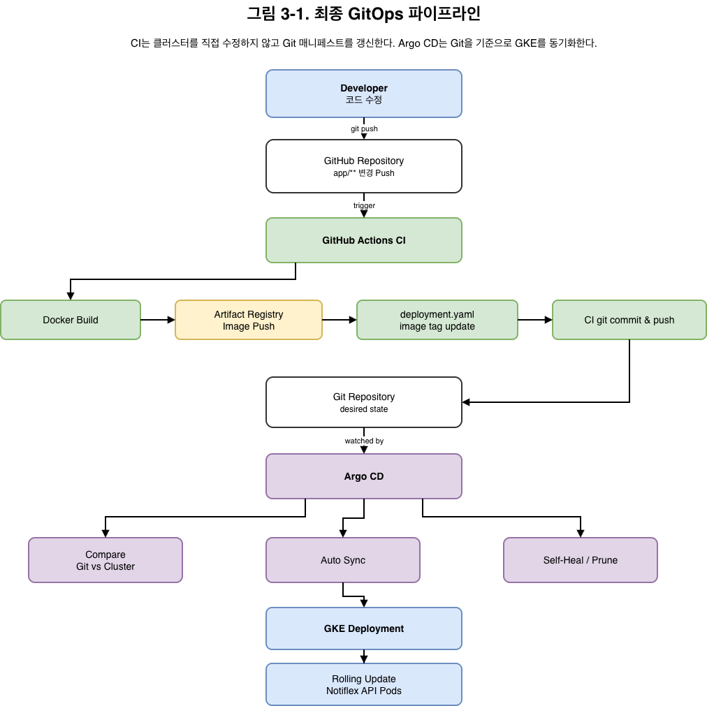

```text
Developer
  ↓ git push
GitHub Repository
  ↓ trigger
GitHub Actions CI
  ├─ Docker Build
  ├─ Artifact Registry Push
  └─ deployment.yaml image tag update
        ↓ git commit & push
Git Repository
  ↓ watched by
Argo CD
  ├─ Compare Git vs Cluster
  ├─ Auto Sync
  └─ Self-Heal / Prune
        ↓
GKE Deployment
  ↓
Rolling Update
  ↓
Notiflex API Pods
```

> 그림 3-1. 3장에서 완성하는 GitHub Actions + Argo CD 기반 GitOps 배포 파이프라인

핵심은 **CI가 직접 `kubectl apply`를 실행하지 않는 것**입니다.

CI는 이미지를 만들고 Git의 매니페스트를 갱신합니다. Argo CD는 Git을 기준으로 클러스터를 동기화합니다.

---

# 3.1 푸시 기반 배포의 한계

<details>
<summary><b>3.1 푸시 기반 배포의 한계 상세 내용 접기/펼치기</b></summary>

## 기존 방식의 문제

2장에서는 클로드 코드가 이미지를 빌드하고 GKE에 직접 배포했습니다.

편리하긴 했지만, 이 방식에는 구조적인 문제가 있습니다. 클러스터에 무언가 올라가긴 하지만, **그 상태가 어디에 기록되어 있는지 불분명**합니다.

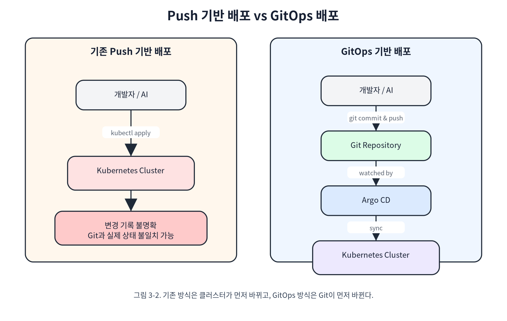

> 그림 3-2. 기존 Push 기반 배포는 클러스터가 먼저 바뀌고, GitOps 배포는 Git이 먼저 바뀐다.

Push 기반 배포는 “지금 실행한 명령”이 중심입니다. 반면 GitOps 배포는 “Git에 기록된 원하는 상태”가 중심입니다.

---

## 문제 1. 클러스터에 무엇이 있는지 확인하기 어렵다

배포된 것이 정확히 무엇인지 확인하려면 클러스터에 직접 물어봐야 합니다.

예를 들어 누군가 `kubectl edit configmap`으로 설정을 고치면 클러스터 상태는 바뀝니다. 하지만 Git 저장소의 YAML은 바뀌지 않습니다.

```text
Git 저장소의 ConfigMap: level: info
클러스터의 ConfigMap: level: warn
```

이처럼 Git의 상태와 클러스터의 실제 상태가 달라지는 것을 **설정 드리프트(configuration drift)**라고 합니다.

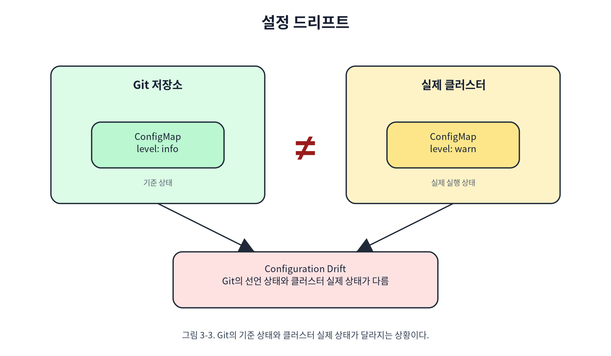

> 그림 3-3. 설정 드리프트는 Git의 기준 상태와 클러스터의 실제 상태가 달라지는 상황이다.

드리프트가 생기면 다음 문제가 발생합니다.

| 문제 | 설명 |
| --- | --- |
| 실제 기준이 불명확함 | Git이 맞는지, 클러스터가 맞는지 알 수 없음 |
| 변경 이력 추적 불가 | 누가, 왜 바꿨는지 남지 않음 |
| 복구 기준 없음 | 문제가 생겨도 무엇으로 되돌려야 할지 모름 |

---

## 문제 2. “왜 배포했는지”가 남지 않는다

Deployment는 `kubectl rollout undo`로 되돌릴 수 있습니다. 하지만 이것만으로는 충분하지 않습니다.

```shell
kubectl rollout history deployment/notiflex-api -n notiflex
```

기록을 보면 `CHANGE-CAUSE`가 `<none>`으로 나오는 경우가 많습니다.

```text
REVISION    CHANGE-CAUSE
1           <none>
2           <none>
```

즉, 되돌릴 수는 있어도 **왜 이 배포를 했는지**는 알 수 없습니다.

또한 ConfigMap 같은 리소스에는 Deployment처럼 rollout history가 없습니다. 리소스마다 추적 방식이 다르기 때문에 전체 시스템 상태를 일관되게 복구하기 어렵습니다.

---

## 문제 3. 명령형 배포는 흔적이 약하다

배포 방식은 크게 두 가지로 나눌 수 있습니다.

| 방식 | 예시 | 특징 |
| --- | --- | --- |
| 명령형 | `kubectl set image ...` | 지금 당장 실행하는 동작. 실행 후 기준 상태가 남지 않음 |
| 선언형 | YAML에 원하는 상태 작성 | “이 상태가 되어야 한다”는 기준이 Git에 남음 |

명령형은 빠르게 작업하기 좋습니다. 하지만 실행이 끝나면 **현재 상태를 만든 의도와 과정이 사라집니다.**

선언형은 YAML을 고쳐야 하므로 처음에는 번거롭습니다. 하지만 YAML이 곧 기준 상태가 됩니다.

---

## GitOps의 핵심 사고방식

GitOps는 이 문제를 해결하기 위해 다음 원칙을 사용합니다.

> Git에 적힌 YAML이 기준이고, 클러스터는 그 상태를 계속 따라가야 한다.

핵심 원칙은 세 가지입니다.

| 원칙 | 의미 |
| --- | --- |
| Single Source of Truth | 모든 기준 상태는 Git에 둔다 |
| Reconciliation Loop | Git과 클러스터 상태를 계속 비교한다 |
| Self-Heal | 클러스터가 Git과 달라지면 자동으로 원래 상태로 되돌린다 |

즉, 누군가 클러스터를 직접 수정해도 Argo CD가 Git 상태를 기준으로 다시 맞춥니다.

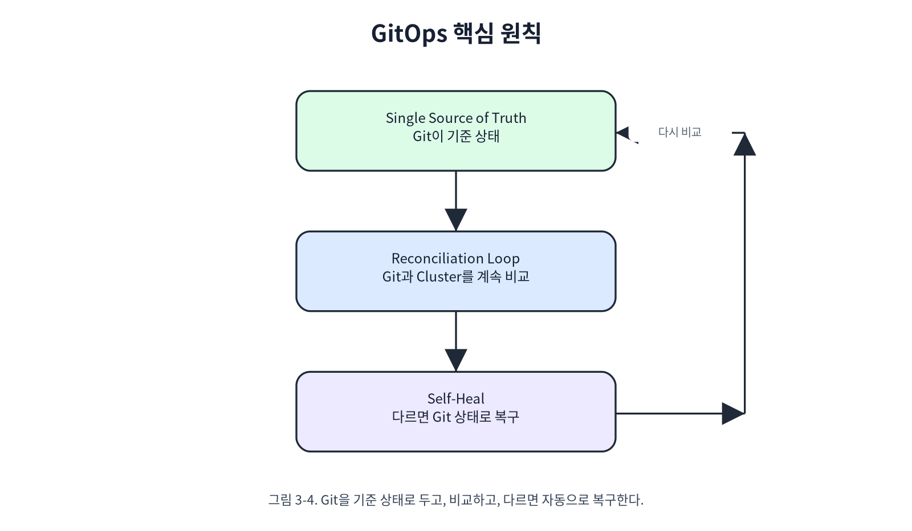

> 그림 3-4. GitOps는 Git을 기준 상태로 두고, 클러스터를 계속 비교하며, 다르면 자동으로 복구한다.

GitOps는 선언하고, 비교하고, 복구하는 반복 구조입니다.

</details>

---

# 3.2 Argo CD 설치 및 GitOps 연결

<details>
<summary><b>3.2 Argo CD 설치 및 GitOps 연결 상세 내용 접기/펼치기</b></summary>

## Argo CD를 선택한 이유

GitOps 도구는 여러 가지가 있습니다.

| 구분 | Argo CD | Flux | Jenkins X | Spinnaker |
| --- | --- | --- | --- | --- |
| 추천도 | 높음 | 중간 | 낮음 | 낮음 |
| 메모리 | 약 500MB | 약 100MB | 약 2GB | 약 4GB |
| Pod 수 | 약 7개 | 약 4개 | 20개 이상 | 10개 이상 |
| Web UI | 기본 제공 | 별도 설치 | 있음 | 있음 |
| CNCF | Graduated | Graduated | Sandbox | 별도 |
| 학습 곡선 | 보통 | 가파름 | 가파름 | 매우 가파름 |

Flux는 가볍지만 UI가 기본 제공되지 않습니다. Jenkins X와 Spinnaker는 학습용 환경에서 사용하기에는 무겁습니다.

이번 실습에서는 **눈으로 배포 상태를 확인할 수 있는 Argo CD**가 가장 적합합니다.

---

## Argo CD 설치 흐름

Argo CD 설치는 다음 순서로 진행합니다.

```shell
# 1. Argo CD 네임스페이스 생성
kubectl --context gke-sysnet4admin_book_gitaiops create namespace argocd

# 2. Argo CD 설치
kubectl --context gke-sysnet4admin_book_gitaiops apply -n argocd \
  -f https://raw.githubusercontent.com/argoproj/argo-cd/v2.14.11/manifests/install.yaml \
  --server-side=true \
  --force-conflicts=true

# 3. Pod 상태 확인
kubectl --context gke-sysnet4admin_book_gitaiops get pods -n argocd

# 4. Service 확인
kubectl --context gke-sysnet4admin_book_gitaiops get svc -n argocd
```

설치하면 다음과 같은 주요 컴포넌트가 생성됩니다.

| 컴포넌트 | 역할 |
| --- | --- |
| `argocd-server` | Web UI와 API 제공 |
| `argocd-repo-server` | Git 저장소에서 YAML을 가져옴 |
| `argocd-application-controller` | Git 상태와 클러스터 상태를 비교하고 동기화 |
| `argocd-applicationset-controller` | 여러 애플리케이션을 일괄 관리할 때 사용 |
| `argocd-dex-server` | SSO 로그인 처리 |
| `argocd-redis` | 캐시 저장 |
| `argocd-notifications-controller` | 알림 처리 |

가장 중요한 것은 다음 세 가지입니다.

```text
argocd-server
argocd-repo-server
argocd-application-controller
```

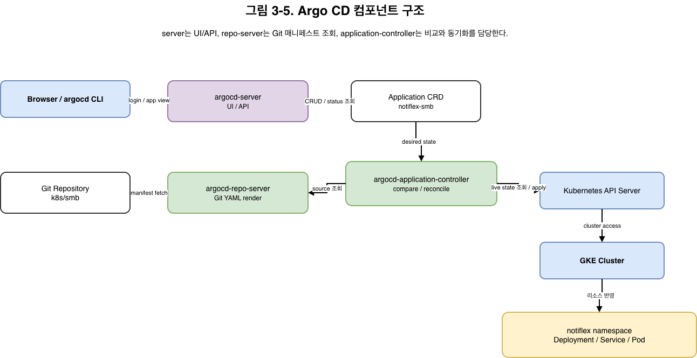

```text
Browser / argocd CLI
        ↓
argocd-server
        ↓
Application CRD: notiflex-smb
        ↓
argocd-application-controller
        ├─ Git 상태 조회 요청
        │      ↓
        │   argocd-repo-server
        │      ↓
        │   Git Repository: k8s/smb
        │
        └─ 클러스터 상태 비교 및 동기화
               ↓
            GKE Cluster
               ↓
            notiflex namespace
```

> 그림 3-5. Argo CD는 Git 저장소의 매니페스트를 읽고, Application Controller가 클러스터 상태와 비교해 동기화한다.

여기서 `server`, `repo-server`, `application-controller`의 역할을 구분하는 것이 중요합니다.

---

## `--server-side=true`를 붙인 이유

일반적인 `kubectl apply`는 클라이언트가 `last-applied-configuration`을 관리합니다. 하지만 Argo CD, Helm, kubectl이 같은 리소스를 수정하면 충돌이 생길 수 있습니다.

`--server-side=true`를 사용하면 kube-apiserver가 필드 소유권을 관리합니다.

```shell
--server-side=true
--force-conflicts=true
```

| 옵션 | 의미 |
| --- | --- |
| `--server-side=true` | 서버가 필드 소유권을 관리 |
| `--force-conflicts=true` | 기존 필드 소유권 충돌을 무시하고 적용 |

Argo CD처럼 많은 리소스를 관리하는 도구를 설치할 때 유용한 방식입니다.

---

## Argo CD UI 접속

Argo CD 서버는 기본적으로 ClusterIP Service로 생성됩니다. 로컬에서 접속하려면 포트 포워딩을 사용합니다.

```shell
# 초기 비밀번호 확인
kubectl --context gke-sysnet4admin_book_gitaiops -n argocd get secret argocd-initial-admin-secret \
  -o jsonpath="{.data.password}" | base64 -d

# 로컬 포트 포워딩
kubectl --context gke-sysnet4admin_book_gitaiops port-forward svc/argocd-server -n argocd 8443:443 &
```

브라우저에서 다음 주소로 접속합니다.

```text
https://localhost:8443
```

```text
ID: admin
PW: 초기 비밀번호
```

운영 환경이라면 로그인 후 비밀번호를 변경하고 초기 Secret을 삭제해야 합니다.

```shell
argocd login localhost:8443 --username admin --password <초기비밀번호> --insecure
argocd account update-password
kubectl -n argocd delete secret argocd-initial-admin-secret
```

---

## Argo CD 서버와 CLI의 차이

헷갈리기 쉬운 부분입니다.

| 구분 | 위치 | 역할 |
| --- | --- | --- |
| Argo CD 서버 | 클러스터 내부 | Git을 감시하고 배포를 실행하는 본체 |
| `argocd` CLI | 로컬 터미널 | 서버에 명령을 보내는 클라이언트 |

비유하면 다음과 같습니다.

```text
Argo CD 서버 = 데이터베이스 서버
argocd CLI = psql 같은 클라이언트
```

CLI가 없어도 Argo CD 서버는 계속 동작합니다. 하지만 CLI가 있으면 애플리케이션 상태 조회, 저장소 등록, 강제 Sync 등을 편하게 할 수 있습니다.

---

## Argo CD의 핵심 설정: Clusters, Repositories, Projects

Argo CD UI의 Settings에는 세 가지 중요한 개념이 있습니다.

| 항목 | 의미 |
| --- | --- |
| Clusters | Argo CD가 배포할 대상 클러스터 |
| Repositories | Argo CD가 감시할 Git 저장소 |
| Projects | 어떤 저장소가 어떤 클러스터와 네임스페이스에 배포될 수 있는지 정하는 논리적 경계 |

한 문장으로 정리하면 다음과 같습니다.

> Repositories는 “어디서 가져올지”, Clusters는 “어디에 배포할지”, Projects는 “어떤 규칙으로 묶을지”를 정합니다.

---

## 비공개 저장소 연결

공개 저장소라면 바로 접근할 수 있습니다. 하지만 회사 실무에서는 대부분 비공개 저장소를 사용합니다.

이 경우 GitHub 토큰을 담은 Secret을 `argocd` 네임스페이스에 만들어야 합니다.

```yaml
apiVersion: v1
kind: Secret
metadata:
  name: repo-notiflex-platform
  namespace: argocd
  labels:
    argocd.argoproj.io/secret-type: repository
stringData:
  type: git
  url: https://github.com/{user}/notiflex-platform.git
  username: {user}
  password: ghp_xxxxxxxxxxxxxxxxxxxx
  forceHttpBasicAuth: "true"
```

주의할 점은 이 Secret을 Git에 커밋하면 안 된다는 것입니다.

```text
argocd/repo-*.yaml
```

같은 패턴을 `.gitignore`에 추가하거나, 이후에는 Secret Manager와 CSI Driver로 관리하는 방식이 더 안전합니다.

---

## Argo CD Application 생성

Argo CD에서 배포 단위는 `Application`입니다. 이번 장에서는 `notiflex-smb` 애플리케이션을 만들었습니다.

```yaml
apiVersion: argoproj.io/v1alpha1
kind: Application
metadata:
  name: notiflex-smb
  namespace: argocd
spec:
  project: default
  source:
    repoURL: https://github.com/{user}/notiflex-platform.git
    targetRevision: main
    path: k8s/smb
  destination:
    server: https://kubernetes.default.svc
    namespace: notiflex
  syncPolicy:
    automated:
      prune: true
      selfHeal: true
    syncOptions:
      - CreateNamespace=true
```

핵심 설정은 다음과 같습니다.

| 설정 | 의미 |
| --- | --- |
| `source.repoURL` | 감시할 Git 저장소 |
| `source.path` | 저장소 안에서 감시할 디렉터리 |
| `destination.namespace` | 배포 대상 네임스페이스 |
| `automated` | Git 변경 시 자동 반영 |
| `prune: true` | Git에서 삭제된 리소스는 클러스터에서도 삭제 |
| `selfHeal: true` | 클러스터가 직접 수정되면 Git 상태로 복구 |
| `CreateNamespace=true` | 네임스페이스가 없으면 자동 생성 |

---

## Sync와 Health 상태 이해

Argo CD는 상태를 두 축으로 나눠서 보여줍니다.

| 상태 축 | 의미 |
| --- | --- |
| Sync Status | Git과 클러스터 상태가 같은지 여부 |
| Health Status | Kubernetes 리소스가 정상 동작 중인지 여부 |

예를 들어 처음 Application을 만들면 다음 상태가 나옵니다.

```text
OutOfSync / Missing
```

이후 자동 Sync가 진행되면 상태가 바뀝니다.

```mermaid
stateDiagram-v2
    [*] --> OutOfSyncMissing: Application 생성
    OutOfSyncMissing --> SyncingProgressing: Auto Sync 시작
    SyncingProgressing --> SyncedProgressing: 리소스 생성 완료
    SyncedProgressing --> SyncedHealthy: Pod / Service 준비 완료

    state OutOfSyncMissing as "OutOfSync / Missing"
    state SyncingProgressing as "Syncing / Progressing"
    state SyncedProgressing as "Synced / Progressing"
    state SyncedHealthy as "Synced / Healthy"
```

> 그림 3-6. Argo CD Application은 Git과 클러스터의 일치 여부를 Sync로, Kubernetes 리소스의 정상 여부를 Health로 표현한다.

| 상태 | 의미 |
| --- | --- |
| OutOfSync | Git과 클러스터 상태가 다름 |
| Missing | 클러스터에 리소스가 아직 없음 |
| Syncing | Argo CD가 적용 중 |
| Progressing | 리소스가 생성됐지만 아직 준비 중 |
| Synced | Git과 클러스터 상태가 같음 |
| Healthy | Pod, Service, Deployment 등이 정상 상태 |

`Synced`는 Git과 클러스터 상태가 같다는 뜻이고, `Healthy`는 Kubernetes 관점에서 리소스가 정상이라는 뜻입니다.

</details>

---

# 3.3 Argo CD로 롤링 업데이트: Git Push만으로 배포

<details>
<summary><b>3.3 Argo CD로 롤링 업데이트: Git Push만으로 배포 상세 내용 접기/펼치기</b></summary>

## 목표

Argo CD가 설치되었으므로 이제 실제로 Git Push만으로 배포가 되는지 확인합니다.

기존 Notiflex API에는 `/health`와 `/id`만 있었습니다. 운영 중에는 지금 어떤 버전이 실행되고 있는지 확인할 수 있어야 합니다.

그래서 `/version` 엔드포인트를 추가하고 `v0.1.1`로 배포했습니다.

---

## 새 기능 추가와 배포 흐름

이번 실습의 흐름은 다음과 같습니다.

```text
1. 코드에 /version 엔드포인트 추가
2. 이미지 빌드
3. Artifact Registry에 이미지 푸시
4. 매니페스트 이미지 태그 변경
5. Git Push
6. Argo CD가 변경 감지
7. GKE Rolling Update
8. 배포 확인
```

초기에는 이미지 빌드를 여전히 수동으로 실행했습니다.

```shell
gcloud builds submit --tag {REGION}-docker.pkg.dev/{PROJECT}/notiflex/api:v0.1.1 app/
```

그다음 매니페스트를 수정하고 Git에 푸시합니다.

```shell
git add -A
git commit -m "feat: add /version endpoint (v0.1.1)"
git push
```

Git에 푸시하는 순간 Argo CD가 변경을 감지하고 배포를 시작합니다.

---

## Rolling Update 확인

Pod 상태를 watch로 보면 새 Pod가 뜨고 기존 Pod가 내려가는 과정을 확인할 수 있습니다.

```shell
kubectl --context gke-sysnet4admin_book_gitaiops get pods -n notiflex -w
```

예상 흐름은 다음과 같습니다.

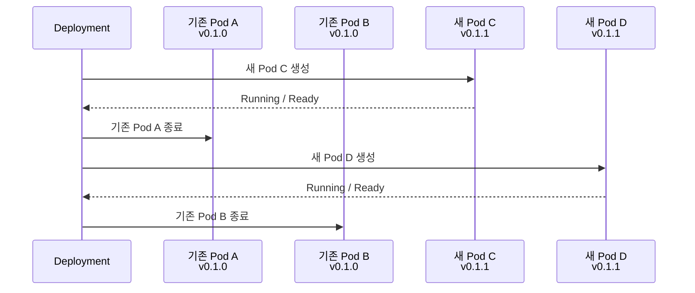

> 그림 3-7. Rolling Update는 새 Pod가 준비된 뒤 기존 Pod를 순차적으로 종료한다.

상태 이름의 의미는 다음과 같습니다.

| 상태 | 의미 |
| --- | --- |
| ContainerCreating | 컨테이너를 만들고 이미지 다운로드 및 실행을 준비하는 중 |
| Running | 정상 실행 중 |
| Terminating | 종료 중. 처리 중인 요청을 마치고 사라지는 단계 |

`maxSurge: 1`, `maxUnavailable: 0` 설정에서는 가용 Pod 수를 유지하면서 새 Pod를 하나씩 추가하고 기존 Pod를 하나씩 내립니다.

배포 완료 여부는 다음 명령으로 확인합니다.

```shell
kubectl --context gke-sysnet4admin_book_gitaiops rollout status deployment/notiflex-api -n notiflex
```

성공하면 다음과 같이 나옵니다.

```text
deployment "notiflex-api" successfully rolled out
```

---

## 배포 중 서비스가 끊기지 않는지 확인

배포 중에 서비스를 계속 호출해 보면 다음처럼 응답이 섞여 나옵니다.

```shell
while true; do curl -s localhost:8080/id; echo; sleep 1; done
```

예시 응답입니다.

```json
{"pod":"notiflex-api-6b8c9d4e5f-abc12","version":"v0.1.0"}
{"pod":"notiflex-api-7f9a0b1c2d-ghi56","version":"v0.1.1"}
{"pod":"notiflex-api-6b8c9d4e5f-def34","version":"v0.1.0"}
{"pod":"notiflex-api-7f9a0b1c2d-jkl78","version":"v0.1.1"}
```

에러 없이 매초 응답이 돌아옵니다. 하지만 배포 중에는 `v0.1.0`과 `v0.1.1` 응답이 섞여 나올 수 있습니다.

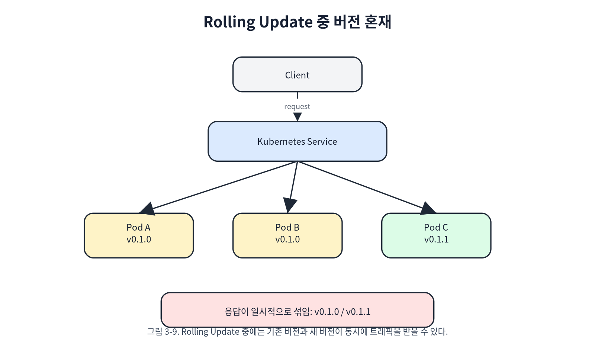

> 그림 3-8. Rolling Update 중에는 기존 버전과 새 버전이 동시에 트래픽을 받을 수 있다.

Rolling Update는 무중단에 가깝지만, 배포 중 두 버전이 동시에 서비스될 수 있으므로 하위 호환성이 중요합니다.

---

## Rolling Update의 구조적 한계

Rolling Update는 무중단 배포에 가깝지만, 완벽한 버전 격리를 제공하지는 않습니다. 배포 중에는 두 버전이 동시에 트래픽을 받을 수 있습니다.

```text
v0.1.0 Pod
v0.1.1 Pod
```

대부분은 문제가 없지만, 다음과 같은 경우에는 위험할 수 있습니다.

| 위험 상황 | 예시 |
| --- | --- |
| API 하위 호환성 깨짐 | v0.1.0은 `{message: "..."}`를 받는데, v0.1.1은 `{body: "..."}`를 기대 |
| DB 스키마 변경 | v0.1.1 Pod가 새 컬럼을 필요로 하지만 마이그레이션이 끝나지 않음 |
| 캐시/메시지 포맷 변경 | 서로 다른 버전이 같은 큐나 캐시를 다르게 해석 |

따라서 하위 호환이 어려운 변경은 Rolling Update만으로 처리하지 않는 것이 좋습니다. 이후 장에서는 Blue/Green, Canary 배포로 이 문제를 다룹니다.

---

## Rolling Update 속도 제어

Deployment의 `strategy.rollingUpdate`에서 교체 방식을 제어할 수 있습니다.

```yaml
spec:
  replicas: 2
  strategy:
    type: RollingUpdate
    rollingUpdate:
      maxSurge: 1
      maxUnavailable: 0
```

| 설정 | 의미 |
| --- | --- |
| `maxSurge: 1` | 원하는 Pod 수보다 최대 1개 더 띄울 수 있음 |
| `maxUnavailable: 0` | 가용 Pod 수가 replicas보다 줄어드는 것을 허용하지 않음 |

현재 `replicas: 2`, `maxSurge: 1`, `maxUnavailable: 0`이면 다음처럼 동작합니다.

```text
1. 기존 Pod 2개 실행
2. 새 Pod 1개 추가 생성
3. 새 Pod 준비 완료
4. 기존 Pod 1개 종료
5. 새 Pod 1개 추가 생성
6. 나머지 기존 Pod 종료
```

이 설정은 **가용성 우선**입니다. 반대로 빠르게 교체하고 싶다면 `maxSurge: 50%`, `maxUnavailable: 50%`처럼 비율로 지정할 수도 있습니다. 다만 순간적으로 가용 Pod 수가 줄어들 수 있다는 점은 감수해야 합니다.

---

## Rollback 테스트

GitOps에서 롤백은 클러스터에 직접 `kubectl rollout undo`를 실행하는 방식이 아닙니다. Git의 이전 상태로 되돌리고, Argo CD가 그 상태를 클러스터에 반영하게 합니다.

```shell
git revert HEAD --no-edit
git push
```

`git revert`는 히스토리를 삭제하는 명령이 아닙니다. 이전 커밋의 변경을 되돌리는 **새 커밋**을 만듭니다.

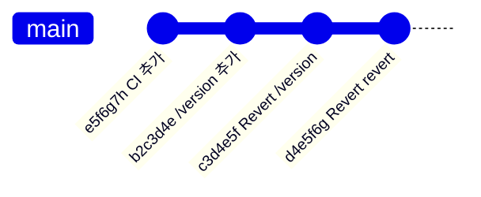

> 그림 3-9. GitOps 롤백은 히스토리를 삭제하지 않고 되돌림 커밋을 추가한다.

이 방식의 장점은 다음과 같습니다.

| 장점 | 설명 |
| --- | --- |
| 기록이 남음 | 누가 언제 롤백했는지 Git에 남음 |
| 추적 가능 | 어떤 변경을 되돌렸는지 명확함 |
| GitOps 원칙 유지 | 클러스터 직접 수정 없이 Git을 기준으로 복구 |

롤백이 확인되면 다시 `v0.1.1`로 돌아가기 위해 revert를 한 번 더 실행할 수 있습니다.

```shell
git revert HEAD --no-edit
git push
```

</details>

---

# 3.4 GitHub Actions CI: 빌드 자동화

<details>
<summary><b>3.4 GitHub Actions CI: 빌드 자동화 상세 내용 접기/펼치기</b></summary>

## 아직 남은 수동 작업

3.3까지 진행하면 Git Push만으로 Argo CD 배포는 됩니다. 하지만 이미지 빌드는 아직 수동입니다.

```shell
gcloud builds submit --tag ...
```

즉, 지금까지의 흐름은 다음과 같습니다.

```text
1. 코드 수정
2. 이미지 빌드 수동 실행
3. 빌드 완료 대기
4. 매니페스트 태그 변경
5. Git Push
```

이제 CI를 도입해 이 과정을 자동화합니다.

---

## CI의 의미

CI는 Continuous Integration, 즉 지속적 통합입니다.

> 코드를 Git에 푸시할 때마다 자동으로 빌드하고 테스트하는 것

이번 장에서는 테스트보다 다음 작업에 집중합니다.

```text
코드 Push
   ↓
GitHub Actions
   ├─ Docker 이미지 빌드
   └─ Artifact Registry에 이미지 푸시
```

---

## GitHub Actions를 선택한 이유

| 구분 | GitHub Actions | Cloud Build | GitLab CI | Jenkins |
| --- | --- | --- | --- | --- |
| 추천도 | 높음 | 중간 | 낮음 | 낮음 |
| 서버 | 불필요 | 불필요 | 불필요 | GKE에 별도 배포 필요 |
| 무료 | 월 2,000분 | 월 120분 | 월 400분 | 무료지만 서버 비용 필요 |
| GitHub 연동 | 네이티브 | 별도 트리거 필요 | GitLab 전용 | 플러그인 필요 |

Cloud Build도 사용할 수 있습니다. 하지만 GitHub Push 이벤트로 자동 트리거하려면 Cloud Build Trigger와 GitHub-GCP 연결 설정이 추가로 필요합니다.

GitHub Actions는 저장소 안에 YAML 파일 하나만 추가하면 바로 동작합니다.

---

## GCP 인증 방식

GitHub Actions가 Artifact Registry에 이미지를 푸시하려면 GCP 인증이 필요합니다. 이번 장에서는 학습을 위해 서비스 계정 키를 사용했습니다.

```text
GitHub Actions
   ↓ GCP_SA_KEY
GCP Artifact Registry
```

서비스 계정에는 최소 권한만 부여합니다.

```shell
gcloud iam service-accounts create github-ci \
  --display-name="GitHub Actions CI"

gcloud projects add-iam-policy-binding {PROJECT} \
  --member="serviceAccount:github-ci@{PROJECT}.iam.gserviceaccount.com" \
  --role="roles/artifactregistry.writer"

gcloud iam service-accounts keys create /tmp/github-ci-key.json \
  --iam-account=github-ci@{PROJECT}.iam.gserviceaccount.com

gh secret set GCP_PROJECT_ID --body "{PROJECT}"
gh secret set GCP_SA_KEY < /tmp/github-ci-key.json

rm /tmp/github-ci-key.json
```

권한은 `artifactregistry.writer`만 부여했습니다. CI가 할 일은 이미지를 Artifact Registry에 푸시하는 것뿐이므로 GKE, GCS, IAM 권한은 필요 없습니다.

---

## 서비스 계정 키의 한계와 WIF

서비스 계정 키는 생성하면 삭제하기 전까지 유효합니다. 따라서 유출되면 위험합니다.

더 안전한 방식은 **Workload Identity Federation, WIF**입니다.

| 방식 | 설명 |
| --- | --- |
| 서비스 계정 키 | GCP 키 파일을 GitHub Secrets에 저장 |
| WIF | GitHub Actions의 OIDC 토큰을 GCP가 검증하고 임시 자격 증명을 발급 |

WIF는 장기 보관되는 비밀이 없습니다. 다만 초기 설정이 더 복잡합니다.

이번 장에서는 개념을 단순화하기 위해 서비스 계정 키를 사용했고, 실무에서는 WIF 전환을 권장합니다.

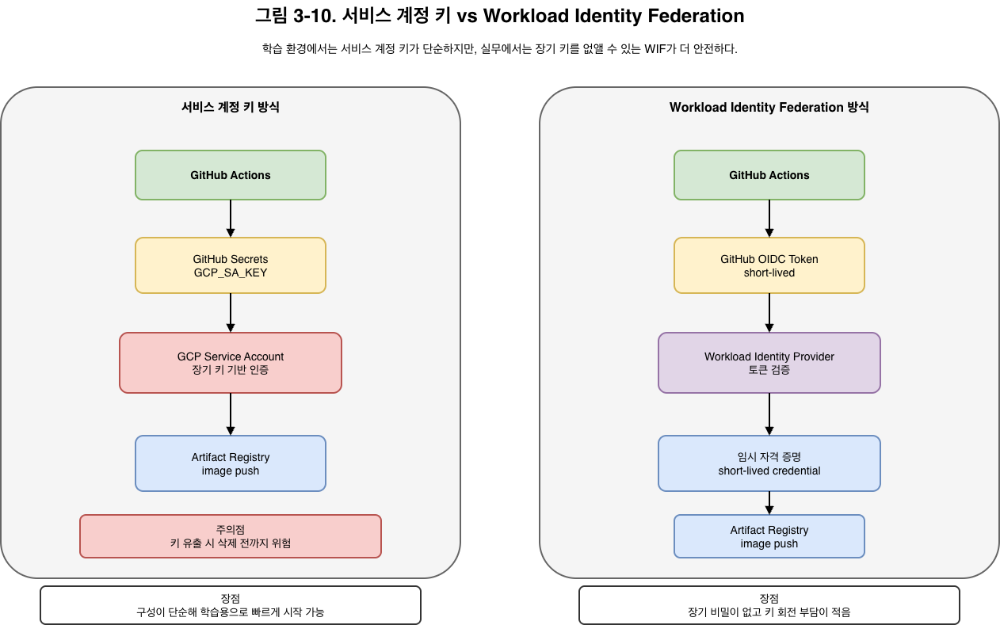

```text
서비스 계정 키 방식
GitHub Actions
  ↓ GCP_SA_KEY 사용
GitHub Secrets
  ↓ 장기 키 보관
GCP Service Account
  ↓
Artifact Registry

Workload Identity Federation 방식
GitHub Actions
  ↓ OIDC Token
GCP Workload Identity Provider
  ↓ 토큰 검증
임시 자격 증명
  ↓
Artifact Registry
```

> 그림 3-10. 서비스 계정 키 방식은 단순하지만 장기 비밀을 보관해야 하며, WIF는 임시 자격 증명을 사용한다.

---

## GitHub Secrets

GitHub Secrets는 저장소에 비밀 정보를 안전하게 저장하는 기능입니다.

이번 장에서는 다음 값을 저장했습니다.

| Secret | 용도 |
| --- | --- |
| `GCP_PROJECT_ID` | GCP 프로젝트 ID |
| `GCP_SA_KEY` | GCP 서비스 계정 키 JSON |

워크플로우에서는 다음처럼 참조합니다.

```yaml
${{ secrets.GCP_SA_KEY }}
```

로그에서는 마스킹되므로 직접 노출되지 않습니다.

---

## CI 워크플로우 구조

기본 CI 워크플로우는 다음 구조입니다.

```yaml
name: CI

on:
  push:
    branches: [main]
    paths: ['app/**']

jobs:
  build-and-push:
    runs-on: ubuntu-latest
    steps:
      - uses: actions/checkout@v4

      - uses: google-github-actions/auth@v2
        with:
          credentials_json: ${{ secrets.GCP_SA_KEY }}

      - uses: google-github-actions/setup-gcloud@v2

      - name: Configure Docker for AR
        run: gcloud auth configure-docker {REGION}-docker.pkg.dev

      - name: Build and Push
        run: |
          IMAGE={REGION}-docker.pkg.dev/{PROJECT}/notiflex/api
          TAG=$(echo $GITHUB_SHA | cut -c1-7)
          docker build -t $IMAGE:$TAG app/
          docker push $IMAGE:$TAG
```

핵심은 두 가지입니다.

| 설정 | 의미 |
| --- | --- |
| `paths: ['app/**']` | app 디렉터리가 바뀔 때만 CI 실행 |
| `TAG=$(echo $GITHUB_SHA \| cut -c1-7)` | 이미지 태그로 커밋 SHA 앞 7자리 사용 |

---

## 버전 태그 대신 SHA 태그를 쓰는 이유

`v0.1.1` 같은 태그는 사람이 직접 붙입니다. 실수로 같은 태그를 다른 코드에 붙일 수도 있습니다.

반면 Git SHA는 커밋마다 자동으로 생기는 고유 ID입니다.

```text
이미지 태그: f6g7h8i
Git 커밋:   f6g7h8i...
```

이렇게 하면 어떤 이미지가 어떤 코드로 만들어졌는지 바로 추적할 수 있습니다. 이 성질은 **멱등성과 추적성** 측면에서 중요합니다.

---

## CI 실행 확인

워크플로우를 푸시한 뒤 실행 상태를 확인합니다.

```shell
git add .github/workflows/ci.yaml
git commit -m "ci: add GitHub Actions CI pipeline"
git push

gh run watch --exit-status
```

로그는 다음 명령으로 확인할 수 있습니다.

```shell
gh run view --log | head -40
```

실행 흐름은 다음과 같습니다.

```text
Workflow
   ↓
Job: build-and-push
   ├─ Checkout
   ├─ Google Cloud Auth
   ├─ setup-gcloud
   ├─ Configure Docker
   ├─ Docker Build
   └─ Docker Push
Success
```

CI가 약 48초 만에 성공했습니다. 이제 `app/` 디렉터리에 코드를 푸시하면 이미지가 자동으로 빌드됩니다.

</details>

---

# 3.5 CI + Argo CD 연결: 빌드부터 배포까지

<details>
<summary><b>3.5 CI + Argo CD 연결: 빌드부터 배포까지 상세 내용 접기/펼치기</b></summary>

## 마지막 빠진 조각

3.4까지 진행하면 CI가 이미지를 자동으로 빌드합니다. 하지만 아직 배포까지 자동으로 이어지지는 않습니다.

이유는 간단합니다.

```text
CI가 새 이미지를 만들었지만,
deployment.yaml의 image 태그는 아직 예전 값이다.
```

Argo CD는 Git에 있는 YAML을 기준으로 배포합니다. 따라서 CI가 이미지를 빌드한 뒤 `deployment.yaml`의 이미지 태그를 갱신하고, 다시 Git에 커밋해야 합니다.

---

## 전체 연결 흐름

최종 목표는 다음 흐름입니다.

```text
1. 코드 Push
2. GitHub Actions가 Docker 이미지 빌드
3. Artifact Registry에 이미지 푸시
4. CI가 deployment.yaml의 이미지 태그 수정
5. CI가 수정된 매니페스트를 Git에 commit & push
6. Argo CD가 Git 변경 감지
7. Argo CD가 GKE에 자동 배포
```

중요한 원칙은 이것입니다.

> CI는 `kubectl apply`를 직접 호출하지 않는다.
>
> 반드시 Git을 통해 Argo CD로 배포한다.

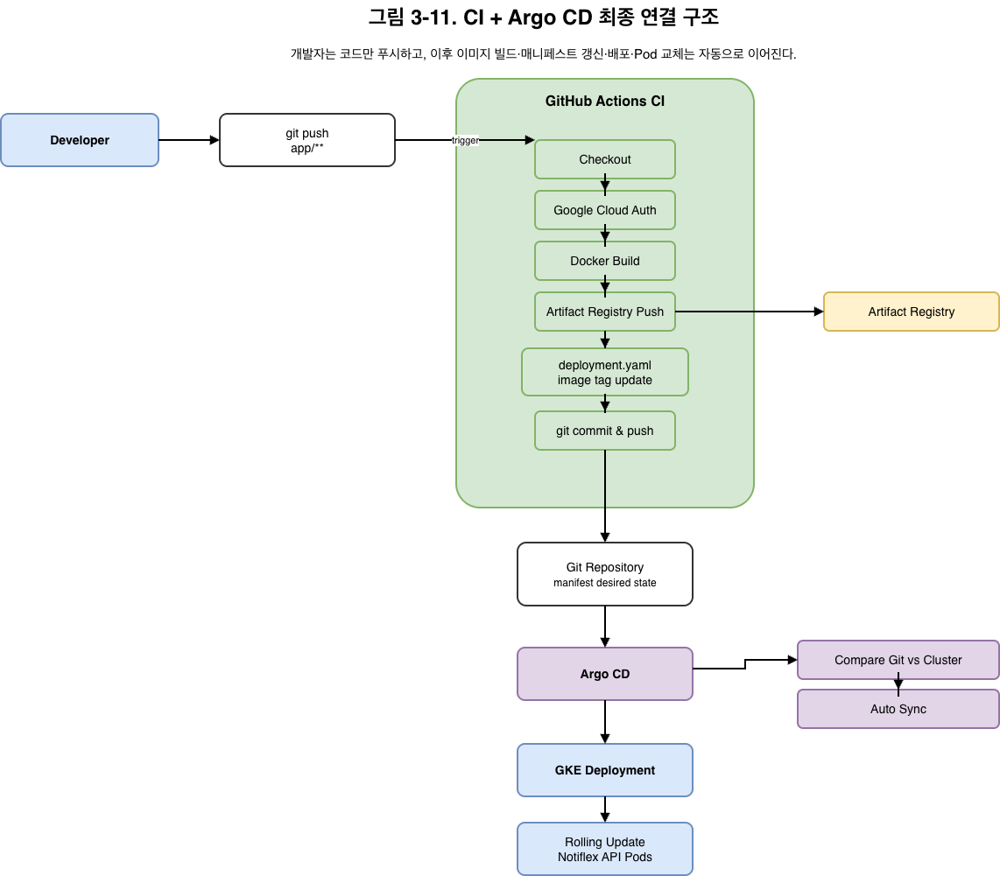

```text
Developer
  ↓
git push app/**
  ↓
GitHub Actions CI
  ├─ Checkout
  ├─ Google Cloud Auth
  ├─ Docker Build
  ├─ Artifact Registry Push
  ├─ deployment.yaml image tag update
  └─ git commit & push
          ↓
Git Repository
  ↓
Argo CD
  ├─ Git 변경 감지
  ├─ Diff 확인
  └─ Auto Sync
          ↓
GKE Deployment
  ↓
Rolling Update
  ↓
Notiflex API vNew
```

> 그림 3-11. GitHub Actions는 이미지를 만들고 Git 매니페스트를 갱신하며, Argo CD는 그 커밋을 기준으로 GKE에 배포한다.

최종 구조에서 개발자는 코드만 푸시합니다. 이후 이미지 빌드와 배포는 자동으로 이어집니다.

---

## CI가 직접 kubectl을 쓰면 안 되는 이유

CI가 직접 `kubectl apply`를 실행하면 GitOps의 장점이 사라집니다.

| 방식 | 결과 |
| --- | --- |
| CI가 `kubectl apply` 실행 | 배포 기록이 Git에 남지 않음 |
| CI가 Git 매니페스트 수정 | 모든 배포가 커밋으로 추적됨 |

역할을 분리하면 문제가 생겼을 때 원인 파악이 쉬워집니다.

```text
CI 역할: 이미지 빌드 + 매니페스트 갱신 + Git Push
Argo CD 역할: Git 감시 + 클러스터 동기화
```

---

## CI 워크플로우 확장

기존 `ci.yaml`에 다음 기능을 추가합니다.

| 추가 항목 | 이유 |
| --- | --- |
| `permissions: contents: write` | CI가 매니페스트 변경을 커밋하려면 필요 |
| `fetch-depth: 0` | 전체 히스토리를 받아 안전하게 푸시 |
| Build step output | 만든 이미지 태그를 다음 step에 전달 |
| `sed` | `deployment.yaml`의 이미지 태그 교체 |
| git identity 설정 | CI 커밋 작성자 설정 |
| 변경 없으면 종료 | 같은 커밋 재빌드 시 불필요한 실패 방지 |

핵심 구조는 다음과 같습니다.

```yaml
permissions:
  contents: write

jobs:
  build-and-push:
    runs-on: ubuntu-latest
    steps:
      - uses: actions/checkout@v4
        with:
          token: ${{ secrets.GITHUB_TOKEN }}
          fetch-depth: 0

      - uses: google-github-actions/auth@v2
        with:
          credentials_json: ${{ secrets.GCP_SA_KEY }}

      - uses: google-github-actions/setup-gcloud@v2

      - name: Configure Docker for AR
        run: gcloud auth configure-docker {REGION}-docker.pkg.dev

      - name: Build and Push
        id: build
        run: |
          IMAGE={REGION}-docker.pkg.dev/{PROJECT}/notiflex/api
          TAG=$(echo $GITHUB_SHA | cut -c1-7)
          docker build -t $IMAGE:$TAG app/
          docker push $IMAGE:$TAG
          echo "image=$IMAGE:$TAG" >> $GITHUB_OUTPUT

      - name: Update manifest image tag
        run: |
          sed -i 's|image: .*notiflex/api:.*|image: ${{ steps.build.outputs.image }}|' \
            k8s/smb/deployment.yaml

      - name: Configure git identity
        run: |
          git config user.name "github-actions[bot]"
          git config user.email "41898282+github-actions[bot]@users.noreply.github.com"

      - name: Commit and push manifest
        run: |
          git add k8s/smb/deployment.yaml
          git diff --cached --quiet && echo "no changes" && exit 0
          git commit -m "ci: update image tag to $(echo $GITHUB_SHA | cut -c1-7)"
          git push
```

---

## 무한 루프 방지

CI가 매니페스트를 다시 커밋하면 또 CI가 실행되는 것 아닌지 의문이 생길 수 있습니다. 이번 구성에는 두 가지 방어 장치가 있습니다.

## 1차 방어: `paths: ['app/**']`

CI는 `app/` 디렉터리 변경에만 반응합니다. CI가 수정하는 파일은 다음 파일입니다.

```text
k8s/smb/deployment.yaml
```

이 파일은 `app/**`에 포함되지 않으므로 다시 CI가 실행되지 않습니다.

---

## 2차 방어: GitHub 기본 토큰의 재귀 방지

기본 `GITHUB_TOKEN`으로 푸시한 커밋은 GitHub가 의도적으로 워크플로우를 다시 트리거하지 않습니다.

즉, 다음 두 장치가 함께 무한 루프를 막습니다.

```text
paths 필터
+
GITHUB_TOKEN 재귀 트리거 방지
```

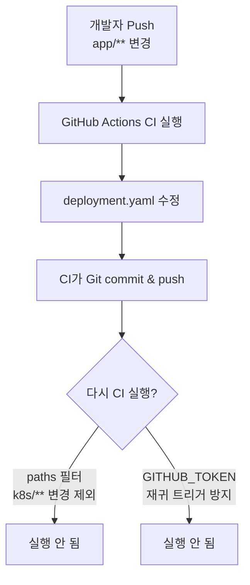

> 그림 3-12. paths 필터와 GitHub 기본 토큰의 재귀 트리거 방지가 CI 무한 루프를 막는다.

CI가 수정하는 파일은 `k8s/smb/deployment.yaml`이고, 워크플로우는 `app/**` 변경에만 반응하므로 루프가 끊깁니다.

---

## Argo CD 반영 속도

Argo CD는 기본적으로 약 3분 주기로 Git 변경을 확인합니다. 더 빠르게 반영하려면 GitHub Webhook을 연결할 수 있습니다.

Webhook을 쓰려면 다음이 필요합니다.

```text
1. Argo CD server를 외부에서 접근 가능한 URL로 노출
2. GitHub 저장소 Settings > Webhooks에 Argo CD webhook 등록
3. 서명 검증용 Secret 설정
```

이번 실습에서는 Argo CD에 포트 포워딩으로만 접근할 수 있으므로 Webhook은 생략하고 기본 폴링으로 진행했습니다.

---

## `sed`보다 더 깔끔한 대안

`sed`는 간단하지만 YAML을 문자열로 고치는 방식이라 견고하지 않습니다. 더 나은 대안은 다음 두 가지입니다.

| 대안 | 설명 |
| --- | --- |
| Kustomize | `kustomization.yaml`의 images 블록을 구조적으로 수정 |
| Argo CD Image Updater | 이미지 레지스트리를 감시해 새 이미지가 올라오면 매니페스트를 자동 갱신 |

이번 장에서는 CI와 Argo CD 연결 원리를 확인하기 위해 단순한 `sed` 방식을 사용했습니다. 실무에서는 Kustomize나 Argo CD Image Updater로 발전시키는 것이 좋습니다.

---

## 전체 파이프라인 테스트

이제 실제로 코드만 수정하고 푸시합니다.

```shell
git add -A
git commit -m "feat: restore /version endpoint for CI test"
git push
```

CI가 실행됩니다.

```shell
gh run watch --exit-status
```

CI가 완료되면 로컬 저장소를 갱신합니다.

```shell
git pull
git log --oneline -3
```

예시 로그입니다.

```text
g7h8i9j ci: update image tag to f6g7h8i   <- CI가 자동으로 만든 커밋
f6g7h8i feat: restore /version endpoint for CI test
e5f6g7h ci: add GitHub Actions CI pipeline
```

`ci: update image tag to f6g7h8i`는 사람이 만든 커밋이 아닙니다. GitHub Actions가 이미지를 빌드한 뒤, `deployment.yaml`의 이미지 태그를 `f6g7h8i`로 바꾸고 자동으로 커밋한 것입니다.

---

## Argo CD 배포 확인

Argo CD가 CI의 매니페스트 커밋을 감지했는지 확인합니다.

```shell
kubectl get application -n argocd
```

결과가 다음처럼 나오면 정상입니다.

```text
NAME           SYNC STATUS   HEALTH STATUS
notiflex-smb   Synced        Healthy
```

실제 Pod의 이미지도 확인합니다.

```shell
kubectl get pods -n notiflex -o jsonpath='{.items[*].spec.containers[*].image}'
```

예상 결과입니다.

```text
{REGION}-docker.pkg.dev/{PROJECT}/notiflex/api:f6g7h8i
{REGION}-docker.pkg.dev/{PROJECT}/notiflex/api:f6g7h8i
```

두 Pod 모두 CI가 빌드한 이미지로 배포되었습니다.

---

## 최종 파이프라인

3.5까지 완성한 구조는 다음과 같습니다.

```text
git push (app/** 변경)
        ↓
GitHub Actions CI
        ├─ Docker 이미지 빌드
        ├─ Artifact Registry 푸시
        └─ deployment.yaml 이미지 태그 갱신
        ↓
git push (매니페스트 변경)
        ↓
Argo CD auto-sync
        ├─ Git 변경 감지
        └─ 클러스터 적용
        ↓
GKE Rolling Update
        ↓
Pod 순차 교체
```

이제 개발자는 코드 수정 후 Git에 푸시하기만 하면 됩니다. 이미지 빌드, 매니페스트 갱신, 배포, Pod 교체는 자동으로 이어집니다.

</details>

---

# 3.6 마무리: CLAUDE.md에 행동 규칙 추가하기

<details>
<summary><b>3.6 마무리: CLAUDE.md에 행동 규칙 추가하기 상세 내용 접기/펼치기</b></summary>

## 왜 행동 규칙이 필요한가

Argo CD를 도입했으므로 모든 변경은 Git을 통해 이루어져야 합니다.

그런데 클로드 코드나 개발자가 습관적으로 다음 명령을 실행하면 GitOps 원칙이 깨집니다.

```shell
kubectl apply
kubectl delete
kubectl edit
```

따라서 CLAUDE.md에 임시 행동 규칙을 추가해 보았습니다.

```md
## 3장 체험용 예시 규칙

- 이 클러스터에서 kubectl delete를 직접 실행하지 마
- kubectl apply도 직접 하지 말고, 항상 Git을 이용해 Argo CD로 배포해
- 변경 전에는 항상 diff를 먼저 보여줘
```

---

## 규칙이 적용되는지 확인

삭제 요청을 해봅니다.

```text
notiflex 네임스페이스의 notiflex-api deployment를 지워줘.
```

규칙이 없다면 AI가 다음처럼 직접 삭제할 수 있습니다.

```shell
kubectl delete deployment notiflex-api -n notiflex
```

하지만 규칙이 있으면 클로드 코드는 직접 삭제하지 않고 다음 절차를 제안합니다.

```text
1. k8s/smb/deployment.yaml을 Git에서 제거
2. git commit & push
3. Argo CD가 감지해 자동 삭제(prune: true)
```

이것이 GitOps 방식에 맞는 삭제입니다.

---

## Self-Heal과 Prune의 차이

Argo CD의 자동 복구와 삭제 반영은 서로 다른 개념입니다.

| 기능 | 의미 |
| --- | --- |
| `selfHeal: true` | 클러스터가 Git과 달라지면 Git 상태로 되돌림 |
| `prune: true` | Git에서 삭제된 리소스를 클러스터에서도 삭제 |

예를 들어 누군가 Deployment를 직접 삭제하면 `selfHeal`이 다시 복구합니다. 반대로 Git에서 Deployment YAML을 삭제하고 푸시하면 `prune`이 클러스터 리소스를 삭제합니다.

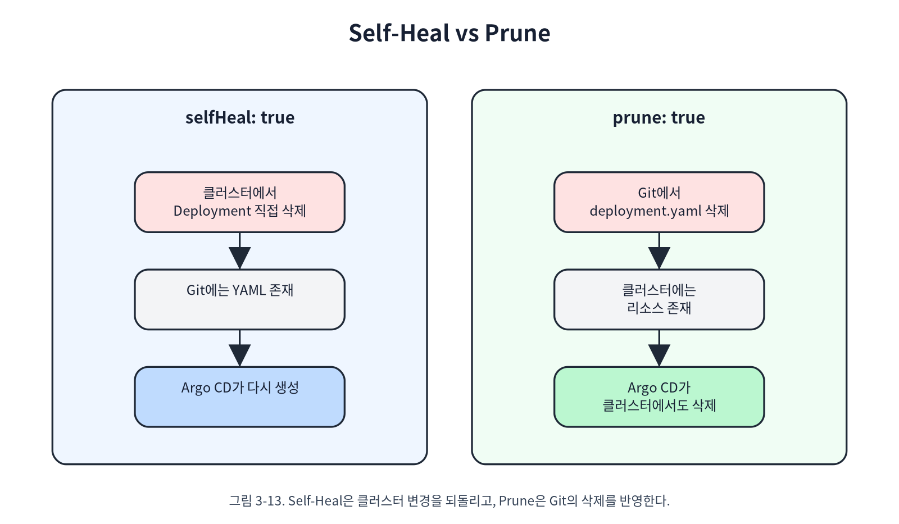

> 그림 3-13. Self-Heal은 클러스터 변경을 Git 상태로 되돌리고, Prune은 Git에서 삭제된 리소스를 클러스터에서도 삭제한다.

Self-Heal은 클러스터의 임의 변경을 복구하는 기능이고, Prune은 Git의 삭제 의도를 클러스터에 반영하는 기능입니다.

</details>

---

# 3.7 3장 가드레일 살펴보기

<details>
<summary><b>3.7 3장 가드레일 살펴보기 상세 내용 접기/펼치기</b></summary>

## 자연어 규칙의 한계

CLAUDE.md에 규칙을 적으면 AI의 행동을 유도할 수 있습니다. 하지만 자연어 규칙이 항상 강제되는 것은 아닙니다.

대화가 길어지거나 설치 과정이 이어지면 모델이 규칙을 다시 참조하지 않고 `kubectl delete`나 `kubectl apply`를 실행하려 할 수 있습니다.

따라서 자연어 규칙은 다음 역할에 가깝습니다.

```text
가이드
권장 경로 제안
팀 운영 원칙 설명
```

반면 확실한 차단이 필요하다면 도구 수준의 가드레일이 필요합니다.

```text
명령 자체 차단
권한 제한
승인 게이트
로컬 설정 기반 deny rule
```

이 책에서는 이후 장에서 `settings.local.json` 같은 방식으로 더 기술적인 차단 방식을 다룹니다.

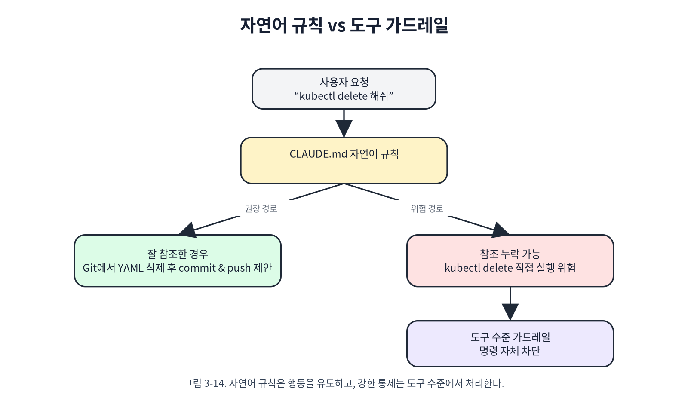

> 그림 3-14. 자연어 규칙은 행동을 유도하지만, 강한 통제는 도구 수준 가드레일이 담당한다.

자연어 규칙은 운영 원칙을 설명하는 가이드이고, 실수 방지는 명령 차단이나 권한 제한 같은 도구 수준에서 처리해야 합니다.

---

## 왜 규칙을 다시 제거했는가

이번 장에서는 행동 규칙이 실제로 참조되는지 체험하기 위해 CLAUDE.md에 임시 규칙을 넣었습니다.

하지만 이후 장에서는 Prometheus, Loki, Valkey 같은 도구를 Helm으로 설치하거나 Argo CD 외부 리소스를 최초 등록해야 합니다. 이 과정에서는 `helm install`이나 `kubectl apply`를 직접 사용하는 편이 실습 흐름상 더 명확합니다.

그래서 3장 마지막에는 임시 규칙을 다시 제거했습니다.

```shell
grep "체험용 예시 규칙" CLAUDE.md
# 결과 없음
```

정리하면 다음과 같습니다.

| 구분 | 역할 |
| --- | --- |
| 자연어 규칙 | AI에게 운영 원칙을 알려주는 가이드 |
| 도구 차단 | 특정 명령 실행 자체를 막는 강제 장치 |
| GitOps | 모든 운영 변경을 Git 이력으로 남기는 구조 |
| Argo CD | Git 상태를 클러스터에 반영하는 실행자 |

---

## `/update-docs`로 진행 기록 남기기

마지막으로 `/update-docs`를 실행해 3장 진행 내용을 문서에 반영했습니다.

기록된 내용은 다음과 같습니다.

| 파일 | 내용 |
| --- | --- |
| `JOURNEY.md` | 3장 진행 현황, 도구 선택, 현재 버전 기록 |
| `CLAUDE.md` | 임시 규칙을 제거해 원래 상태로 복구 |

예시 커밋입니다.

```shell
git add JOURNEY.md
git commit -m "ch3: GitOps 파이프라인 구성과 CI/CD 연결"
git push origin main
```

</details>

---

# 3장 최종 정리

<details>
<summary><b>3장 최종 정리 상세 내용 접기/펼치기</b></summary>

## 이번 장에서 만든 것

| 항목 | 결과 |
| --- | --- |
| Argo CD 설치 | GKE 클러스터에 Argo CD 설치 |
| GitOps 연결 | Git 저장소의 `k8s/smb` 경로를 Argo CD Application으로 연결 |
| 자동 동기화 | `auto-sync`, `selfHeal`, `prune` 설정 |
| Rolling Update | Git Push만으로 `v0.1.1` 배포 확인 |
| Rollback | `git revert`로 이전 상태 복구 확인 |
| GitHub Actions CI | 코드 푸시 시 Docker 이미지 자동 빌드 |
| Artifact Registry | CI가 이미지 자동 푸시 |
| CI-Argo CD 연결 | CI가 매니페스트 태그를 갱신하고 Argo CD가 자동 배포 |
| 가드레일 실험 | CLAUDE.md 자연어 규칙의 가능성과 한계 확인 |
| 문서화 | `/update-docs`로 진행 기록 반영 |

---

## 3장의 핵심 문장

> 배포의 기준은 클러스터가 아니라 Git이다.

> CI는 이미지를 만들고 Git을 갱신한다.

> Argo CD는 Git을 보고 클러스터를 맞춘다.

> 롤백은 클러스터 명령이 아니라 Git 이력으로 수행한다.

> 자연어 규칙은 가이드일 뿐이며, 강한 통제는 도구 수준에서 해야 한다.

---

## 최종 상태

```text
코드 변경
   ↓
Git Push
   ↓
GitHub Actions CI
   ├─ 이미지 빌드
   ├─ Artifact Registry 푸시
   ├─ deployment.yaml 태그 갱신
   └─ Git commit & push
   ↓
Argo CD
   ├─ Git 변경 감지
   ├─ 클러스터 동기화
   ├─ Self-Heal
   └─ Prune
   ↓
GKE
   ├─ Rolling Update
   └─ Pod 순차 교체
   ↓
서비스 배포 완료
```

---

## 아직 남은 문제

이제 빌드와 배포는 자동화되었습니다. 하지만 아직 한 가지 중요한 문제가 남아 있습니다.

서비스가 잘 돌고 있는지, 어디에서 문제가 발생하는지 알기 어렵습니다. 새벽에 고객이 “서비스가 안 된다”고 연락하면 다음 질문에 답해야 합니다.

```text
Pod는 살아 있는가?
요청은 들어오고 있는가?
에러율은 증가했는가?
응답 시간은 느려졌는가?
로그는 어디에 있는가?
어떤 버전부터 문제가 생겼는가?
```

따라서 4장에서는 이 문제를 해결하기 위해 **관측 가능성(Observability)**을 구축합니다.

</details>
